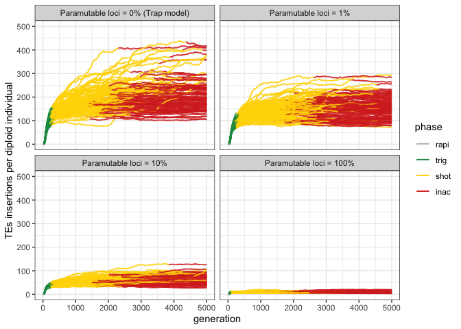
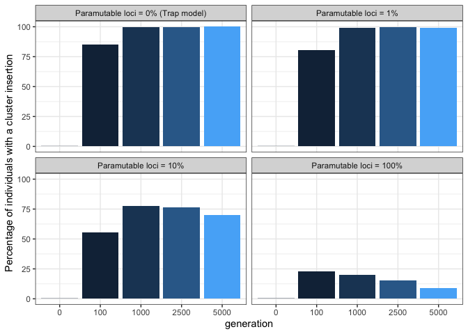
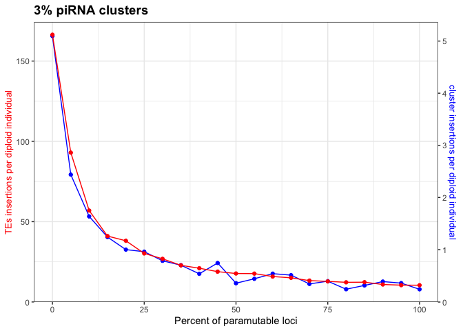

2022_08_09_Simulation_1\_Paramutations
================
Almorò Scarpa

## Introduction

With this simulation we wanted to understand the impact of the
paramutable loci in the transposable elements invasion

### Initial conditions:

A population of 1000, 5 chromosomes of size 10 Mb, 5 piRNA clusters of
size 300 Kb and an initial number of TEs in the population equal to 100.

We used 100 replicates for each simulation.

## Materials & Methods

version: invadego0.2.1

### Commands for the simulation:

``` bash
folder="/Users/ascarpa/Paramutations_TEs/Simulation"
tool="/Users/ascarpa/invade-invadego/invadego022"

$tool --N 1000 --gen 5000 --genome mb:10,10,10,10,10 --cluster kb:300,300,300,300,300 --rr 4,4,4,4,4 --rep 100 --u 0.1 --basepop 100 --steps 20 --sampleid p0 > $folder/2022_08_09_simulation_1_1 &

$tool --N 1000 --gen 5000 --genome mb:10,10,10,10,10 --cluster kb:300,300,300,300,300 --rr 4,4,4,4,4 --rep 100 --u 0.1 --basepop 100 --paramutation 100:1 --steps 20 --sampleid p1 > $folder/2022_08_09_simulation_1_2 &

$tool --N 1000 --gen 5000 --genome mb:10,10,10,10,10 --cluster kb:300,300,300,300,300 --rr 4,4,4,4,4 --rep 100 --u 0.1 --basepop 100 --paramutation 10:1 --steps 20 --sampleid p10 > $folder/2022_08_09_simulation_1_3 &

$tool --N 1000 --gen 5000 --genome mb:10,10,10,10,10 --cluster kb:300,300,300,300,300 --rr 4,4,4,4,4 --rep 100 --u 0.1 --basepop 100 --paramutation 1:0 --steps 20 --sampleid p100 > $folder/2022_08_09_simulation_1_4

cat 2022_08_09_simulation_1_1 2022_08_09_simulation_1_2 2022_08_09_simulation_1_3 2022_08_09_simulation_1_4 |grep -v "^Invade"|grep -v "^#" > 2022_08_09_Simulation_1_Paramutations
```

### Visualization in R

Setting the environment

``` r
library(tidyverse)
library(ggplot2)
library(patchwork)
library(plotrix)
library(RColorBrewer)
theme_set(theme_bw())
```

Visualization:

``` r
p<-c("grey","#1a9850","#ffd700","#d73027")

setwd("/Users/ascarpa/Paramutations_TEs/Simulation")

df<-read.table("2022_08_09_Simulation_1_Paramutations", fill = TRUE, sep = "\t")
names(df)<-c("rep", "gen", "popstat", "fmale", "spacer_1", "fwte", "avw", "avtes", "avpopfreq", "fixed",
             "spacer_2", "phase", "fwpirna", "spacer_3", "fwcli", "avcli", "fixcli", "spacer_4", "fwpar_yespi",
             "fwpar_nopi", "avpar","fixpar","spacer_5","piori","orifreq","spacer 6", "sampleid")

df$phase <- factor(df$phase, levels=c("rapi", "trig", "shot", "inac"))
df$sampleid <- factor(df$sampleid, levels=c("p0", "p1", "p10","p100"))


g<-ggplot()+
  geom_line(data=df,aes(x=gen,y=avtes,group=rep,color=phase),alpha=1,size=0.7)+
  ylab("insertions per diploid individual")+xlab("generation")+
  theme(legend.position="none")+
  scale_colour_manual(values=p)+
  ylim(0,500)+
  facet_wrap(~sampleid, labeller = labeller(sampleid = 
                                       c("p0" = "Paramutable loci = 0% (Trap model)",
                                         "p1" = "Paramutable loci = 1%",
                                         "p10" = "Paramutable loci = 10%",
                                         "p100" = "Paramutable loci = 100%")))
                                       
plot(g)
```

<!-- -->

``` r
clus_ins <- aggregate(x = df$fwcli,
            by = list(df$gen, df$sampleid),
            FUN = sum)
names(clus_ins) <- c("gen", "sampleid", "percentcli")
df2<-subset(clus_ins, gen == 0 | gen == 100 | gen == 1000 | gen == 2500 | gen == 5000)

g2 <- ggplot(df2, aes(x=as.character(gen), y=percentcli)) + 
      geom_bar(stat = "identity", aes(fill=gen)) +
      ylab("Percentage of individuals with a cluster insertion")+
      xlab("generation")+
      theme(legend.position = "none")+
      facet_wrap(~sampleid, labeller = labeller(sampleid = 
                                              c("p0" = "Paramutable loci = 0% (Trap model)",
                                                "p1" = "Paramutable loci = 1%",
                                                "p10" = "Paramutable loci = 10%",
                                                "p100" = "Paramutable loci = 100%")))

plot(g2)
```

<!-- -->

``` r
setwd("/Users/ascarpa/Paramutations_TEs/Simulation/100_simulations")
df3<-read.table("2022_08_19_100_simulations", fill = TRUE, sep = "\t")
names(df3)<-c("rep", "gen", "popstat", "fmale", "spacer_1", "fwte", "avw", "avtes", "avpopfreq", "fixed",
             "spacer_2", "phase", "fwpirna", "spacer_3", "fwcli", "avcli", "fixcli", "spacer_4", "fwpar_yespi",
             "fwpar_nopi", "avpar","fixpar","spacer_5","piori","orifreq","spacer 6", "sampleid")


df3 = subset(df3, gen == 5000 )


df3_2<-aggregate(df3, by = list(df3$sampleid), FUN = "mean")
names(df3_2)<-c("Group1","rep", "gen", "popstat", "fmale", "spacer_1", "fwte", "avw", "avtes", "avpopfreq", "fixed",
             "spacer_2", "phase", "fwpirna", "spacer_3", "fwcli", "avcli", "fixcli", "spacer_4", "fwpar_yespi",
             "fwpar_nopi", "avpar","fixpar","spacer_5","piori","orifreq","spacer 6", "sampleid")

df3_2$Group1<-c(0,10,100,15,20,25,30,35,40,45,5,50,55,60,65,70,75,80,85,90,95)
df3_2 <-df3_2[order(df3_2$Group1),]

par(mar=c(5, 4, 4, 6) + 0.1)
plot(df3_2$Group1, df3_2$avtes, pch=16, axes=FALSE, ylim=c(0,200), xlab="", ylab="", 
     type="b",col="black")
axis(2, ylim=c(0,200),col="black",las=1)
mtext("Tes insertions per diploid individual",side=2,line=2.5)
box()
par(new=TRUE)
plot(df3_2$Group1, df3_2$avcli, pch=15,  xlab="", ylab="", ylim=c(0,6), 
     axes=FALSE, type="b", col="red")
mtext("average cluster insertions",side=4,col="red",line=4) 
axis(4, ylim=c(0,6), col="red",col.axis="red",las=1)
axis(1,pretty(range(df3_2$Group1),10))
mtext("percent paramutable loci",side=1,col="black",line=2.5)  
legend("topright",legend=c("average TEs insertions","average cluster insertions"),
       text.col=c("black","red"),pch=c(16,15),col=c("black","red"))
```

<!-- -->

## Conclusions

-   Paramutations reduce the average TE copy number.

-   Paramutations reduce the average number of cluster insertions.

-   Overall paramutations highly influence the TEs invasion dynamics.
