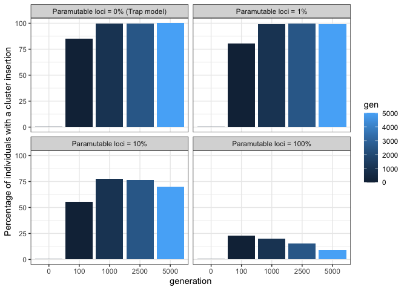
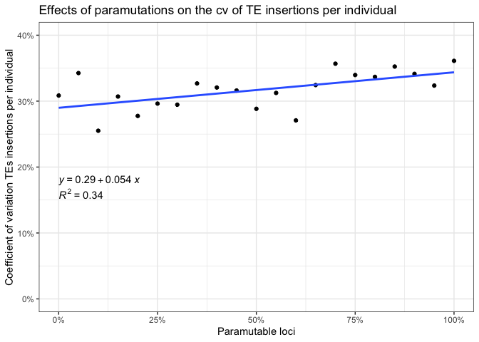
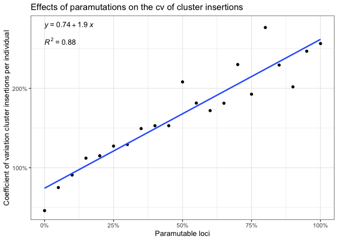

2022_08_09_Simulation_1\_Paramutations
================
Almorò Scarpa

## Introduction

With this simulation we wanted to understand the impact of the
paramutable loci in the transposable elements invasion

### Initial conditions:

A population of 1000, 5 chromosomes of size 10 Mb, 5 piRNA clusters of
size 300 Kb and an initial number of TEs in the population equal to 100.

We used 100 replicates for each simulation.

## Materials & Methods

version: invadego0.2.1

-   seed p0: 1660125902621584000

-   seed p1: 1660125902621656000

-   seed p10: 1660125902621702000

-   seed p100: 1660125902621592000s

### Commands for the simulation:

``` bash
folder="/Users/ascarpa/Paramutations_TEs/Simulation"
tool="/Users/ascarpa/invade-invadego/invadego022"

$tool --N 1000 --gen 5000 --genome mb:10,10,10,10,10 --cluster kb:300,300,300,300,300 --rr 4,4,4,4,4 --rep 100 --u 0.1 --basepop 100 --steps 20 --sampleid p0 > $folder/2022_08_09_simulation_1_1 &

$tool --N 1000 --gen 5000 --genome mb:10,10,10,10,10 --cluster kb:300,300,300,300,300 --rr 4,4,4,4,4 --rep 100 --u 0.1 --basepop 100 --paramutation 100:1 --steps 20 --sampleid p1 > $folder/2022_08_09_simulation_1_2 &

$tool --N 1000 --gen 5000 --genome mb:10,10,10,10,10 --cluster kb:300,300,300,300,300 --rr 4,4,4,4,4 --rep 100 --u 0.1 --basepop 100 --paramutation 10:1 --steps 20 --sampleid p10 > $folder/2022_08_09_simulation_1_3 &

$tool --N 1000 --gen 5000 --genome mb:10,10,10,10,10 --cluster kb:300,300,300,300,300 --rr 4,4,4,4,4 --rep 100 --u 0.1 --basepop 100 --paramutation 1:0 --steps 20 --sampleid p100 > $folder/2022_08_09_simulation_1_4

cat 2022_08_09_simulation_1_1 2022_08_09_simulation_1_2 2022_08_09_simulation_1_3 2022_08_09_simulation_1_4 |grep -v "^Invade"|grep -v "^#" > 2022_08_09_Simulation_1_Paramutations
```

### Visualization in R

Setting the environment

``` r
library(tidyverse)
library(ggplot2)
library(patchwork)
library(plotrix)
library(RColorBrewer)
library(ggpubr)
```

Visualization:

``` r
p<-c("grey","#1a9850","#ffd700","#d73027")

setwd("/Users/ascarpa/Paramutations_TEs/Simulation/Raw")

df<-read.table("2022_08_09_Simulation_1_Paramutations", fill = TRUE, sep = "\t")
names(df)<-c("rep", "gen", "popstat", "fmale", "spacer_1", "fwte", "avw", "avtes", "avpopfreq", "fixed",
             "spacer_2", "phase", "fwpirna", "spacer_3", "fwcli", "avcli", "fixcli", "spacer_4", "fwpar_yespi",
             "fwpar_nopi", "avpar","fixpar","spacer_5","piori","orifreq","spacer 6", "sampleid")

df$phase <- factor(df$phase, levels=c("rapi", "trig", "shot", "inac"))
df$sampleid <- factor(df$sampleid, levels=c("p0", "p1", "p10","p100"))


g<-ggplot()+
  geom_line(data=df,aes(x=gen,y=avtes,group=rep,color=phase),alpha=1,size=0.7)+
  xlab("generation")+
  ylab("TEs insertions per diploid individual")+
  theme(legend.position="none")+
  scale_colour_manual(values=p)+
  ylim(0,500)+
  facet_wrap(~sampleid, labeller = labeller(sampleid = 
                                       c("p0" = "Paramutable loci = 0% (Trap model)",
                                         "p1" = "Paramutable loci = 1%",
                                         "p10" = "Paramutable loci = 10%",
                                         "p100" = "Paramutable loci = 100%")))
                                       
plot(g)
```

<!-- -->

``` r
clus_ins <- aggregate(x = df$fwcli,
            by = list(df$gen, df$sampleid),
            FUN = sum)
names(clus_ins) <- c("gen", "sampleid", "percentcli")
df2<-subset(clus_ins, gen == 0 | gen == 100 | gen == 1000 | gen == 2500 | gen == 5000)

g2 <- ggplot(df2, aes(x=as.character(gen), y=percentcli)) + 
      geom_bar(stat = "identity", aes(fill=gen)) +
      ylab("Percentage of individuals with a cluster insertion")+
      xlab("generation")+
      theme(legend.position = "none")+
      facet_wrap(~sampleid, labeller = labeller(sampleid = 
                                              c("p0" = "Paramutable loci = 0% (Trap model)",
                                                "p1" = "Paramutable loci = 1%",
                                                "p10" = "Paramutable loci = 10%",
                                                "p100" = "Paramutable loci = 100%")))

plot(g2)
```

<!-- -->

``` r
setwd("/Users/ascarpa/Paramutations_TEs/Simulation/Raw")
df3<-read.table("2022_08_19_100_simulations", fill = TRUE, sep = "\t")
names(df3)<-c("rep", "gen", "popstat", "fmale", "spacer_1", "fwte", "avw", "avtes", "avpopfreq", "fixed",
             "spacer_2", "phase", "fwpirna", "spacer_3", "fwcli", "avcli", "fixcli", "spacer_4", "fwpar_yespi",
             "fwpar_nopi", "avpar","fixpar","spacer_5","piori","orifreq","spacer 6", "sampleid", "extra")


df3 = subset(df3, gen == 5000 )
df3 <- df3 %>% 
  select(-c("extra"))

df3_2 <- df3 %>% 
  group_by(sampleid) %>% 
  summarize(av_cli = mean(avcli), sd_cli = sd(avcli), cv_cli_percent = sd(avcli)/mean(avcli), 
            av_tes = mean(avtes), sd_tes = sd(avtes), cv_tes_percent = sd(avtes)/mean(avtes))

percent_para<-c(0,10,100,15,20,25,30,35,40,45,5,50,55,60,65,70,75,80,85,90,95)
df3_2$sampleid<-percent_para
df3_2 <- df3_2[order(df3_2$sampleid),]


coeff_3=32.5
g3 <- ggplot(df3_2, aes(x=sampleid/100))+
  geom_point(aes(y=av_cli*coeff_3), color="blue")+
  geom_line(aes(y=av_cli*coeff_3), color="blue")+
  geom_point(aes(y=av_tes), color="red")+
  geom_line(aes(y=av_tes), color="red")+
  scale_x_continuous(labels = scales::percent)+
  ggtitle("3% piRNA clusters")+
  scale_y_continuous(
    name = "TEs insertions per diploid individual",
    sec.axis = sec_axis(~./coeff_3, name="cluster insertions per diploid individual")
  )+
  xlab("Paramutable loci")+
  theme(legend.position="none",
        plot.title = element_text(size=14, face="bold"),
        axis.title.y = element_text(color = "red", size=10),
        axis.title.y.right = element_text(color = "blue", size=10)
  )

plot(g3)
```

<!-- -->

``` r
g_3_2 <- ggplot(df3_2, aes(x=sampleid/100, y=cv_tes_percent))+
  geom_point()+
  geom_smooth(method='lm', formula= y~x, se = FALSE)+
  stat_regline_equation(label.y = 0.18, aes(label = ..eq.label..))+
  stat_regline_equation(label.y = 0.16, aes(label = ..rr.label..))+
  xlab("Paramutable loci")+
  ylab("Coefficient of variation TEs insertions per individual")+
  scale_x_continuous(labels = scales::percent)+
  scale_y_continuous(labels = scales::percent, limits = c(0, 0.4))+
  ggtitle("Effects of paramutations on the cv of TE insertions per individual")+
  theme(legend.position="none",
        plot.title = element_text(size=14, face="bold"))

plot(g_3_2)
```

<!-- -->

``` r
g_3_3 <- ggplot(df3_2, aes(x=sampleid/100, y=cv_cli_percent))+
  geom_point()+
  geom_smooth(method='lm', formula= y~x, se = FALSE)+
  stat_regline_equation(label.y = 2.8, aes(label = ..eq.label..))+
  stat_regline_equation(label.y = 2.6, aes(label = ..rr.label..))+
  xlab("Paramutable loci")+
  ylab("Coefficient of variation cluster insertions per individual")+
  scale_x_continuous(labels = scales::percent)+
  scale_y_continuous(labels = scales::percent)+
  ggtitle("Effects of paramutations on the cv of cluster insertions")+
  theme(legend.position="none",
        plot.title = element_text(size=14, face="bold"))

plot(g_3_3)
```

<!-- -->

The high

obtained from the linear regression of the cv of cluster insertions on
the paramutable loci size shows a relation between the two. This make
sense in our model since the increase of paramutable loci increase the
number of scenarios in which cluster insertions and paramutations
contribute to stop the TEs invasion. This is not the case for TEs, they
dicrease with the increase of paramutable loci, but their coefficient of
variation is not affected.

## Conclusions

-   Paramutations reduce the average TE copy number.

-   Paramutations reduce the average number of cluster insertions.

-   Overall paramutations highly influence the TEs invasion dynamics.
