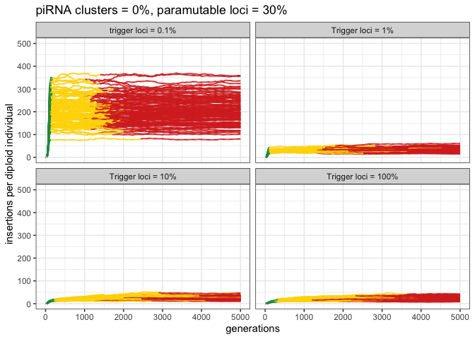

2022_08_09_Simulation_1\_Paramutations
================
Almorò Scarpa

## Introduction

In this simulation we compared the effects of different shares of
trigger loci in a genome made of paramutable loci by 30%.

### Initial conditions:

A population of 1000, 5 chromosomes of size 10 Mb, 30% of the genome as
paramutable loci and an initial number of TEs in the population equal to
100.

We used 300 replicates for each simulation.

## Materials & Methods

version: invadego0.2.1

-   seed p30_0: 1660131023489346000

-   seed p30_1: 1660120153070897000

-   seed p30_10: 1660120153071664000

-   seed p30_100: 1660120153072163000

### Commands for the simulation:

``` bash
folder="/Users/ascarpa/Paramutations_TEs/Simulation/Raw"
tool="/Users/ascarpa/invade-invadego/invadego022"

$tool --N 1000 --gen 5000 --genome mb:10,10,10,10,10 --rr 4,4,4,4,4 --rep 100 --u 0.1 --basepop 100 --paramutation 10:1,3,5 --trigger 1000:1 --steps 20 --sampleid p30_0.1 > $folder/2022_08_09_simulation_2_1

$tool --N 1000 --gen 5000 --genome mb:10,10,10,10,10 --rr 4,4,4,4,4 --rep 100 --u 0.1 --basepop 100 --paramutation 10:1,3,5 --trigger 100:1 --steps 20 --sampleid p30_1 > $folder/2022_08_09_simulation_2_2

$tool --N 1000 --gen 5000 --genome mb:10,10,10,10,10 --rr 4,4,4,4,4 --rep 100 --u 0.1 --basepop 100 --paramutation 10:1,3,5 --trigger 10:1 --steps 20 --sampleid p30_10 > $folder/2022_08_09_simulation_2_3

$tool --N 1000 --gen 5000 --genome mb:10,10,10,10,10 --rr 4,4,4,4,4 --rep 100 --u 0.1 --basepop 100 --paramutation 10:1,3,5 --trigger 1:0 --steps 20 --sampleid p30_100 > $folder/2022_08_09_simulation_2_4

cat 2022_08_09_simulation_2_1 2022_08_09_simulation_2_2 2022_08_09_simulation_2_3 2022_08_09_simulation_2_4 |grep -v "^Invade"|grep -v "^#" > 2022_08_09_Simulation_2_Trigger
```

### Visualization in R

Setting the environment

``` r
library(tidyverse)
library(ggplot2)
library(patchwork)
library(RColorBrewer)
theme_set(theme_bw())
```

Visualization: comparing the simulations with the prediction

``` r
p<-c("grey","#1a9850","#ffd700","#d73027")

setwd("/Users/ascarpa/Paramutations_TEs/Simulation/Raw")

df<-read.table("2022_08_09_Simulation_2_Trigger", fill = TRUE, sep = "\t")
names(df)<-c("rep", "gen", "popstat", "fmale", "spacer_1", "fwte", "avw", "avtes", "avpopfreq", "fixed","spacer_2","phase","fwpirna","spacer_3","fwcli","avcli","fixcli","spacer_4","fwpar_yespi","fwpar_nopi",
             "avpar","fixpar","spacer_5","piori","orifreq","spacer 6", "sampleid")

df$phase <- factor(df$phase, levels=c("rapi", "trig", "shot", "inac"))
df$sampleid <- factor(df$sampleid, levels=c("p30_0.1", "p30_1", "p30_10","p30_100"))


g<-ggplot()+
  geom_line(data=df,aes(x=gen,y=avtes,group=rep,color=phase),alpha=1,size=0.7)+
  ylab("insertions per diploid individual")+xlab("generations")+
  theme(legend.position="none")+
  scale_colour_manual(values=p)+
  ylim(0,500)+
  facet_wrap(~sampleid, labeller = labeller(sampleid = 
                                                      c("p30_0.1" = "Trigger loci = 0.1%",
                                                        "p30_1" = "Trigger loci = 1%",
                                                        "p30_10" = "Trigger loci = 10%",
                                                        "p30_100" = "Trigger loci = 100%")))

plot(g)
```

<!-- -->

## Conclusions

1% of the genome as trigger loci is enough to reduce the average number
of transposable elements.
