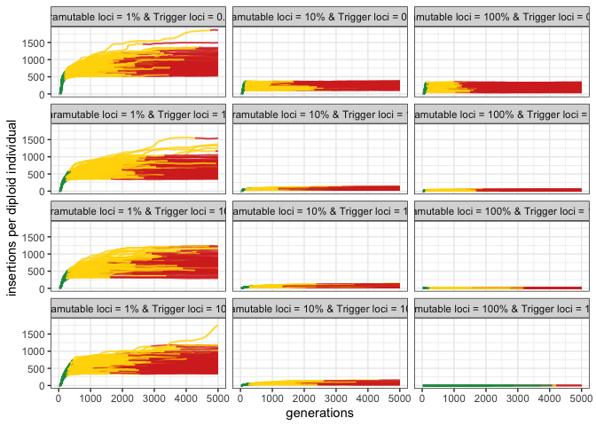

2022_08_11_Simulation_2\_supplementary
================
Almorò Scarpa

## Introduction

In this simulation we compared different genomic compositions regarding
paramutable and trigger loci.

### Initial conditions:

A population of 1000, 5 chromosomes of size 10 Mb and an initial number
of TEs in the population equal to 100.

We used 300 replicates for each simulation.

## Materials & Methods

version: invadego0.2.1

-   seed p1_0.1: 1661265214047499000

-   seed p10_0.1: 1661265214047660000

-   seed p100_0.1: 1661265214047576000

-   seed p1_1: 1661265214047488000

-   seed p10_1: 1661265214047640000

-   seed p100_1: 1661265214047599000

-   seed p1_10: 1661265214047598000

-   seed p10_10: 1661265214047676000

-   seed p100_10: 1661265214047650000

-   seed p1_100: 1661265214047590000

-   seed p10_100: 1661265214047441000

-   seed p100_100: 1661265214047705000

### Commands for the simulation:

``` bash
​​folder="/Users/ascarpa/Paramutations_TEs/Simulation"
tool="/Users/ascarpa/invade-invadego/invadego022"


$tool --N 1000 --gen 5000 --genome mb:10,10,10,10,10 --rr 4,4,4,4,4 --rep 100 --u 0.1 --basepop 100 --paramutation 100:1 --trigger 1000:2 --steps 20 --sampleid p1_0.1 > $folder/2022_08_09_simulation_2_1_s &

$tool --N 1000 --gen 5000 --genome mb:10,10,10,10,10 --rr 4,4,4,4,4 --rep 100 --u 0.1 --basepop 100 --paramutation 10:1 --trigger 1000:2 --steps 20 --sampleid p10_0.1 > $folder/2022_08_09_simulation_2_2_s &

$tool --N 1000 --gen 5000 --genome mb:10,10,10,10,10 --rr 4,4,4,4,4 --rep 100 --u 0.1 --basepop 100 --paramutation 1:0 --trigger 1000:2 --steps 20 --sampleid p100_0.1 > $folder/2022_08_09_simulation_2_3_s &


$tool --N 1000 --gen 5000 --genome mb:10,10,10,10,10 --rr 4,4,4,4,4 --rep 100 --u 0.1 --basepop 100 --paramutation 100:1 --trigger 100:2 --steps 20 --sampleid p1_1 > $folder/2022_08_09_simulation_2_4_s &

$tool --N 1000 --gen 5000 --genome mb:10,10,10,10,10 --rr 4,4,4,4,4 --rep 100 --u 0.1 --basepop 100 --paramutation 10:1 --trigger 100:2 --steps 20 --sampleid p10_1 > $folder/2022_08_09_simulation_2_5_s &

$tool --N 1000 --gen 5000 --genome mb:10,10,10,10,10 --rr 4,4,4,4,4 --rep 100 --u 0.1 --basepop 100 --paramutation 1:0 --trigger 100:2 --steps 20 --sampleid p100_1 > $folder/2022_08_09_simulation_2_6_s &


$tool --N 1000 --gen 5000 --genome mb:10,10,10,10,10 --rr 4,4,4,4,4 --rep 100 --u 0.1 --basepop 100 --paramutation 100:1 --trigger 10:2 --steps 20 --sampleid p1_10 > $folder/2022_08_09_simulation_2_7_s &

$tool --N 1000 --gen 5000 --genome mb:10,10,10,10,10 --rr 4,4,4,4,4 --rep 100 --u 0.1 --basepop 100 --paramutation 10:1 --trigger 10:2 --steps 20 --sampleid p10_10 > $folder/2022_08_09_simulation_2_8_s &

$tool --N 1000 --gen 5000 --genome mb:10,10,10,10,10 --rr 4,4,4,4,4 --rep 100 --u 0.1 --basepop 100 --paramutation 1:0 --trigger 10:2 --steps 20 --sampleid p100_10 > $folder/2022_08_09_simulation_2_9_s &


$tool --N 1000 --gen 5000 --genome mb:10,10,10,10,10 --rr 4,4,4,4,4 --rep 100 --u 0.1 --basepop 100 --paramutation 100:1 --trigger 1:0 --steps 20 --sampleid p1_100 > $folder/2022_08_09_simulation_2_10_s &

$tool --N 1000 --gen 5000 --genome mb:10,10,10,10,10 --rr 4,4,4,4,4 --rep 100 --u 0.1 --basepop 100 --paramutation 10:1 --trigger 1:0 --steps 20 --sampleid p10_100 > $folder/2022_08_09_simulation_2_11_s &

$tool --N 1000 --gen 5000 --genome mb:10,10,10,10,10 --rr 4,4,4,4,4 --rep 100 --u 0.1 --basepop 100 --paramutation 1:0 --trigger 1:0 --steps 20 --sampleid p100_100 > $folder/2022_08_09_simulation_2_12_s

cat 2022_08_09_simulation_2_1_s 2022_08_09_simulation_2_2_s 2022_08_09_simulation_2_3_s 2022_08_09_simulation_2_4_s 2022_08_09_simulation_2_5_s 2022_08_09_simulation_2_6_s 2022_08_09_simulation_2_7_s 2022_08_09_simulation_2_8_s 2022_08_09_simulation_2_9_s 2022_08_09_simulation_2_10_s 2022_08_09_simulation_2_11_s 2022_08_09_simulation_2_12_s |grep -v "^Invade"|grep -v "^#" > 2022_08_11_Simulation_2_supplementary
```

### Visualization in R

Setting the environment

``` r
library(tidyverse)
library(ggplot2)
library(patchwork)
library(RColorBrewer)
theme_set(theme_bw())
```

Visualization: comparing the simulations with the prediction

``` r
p<-c("grey","#1a9850","#ffd700","#d73027")

setwd("/Users/ascarpa/Paramutations_TEs/Simulation/Raw")

df<-read.table("2022_08_11_Simulation_2_supplementary", fill = TRUE, sep = "\t")
names(df)<-c("rep", "gen", "popstat", "fmale", "spacer_1", "fwte", "avw", "avtes", "avpopfreq", "fixed","spacer_2","phase","fwpirna","spacer_3","fwcli","avcli","fixcli","spacer_4","fwpar_yespi","fwpar_nopi",
             "avpar","fixpar","spacer_5","piori","orifreq","spacer 6", "sampleid")

df$phase <- factor(df$phase, levels=c("rapi", "trig", "shot", "inac"))
df$sampleid <- factor(df$sampleid, levels=c("p1_0.1", "p10_0.1", "p100_0.1", "p1_1", "p10_1", "p100_1", "p1_10", "p10_10", "p100_10", "p1_100", "p10_100", "p100_100"))

g<-ggplot()+
  geom_line(data=df,aes(x=gen,y=avtes,group=rep,color=phase),alpha=1,size=0.7)+
  ylab("insertions per diploid individual")+xlab("generations")+
  theme(legend.position="none")+
  scale_colour_manual(values=p)+
  facet_wrap(~sampleid, ncol = 3, labeller = labeller(sampleid = 
                                                        c("p1_0.1" = "Paramutable loci = 1% & Trigger loci = 0.1%",
                                                          "p10_0.1" = "Paramutable loci = 10% & Trigger loci = 0.1%",
                                                          "p100_0.1" = "Paramutable loci = 100% & Trigger loci = 0.1%",
                                                          "p1_1" = "Paramutable loci = 1% & Trigger loci = 1%",
                                                          "p10_1" = "Paramutable loci = 10% & Trigger loci = 1%",
                                                          "p100_1" = "Paramutable loci = 100% & Trigger loci = 1%",
                                                          "p1_10" = "Paramutable loci = 1% & Trigger loci = 10%",
                                                          "p10_10" = "Paramutable loci = 10% & Trigger loci = 10%",
                                                          "p100_10" = "Paramutable loci = 100% & Trigger loci = 10%",
                                                          "p1_100" = "Paramutable loci = 1% & Trigger loci = 100%",
                                                          "p10_100" = "Paramutable loci = 10% & Trigger loci = 100%",
                                                          "p100_100" = "Paramutable loci = 100% & Trigger loci = 100%")))

plot(g)
```

<!-- -->

## Conclusions

The share of paramutable loci is more relevant on the average TE copy
number than the share of trigger loci, as we can see by comparing the
third graph in column 1 with the second in column 2.
