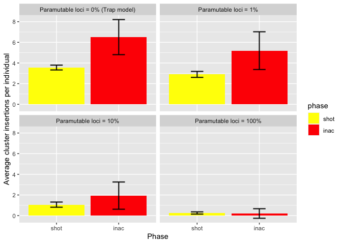

2022_08_24_Simulation_1\_2_Phases
================
Almo
2022-08-24

## Introduction

With this simulation we wanted to understand the impact of the
paramutable loci in the transposable elements invasion

### Initial conditions:

A population of 1000, 5 chromosomes of size 10 Mb, 5 piRNA clusters of
size 300 Kb and an initial number of TEs in the population equal to 100.

We used 100 replicates for each simulation.

## Materials & Methods

version: invadego0.2.1

### Commands for the simulation:

``` bash
folder="/Users/ascarpa/Paramutations_TEs/Simulation"
tool="/Users/ascarpa/invade-invadego/invadego022"

$tool --N 1000 --gen 5000 --genome mb:10,10,10,10,10 --cluster kb:300,300,300,300,300 --rr 4,4,4,4,4 --rep 100 --u 0.1 --basepop 100 --steps 20 --sampleid p0 > $folder/2022_08_09_simulation_1_1 &

$tool --N 1000 --gen 5000 --genome mb:10,10,10,10,10 --cluster kb:300,300,300,300,300 --rr 4,4,4,4,4 --rep 100 --u 0.1 --basepop 100 --paramutation 100:1 --steps 20 --sampleid p1 > $folder/2022_08_09_simulation_1_2 &

$tool --N 1000 --gen 5000 --genome mb:10,10,10,10,10 --cluster kb:300,300,300,300,300 --rr 4,4,4,4,4 --rep 100 --u 0.1 --basepop 100 --paramutation 10:1 --steps 20 --sampleid p10 > $folder/2022_08_09_simulation_1_3 &

$tool --N 1000 --gen 5000 --genome mb:10,10,10,10,10 --cluster kb:300,300,300,300,300 --rr 4,4,4,4,4 --rep 100 --u 0.1 --basepop 100 --paramutation 1:0 --steps 20 --sampleid p100 > $folder/2022_08_09_simulation_1_4

cat 2022_08_09_simulation_1_1 2022_08_09_simulation_1_2 2022_08_09_simulation_1_3 2022_08_09_simulation_1_4 |grep -v "^Invade"|grep -v "^#" > 2022_08_09_Simulation_1_Paramutations
```

### Visualization in R

Setting the environment

``` r
library(tidyverse)
library(ggplot2)
library(patchwork)
library(dplyr)
```

Visualization:

``` r
df<-read.table("2022_08_09_Simulation_1_Paramutations", fill = TRUE, sep = "\t")
names(df)<-c("rep", "gen", "popstat", "fmale", "spacer_1", "fwte", "avw", "avtes", "avpopfreq", "fixed",
             "spacer_2", "phase", "fwpirna", "spacer_3", "fwcli", "avcli", "fixcli", "spacer_4", "fwpar_yespi",
             "fwpar_nopi", "avpar","fixpar","spacer_5","piori","orifreq","spacer 6", "sampleid")

df$phase <- factor(df$phase, levels=c("rapi", "trig", "shot", "inac"))
df$sampleid <- factor(df$sampleid, levels=c("p0", "p1", "p10","p100"))


df1 <- subset(df, phase %in% c("shot", "inac"))

df2 <- data.frame()

repcheck = 1
x = 1
y = 1
while (x<nrow(df1)) {
  if (repcheck != df1[x, 1]){
    y = 1
  }
  if (y == 1){
    if(df1[x, 12]  == "shot"){
      df2<-rbind(df2,df1[x,])
      y = 2
      repcheck = df1[x, 1]
    }
  }
  if (y == 2){
    if(df1[x, 12] == "inac"){
      df2<-rbind(df2,df1[x,])
      y = 1
    }
  }
  x = x+1
}

clus_ins <- aggregate(x = df2$fwcli,
                      by = list(df2$phase, df2$sampleid),
                      FUN = "mean")
names(clus_ins) <- c("phase", "sampleid", "fraccli")

clus_ins_sd <- aggregate(x = df2$fwcli,
                      by = list(df2$phase, df2$sampleid),
                      FUN = "sd")
names(clus_ins_sd) <- c("phase", "sampleid", "sd")


g <- ggplot(clus_ins, aes(x=phase, y=fraccli, fill = phase)) + 
  geom_bar(stat = "identity") +
  geom_errorbar( aes(x=phase, ymin=fraccli-clus_ins_sd$sd, ymax=fraccli+clus_ins_sd$sd), width=0.2, colour="black", alpha=0.9, size=0.8)+
  ylab("Fraction of individuals with a cluster insertion")+
  xlab("Phase")+
  scale_fill_manual(values = c("yellow", "red"))+
  facet_wrap(~sampleid, labeller = labeller(sampleid = 
                                              c("p0" = "Paramutable loci = 0% (Trap model)",
                                                "p1" = "Paramutable loci = 1%",
                                                "p10" = "Paramutable loci = 10%",
                                                "p100" = "Paramutable loci = 100%")))

plot(g)
```

<!-- -->

``` r
clus_ins_2 <- aggregate(x = df2$avcli,
                      by = list(df2$phase, df2$sampleid),
                      FUN = "mean")
names(clus_ins_2) <- c("phase", "sampleid", "avcli")

clus_ins_sd_2 <- aggregate(x = df2$avcli,
                         by = list(df2$phase, df2$sampleid),
                         FUN = "sd")
names(clus_ins_sd_2) <- c("phase", "sampleid", "sd")

g2 <- ggplot(clus_ins_2, aes(x=phase, y=avcli, fill = phase)) + 
  geom_bar(stat = "identity") +
  geom_errorbar( aes(x=phase, ymin=avcli-clus_ins_sd_2$sd, ymax=avcli+clus_ins_sd_2$sd), width=0.2, colour="black", alpha=0.9, size=0.8)+
  ylab("Average cluster insertions per individual")+
  xlab("Phase")+
  scale_fill_manual(values = c("yellow", "red"))+
  facet_wrap(~sampleid, labeller = labeller(sampleid = 
                                              c("p0" = "Paramutable loci = 0% (Trap model)",
                                                "p1" = "Paramutable loci = 1%",
                                                "p10" = "Paramutable loci = 10%",
                                                "p100" = "Paramutable loci = 100%")))

plot(g2)
```

<!-- -->

## Conclusions

Paramutations reduce the number of cluster insertions at the beginning
of each phase
