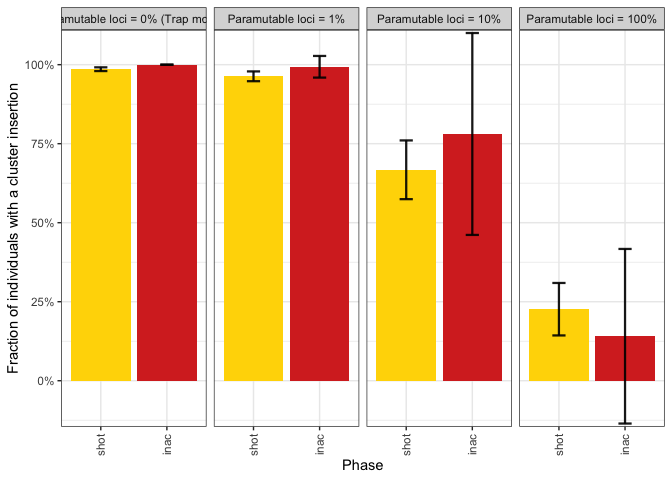
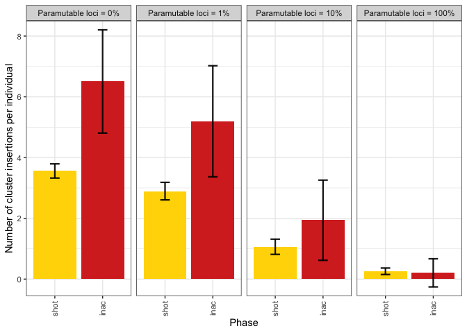
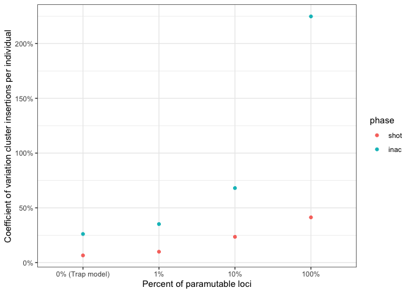
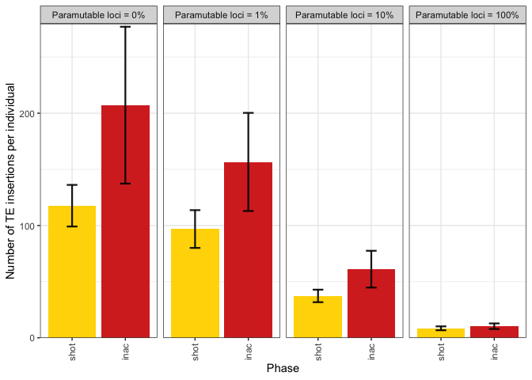
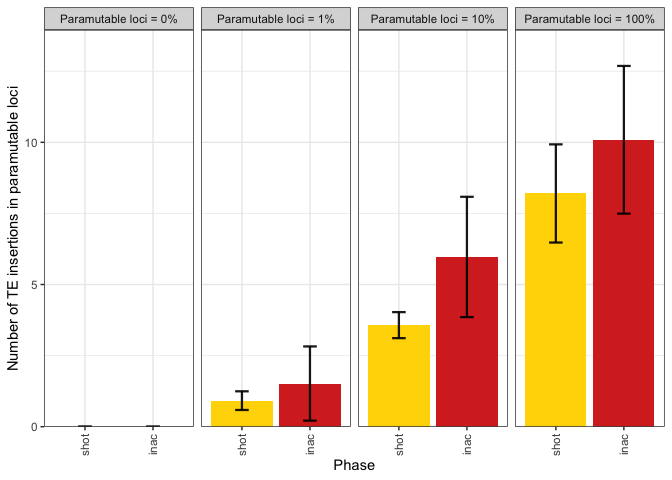
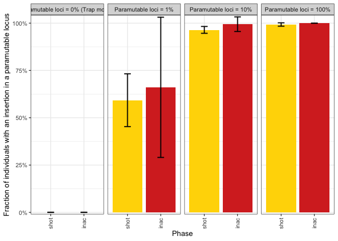
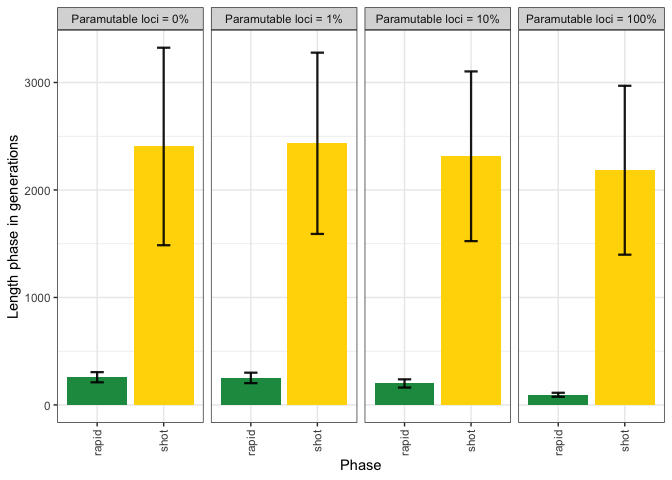

2022_08_24_Simulation_1\_2_Phases
================
Almo
2022-08-24

## Introduction

With this simulation we wanted to understand the impact of the
paramutable loci in the transposable elements invasion phases.

### Initial conditions:

A population of 1000, 5 chromosomes of size 10 Mb, 5 piRNA clusters of
size 300 Kb and an initial number of TEs in the population equal to 100.

We used 100 replicates for each simulation.

## Materials & Methods

version: invadego0.2.1

-   seed p0: 1660125902621584000

-   seed p1: 1660125902621656000

-   seed p10: 1660125902621702000

-   seed p100: 1660125902621592000

### Commands for the simulation:

``` bash
folder="/Users/ascarpa/Paramutations_TEs/Simulation/Raw"
tool="/Users/ascarpa/invade-invadego/invadego022"

$tool --N 1000 --gen 5000 --genome mb:10,10,10,10,10 --cluster kb:300,300,300,300,300 --rr 4,4,4,4,4 --rep 100 --u 0.1 --basepop 100 --steps 20 --sampleid p0 > $folder/2022_08_09_simulation_1_1 &

$tool --N 1000 --gen 5000 --genome mb:10,10,10,10,10 --cluster kb:300,300,300,300,300 --rr 4,4,4,4,4 --rep 100 --u 0.1 --basepop 100 --paramutation 100:1 --steps 20 --sampleid p1 > $folder/2022_08_09_simulation_1_2 &

$tool --N 1000 --gen 5000 --genome mb:10,10,10,10,10 --cluster kb:300,300,300,300,300 --rr 4,4,4,4,4 --rep 100 --u 0.1 --basepop 100 --paramutation 10:1 --steps 20 --sampleid p10 > $folder/2022_08_09_simulation_1_3 &

$tool --N 1000 --gen 5000 --genome mb:10,10,10,10,10 --cluster kb:300,300,300,300,300 --rr 4,4,4,4,4 --rep 100 --u 0.1 --basepop 100 --paramutation 1:0 --steps 20 --sampleid p100 > $folder/2022_08_09_simulation_1_4

cat 2022_08_09_simulation_1_1 2022_08_09_simulation_1_2 2022_08_09_simulation_1_3 2022_08_09_simulation_1_4 |grep -v "^Invade"|grep -v "^#" > 2022_08_09_Simulation_1_Paramutations
```

### Visualization in R

Setting the environment

``` r
library(tidyverse)
library(ggplot2)
library(patchwork)
theme_set(theme_bw())
```

Visualization:

``` r
setwd("/Users/ascarpa/Paramutations_TEs/Simulation/Raw")

df<-read.table("2022_08_09_Simulation_1_Paramutations", fill = TRUE, sep = "\t")
names(df)<-c("rep", "gen", "popstat", "fmale", "spacer_1", "fwte", "avw", "avtes", "avpopfreq", "fixed",
             "spacer_2", "phase", "fwpirna", "spacer_3", "fwcli", "avcli", "fixcli", "spacer_4", "fwpar_yespi",
             "fwpar_nopi", "avpar","fixpar","spacer_5","piori","orifreq","spacer 6", "sampleid")

df$phase <- factor(df$phase, levels=c("rapi", "trig", "shot", "inac"))
df$sampleid <- factor(df$sampleid, levels=c("p0", "p1", "p10","p100"))


df1 <- subset(df, phase %in% c("shot", "inac"))
df2 <- data.frame()

#new dataframe with only the first shotgun & the first inactive phase of each replicate
repcheck = 1
x = 1
y = 1
while (x<nrow(df1)) {
  if (repcheck != df1[x, 1]){
    y = 1
  }
  if (y == 1){
    if(df1[x, 12]  == "shot"){
      df2<-rbind(df2,df1[x,])
      y = 2
      repcheck = df1[x, 1]
    }
  }
  if (y == 2){
    if(df1[x, 12] == "inac"){
      df2<-rbind(df2,df1[x,])
      y = 1
    }
  }
  x = x+1
}

#Summary statistics
df2<-select (df2,-c(28))

df_count <- df2 %>%
  count(sampleid, phase)

df_summary <- df2 %>% 
  group_by(sampleid, phase) %>%
  summarize(av_fwcli = mean(fwcli), sd_fwcli = sd(fwcli),
            av_cli = mean(avcli), sd_cli = sd(avcli), cv_cli_percent = sd(avcli)/mean(avcli),
            av_tes = mean(avtes), sd_tes = sd(avtes), cv_tes_percent = sd(avtes)/mean(avtes),
            av_par = mean(avpar), sd_par = sd(avpar),
            av_fwpar_yespi = mean(fwpar_yespi), sd_fwpar_yespi = sd(fwpar_yespi),
            length_previous_phase = mean(gen),
            sd_gen_phases = sd(gen))

df_summary <- cbind(df_count$n, df_summary)
colnames(df_summary)[1] ="n"

#CI 95%: z* sd/sqrt(population)
df_summary$ci_fwcli <- qt(0.975,df=df_summary$n-1)*(df_summary$sd_fwcli/sqrt(df_summary$n))
df_summary$ci_cli <- qt(0.975,df=df_summary$n-1)*(df_summary$sd_cli/sqrt(df_summary$n))
df_summary$ci_tes <- qt(0.975,df=df_summary$n-1)*(df_summary$sd_tes/sqrt(df_summary$n))
df_summary$ci_par <- qt(0.975,df=df_summary$n-1)*(df_summary$sd_par/sqrt(df_summary$n))
df_summary$ci_fwpar_yespi <- qt(0.975,df=df_summary$n-1)*(df_summary$sd_fwpar_yespi/sqrt(df_summary$n))

g <- ggplot(df_summary, aes(x=phase, y=av_fwcli, fill = phase)) + 
  geom_bar(stat = "identity") +
  geom_errorbar( aes(x=phase, ymin=av_fwcli-sd_fwcli, ymax=av_fwcli+sd_fwcli), width=0.2, colour="black", alpha=0.9, size=0.8)+
  ylab("Fraction of individuals with a cluster insertion")+
  xlab("Phase")+
  scale_y_continuous(labels = scales::percent, expand = c(0, 0.01))+
  scale_fill_manual(values = c("yellow", "red"))+
  theme(legend.position="none", axis.text.x = element_text(angle = 90, vjust = 0.5, hjust=1))+
  facet_wrap(~sampleid, ncol=4, labeller = labeller(sampleid = 
                                              c("p0" = "Paramutable loci = 0% (Trap model)",
                                                "p1" = "Paramutable loci = 1%",
                                                "p10" = "Paramutable loci = 10%",
                                                "p100" = "Paramutable loci = 100%")))

plot(g)
```

<!-- -->

``` r
g_2 <- ggplot(df_summary, aes(x=phase, y=av_cli, fill = phase)) + 
  geom_bar(stat = "identity") +
  geom_errorbar( aes(x=phase, ymin=av_cli-sd_cli, ymax=av_cli+sd_cli), width=0.2, colour="black", alpha=0.9, size=0.8)+
  ylab("Number of cluster insertions per individual")+
  xlab("Phase")+
  scale_y_continuous(expand = c(0, 0.3))+
  scale_fill_manual(values = c("yellow", "red"))+
  theme(legend.position="none", axis.text.x = element_text(angle = 90, vjust = 0.5, hjust=1))+
  facet_wrap(~sampleid, ncol=4, labeller = labeller(sampleid = 
                                              c("p0" = "Paramutable loci = 0%",
                                                "p1" = "Paramutable loci = 1%",
                                                "p10" = "Paramutable loci = 10%",
                                                "p100" = "Paramutable loci = 100%")))

plot(g_2)
```

<!-- -->

``` r
g_2_2 <- ggplot(df_summary, aes(x=sampleid, y=cv_cli_percent))+
  geom_point(aes(colour = phase))+
  xlab("Percent of paramutable loci")+
  ylab("Coefficient of variation cluster insertions per individual")+
  scale_y_continuous(labels = scales::percent)+
  scale_x_discrete(labels = c("0% (Trap model)", "1%", "10%", "100%"))

plot(g_2_2)
```

<!-- -->

``` r
g_3 <- ggplot(df_summary, aes(x=phase, y=av_tes, fill = phase)) + 
  geom_bar(stat = "identity") +
  geom_errorbar( aes(x=phase, ymin=av_tes-sd_tes, ymax=av_tes+sd_tes), width=0.2, colour="black", alpha=0.9, size=0.8)+
  ylab("Number of TE insertions per individual")+
  xlab("Phase")+
  scale_y_continuous(expand = expansion(mult = c(0, 0.01)))+
  scale_fill_manual(values = c("yellow", "red"))+
  theme(legend.position="none", axis.text.x = element_text(angle = 90, vjust = 0.5, hjust=1))+
  facet_wrap(~sampleid, ncol=4, labeller = labeller(sampleid = 
                                                      c("p0" = "Paramutable loci = 0%",
                                                        "p1" = "Paramutable loci = 1%",
                                                        "p10" = "Paramutable loci = 10%",
                                                        "p100" = "Paramutable loci = 100%")))

plot(g_3)
```

<!-- -->

``` r
g_3_2 <- ggplot(df_summary, aes(x=sampleid, y=cv_tes_percent))+
  geom_point(aes(colour = phase))+
  xlab("Percent of paramutable loci")+
  ylab("Coefficient of variation TE insertions per individual")+
  scale_y_continuous(labels = scales::percent, limits = c(0, 0.4), expand = c(0, 0))+
  scale_x_discrete(labels = c("0% (Trap model)", "1%", "10%", "100%"))

plot(g_3_2)
```

<!-- -->

``` r
g_4 <- ggplot(df_summary, aes(x=phase, y=av_par, fill = phase)) + 
  geom_bar(stat = "identity") +
  geom_errorbar( aes(x=phase, ymin=av_par-sd_par, ymax=av_par+sd_par), width=0.2, colour="black", alpha=0.9, size=0.8)+
  ylab("Number of TE insertions in paramutable loci")+
  xlab("Phase")+
  scale_y_continuous(expand = expansion(mult = c(0, 0.1)))+
  scale_fill_manual(values = c("yellow", "red"))+
  theme(legend.position="none", axis.text.x = element_text(angle = 90, vjust = 0.5, hjust=1))+
  facet_wrap(~sampleid, ncol=4, labeller = labeller(sampleid = 
                                                      c("p0" = "Paramutable loci = 0%",
                                                        "p1" = "Paramutable loci = 1%",
                                                        "p10" = "Paramutable loci = 10%",
                                                        "p100" = "Paramutable loci = 100%")))

plot(g_4)
```

<!-- -->

``` r
g_5 <- ggplot(df_summary, aes(x=phase, y=av_fwpar_yespi, fill = phase)) + 
  geom_bar(stat = "identity") +
  geom_errorbar( aes(x=phase, ymin=av_fwpar_yespi-sd_fwpar_yespi, ymax=av_fwpar_yespi+sd_fwpar_yespi), width=0.2, colour="black", alpha=0.9, size=0.8)+
  ylab("Fraction of individuals with an insertion in a paramutable site")+
  xlab("Phase")+
  scale_y_continuous(labels = scales::percent, expand = c(0, 0.01))+
  scale_fill_manual(values = c("yellow", "red"))+
  theme(legend.position="none", axis.text.x = element_text(angle = 90, vjust = 0.5, hjust=1))+
  facet_wrap(~sampleid, ncol=4, labeller = labeller(sampleid = 
                                                      c("p0" = "Paramutable loci = 0% (Trap model)",
                                                        "p1" = "Paramutable loci = 1%",
                                                        "p10" = "Paramutable loci = 10%",
                                                        "p100" = "Paramutable loci = 100%")))

plot(g_5)
```

<!-- -->

``` r
df_phases <- df_summary %>%
  select("sampleid", "phase","length_previous_phase", "sd_gen_phases") %>%
  mutate(across("phase", str_replace, "shot", "rapid")) %>%
  mutate(across("phase", str_replace, "inac", "shot"))

df_phases$length_previous_phase[2]=df_phases$length_previous_phase[2]-df_phases$length_previous_phase[1]
df_phases$length_previous_phase[4]=df_phases$length_previous_phase[4]-df_phases$length_previous_phase[3]
df_phases$length_previous_phase[6]=df_phases$length_previous_phase[6]-df_phases$length_previous_phase[5]
df_phases$length_previous_phase[8]=df_phases$length_previous_phase[8]-df_phases$length_previous_phase[7]

names(df_phases) <- c("sampleid","phase", "length_phase", "sd_gen_phases")


g_6 <- ggplot(df_phases, aes(x=phase, y=length_phase, fill = phase)) + 
  geom_bar(stat = "identity") +
  geom_errorbar( aes(x=phase, ymin=length_phase-sd_gen_phases, ymax=length_phase+sd_gen_phases), width=0.2, colour="black", alpha=0.9, size=0.8)+
  ylab("Length phase in generations")+
  xlab("Phase")+
  scale_y_continuous(trans = "log2")+
  scale_fill_manual(values = c("green", "yellow"))+
  theme(legend.position="none", axis.text.x = element_text(angle = 90, vjust = 0.5, hjust=1))+
  facet_wrap(~sampleid, ncol=4, labeller = labeller(sampleid = 
                                                      c("p0" = "Paramutable loci = 0% (Trap model)",
                                                        "p1" = "Paramutable loci = 1%",
                                                        "p10" = "Paramutable loci = 10%",
                                                        "p100" = "Paramutable loci = 100%")))


plot(g_6)
```

<!-- -->

## Conclusions

Paramutations reduce the number of TEs.aramutations reduce the number of
cluster insertions.aramutations reduce the number of individuals with a
cluster insertion.ven with 1% of paramutable loci more than half of the
individuals have a paramutation. This is very interesting because even
if a small share of the genome has the ability to become a piRNA
producing locus this will still act in most of the
population.aramutations reduce the the length of the rapid phase.
