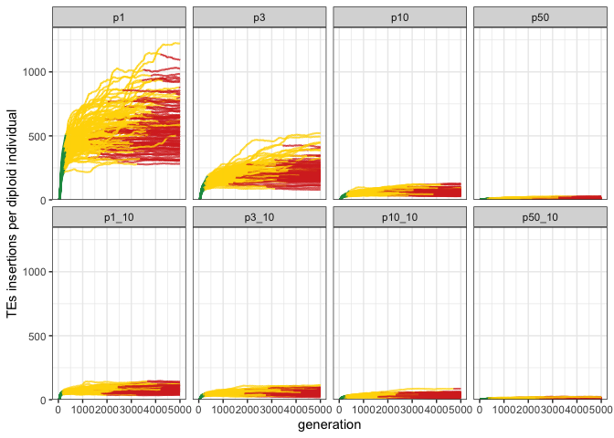
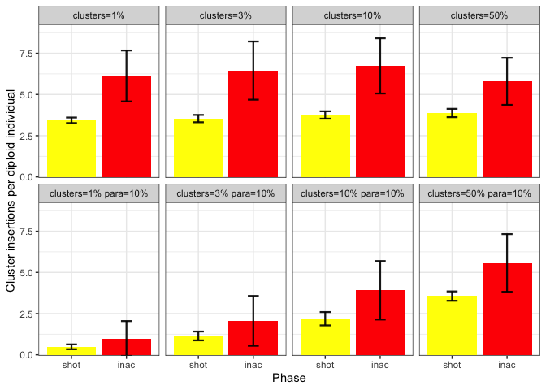
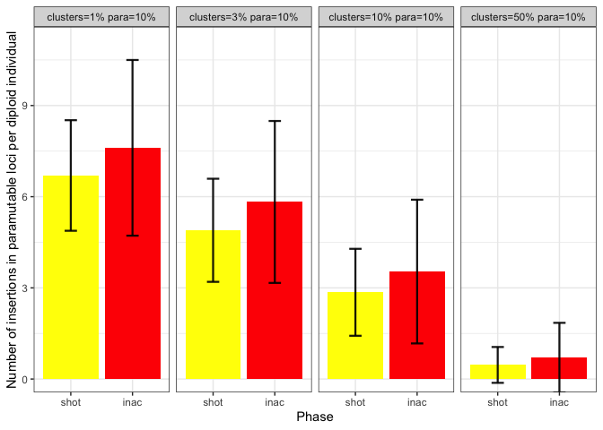

2022_08_29_Simulation_3
================
Almo
2022-08-24

## Introduction

In this simulation we compared the effect of of different piRNA clusters
sizes in a genome with the same share of paramutable loci.

### Initial conditions:

A population of 1000, 5 chromosomes of size 10 Mb, variable piRNA
clusters and an initial number of TEs in the population equal to 100.

We used 100 replicates for each simulation.

## Materials & Methods

version: invadego0.2.1

-   p1: 1% piRNA clusters seed: 1661785947834178000

-   p3: 3% piRNA clusters seed: 1661785947835167000

-   p10: 10% piRNA clusters seed : 1661785947835950000

-   p50: 50% piRNA clusters seed: 1661785947837048000

-   p1_10: 1% piRNA clusters 10% paramutable loci seed:
    1661785947838220000

-   p3_10: 3% piRNA clusters 10% paramutable loci seed:
    1661785947841443000

-   p10_10: 10% piRNA clusters 10% paramutable loci seed:
    1661785947840157000

-   p50_10: 50% piRNA clusters 10% paramutable loci seed:
    1661785947841216000

### Commands for the simulation:

``` bash
folder="/Users/ascarpa/Paramutations_TEs/Simulation/Raw"
tool="/Users/ascarpa/invade-invadego/invadego022"

$tool --N 1000 --gen 5000 --genome mb:10,10,10,10,10 --cluster kb:100,100,100,100,100 --rr 4,4,4,4,4 --rep 100 --u 0.1 --basepop 100 --steps 20 --sampleid p1 > $folder/2022_08_29_simulation_3_1 &

$tool --N 1000 --gen 5000 --genome mb:10,10,10,10,10 --cluster kb:300,300,300,300,300 --rr 4,4,4,4,4 --rep 100 --u 0.1 --basepop 100 --steps 20 --sampleid p3 > $folder/2022_08_29_simulation_3_2 &

$tool --N 1000 --gen 5000 --genome mb:10,10,10,10,10 --cluster mb:1,1,1,1,1 --rr 4,4,4,4,4 --rep 100 --u 0.1 --basepop 100 --steps 20 --sampleid p10 > $folder/2022_08_29_simulation_3_3 &

$tool --N 1000 --gen 5000 --genome mb:10,10,10,10,10 --cluster mb:5,5,5,5,5 --rr 4,4,4,4,4 --rep 100 --u 0.1 --basepop 100 --steps 20 --sampleid p50 > $folder/2022_08_29_simulation_3_4 &

$tool --N 1000 --gen 5000 --genome mb:10,10,10,10,10 --cluster kb:100,100,100,100,100 --rr 4,4,4,4,4 --rep 100 --u 0.1 --basepop 100 --paramutation 10:1 --steps 20 --sampleid p1_10 > $folder/2022_08_29_simulation_3_5 &

$tool --N 1000 --gen 5000 --genome mb:10,10,10,10,10 --cluster kb:300,300,300,300,300 --rr 4,4,4,4,4 --rep 100 --u 0.1 --basepop 100 --paramutation 10:1 --steps 20 --sampleid p3_10 > $folder/2022_08_29_simulation_3_6 &

$tool --N 1000 --gen 5000 --genome mb:10,10,10,10,10 --cluster mb:1,1,1,1,1 --rr 4,4,4,4,4 --rep 100 --u 0.1 --basepop 100 --paramutation 10:1 --steps 20 --sampleid p10_10 > $folder/2022_08_29_simulation_3_7 &

$tool --N 1000 --gen 5000 --genome mb:10,10,10,10,10 --cluster mb:5,5,5,5,5 --rr 4,4,4,4,4 --rep 100 --u 0.1 --basepop 100 --paramutation 10:1 --steps 20 --sampleid p50_10 > $folder/2022_08_29_simulation_3_8
```

### Visualization in R

Setting the environment

``` r
library(tidyverse)
library(ggplot2)
library(patchwork)
library(dplyr)
```

Visualization:

``` r
p<-c("grey","#1a9850","#ffd700","#d73027")

df<-read.table("Raw/2022_08_29_Simulation_3_Clusters", fill = TRUE, sep = "\t")
names(df)<-c("rep", "gen", "popstat", "fmale", "spacer_1", "fwte", "avw", "avtes", "avpopfreq", "fixed",
             "spacer_2", "phase", "fwpirna", "spacer_3", "fwcli", "avcli", "fixcli", "spacer_4", "fwpar_yespi",
             "fwpar_nopi", "avpar","fixpar","spacer_5","piori","orifreq","spacer 6", "sampleid", "extra")

df$phase <- factor(df$phase, levels=c("rapi", "trig", "shot", "inac"))
df$sampleid <- factor(df$sampleid, levels=c("p1", "p3", "p10","p50", "p1_10", "p3_10", "p10_10","p50_10"))

df <- df %>% 
  select(-c("extra"))

g<-ggplot()+
  geom_line(data=df,aes(x=gen,y=avtes,group=rep,color=phase),alpha=1,size=0.7)+
  ylab("TEs insertions per diploid individual")+xlab("generation")+
  theme(legend.position="none")+
  scale_colour_manual(values=p)+
  facet_wrap(~sampleid, ncol=4)

plot(g)
```

<!-- -->

In the first row of the figure we can see (as expected) that the
increase of piRNA clusters reduce the average number of TEs insertions.
What is more interesting is the effect of paramutable loci (second row)
where the difference among the different amount of piRNA clusters is
reduced thanks to the paramutable loci.

``` r
g2<-ggplot()+
  geom_line(data=df,aes(x=gen,y=avcli,group=rep,color=phase),alpha=1,size=0.7)+
  ylab("cluster insertions per diploid individual")+xlab("generation")+
  theme(legend.position="none")+
  scale_colour_manual(values=p)+
  facet_wrap(~sampleid, ncol=4)

plot(g2)
```

<!-- -->

``` r
df1 <- subset(df, phase %in% c("shot", "inac"))

df2 <- data.frame()

repcheck = 1
x = 1
y = 1
while (x<nrow(df1)+1) {
  if (repcheck != df1[x, 1]){
    y = 1
  }
  if (y == 1){
    if(df1[x, 12]  == "shot"){
      df2<-rbind(df2,df1[x,])
      y = 2
      repcheck = df1[x, 1]
    }
  }
  if (y == 2){
    if(df1[x, 12] == "inac"){
      df2<-rbind(df2,df1[x,])
      y = 1
    }
  }
  x = x+1
}

e <- df2 %>% 
  group_by(sampleid, phase) %>% 
  summarize(mean_avcli = mean(avcli), sd_avcli = sd(avcli))

g2_2 <- ggplot(e, aes(x=phase, y=mean_avcli, fill = phase)) + 
  geom_bar(stat = "identity") +
  geom_errorbar( aes(x=phase, ymin=mean_avcli-sd_avcli, ymax=mean_avcli+sd_avcli), width=0.2, colour="black", alpha=0.9, size=0.8)+
  ylab("cluster insertions per diploid individual")+
  xlab("phase")+
  scale_fill_manual(values = c("yellow", "red"))+
  facet_wrap(~sampleid, ncol=4)

plot(g2_2)
```

<!-- -->

Cluster insertions are costant in absence of paramutations even if the
length of the piRNA clusters increase. When there are paramutations and
few piRNA clusters the number of cluster insertions is dramatically
reduced, paramutations will do part of the job and therefore there will
be less cluster insertions

``` r
dfonlypara <- df %>%
  select(rep, gen, popstat, fmale, fwte, avw, avtes, avpopfreq, fixed, 
         phase, fwpirna, fwcli, avcli, fixcli, fwpar_yespi,
         fwpar_nopi, avpar,fixpar, piori, orifreq, sampleid) %>%
  filter(sampleid == "p1_10" | sampleid == "p3_10" | sampleid == "p10_10" | sampleid == "p50_10")


g3<-ggplot()+
  geom_line(data=dfonlypara,aes(x=gen,y=avpar,group=rep,color=phase),alpha=1,size=0.7)+
  ylab("paramutable site insertions per diploid individual")+xlab("generation")+
  theme(legend.position="none")+
  scale_colour_manual(values=p)+
  facet_wrap(~sampleid, ncol=4)

plot(g3)
```

<!-- -->

``` r
e_2 <- dfonlypara %>% 
  group_by(sampleid, phase) %>% 
  summarize(mean_avpar = mean(avpar), sd_avpar = sd(avpar))


e_2 <-subset(e_2, phase!="trig" & phase!="rapi")

g3_2 <- ggplot(e_2, aes(x=phase, y=mean_avpar, fill = phase)) + 
  geom_bar(stat = "identity") +
  geom_errorbar( aes(x=phase, ymin=mean_avpar-sd_avpar, ymax=mean_avpar+sd_avpar), width=0.2, colour="black", alpha=0.9, size=0.8)+
  ylab("paramutable insertions per diploid individual")+
  xlab("phase")+
  scale_fill_manual(values = c("yellow", "red"))+
  facet_wrap(~sampleid, ncol=4)

plot(g3_2)
```

<!-- -->

When the length of piRNA clusters increases there are less insertion in
paramutable loci.

## Conclusions

Paramutations dramatically diminish the influence of piRNA clusters.
