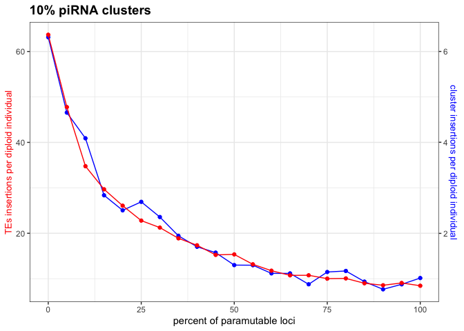
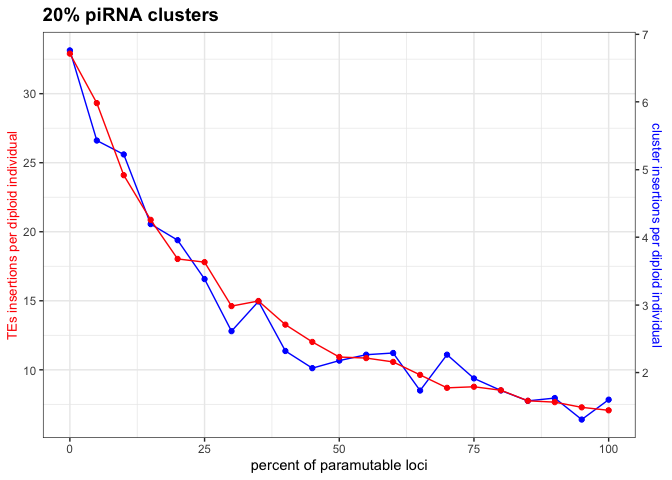

2022_09_31_Simulation_4\_clusters_paramutations
================
Almo
2022-08-31

## Introduction

### Initial conditions:

In this analysis every point in the graph represent the average
TEs/cluster insertions per diploid individual after 5000 generations, in
a population of 1000 individuals, different levels of piRNA clusters
(5%,10%,20%) and paramutable loci (form 0% to 100%) were used.

Every simulation had 100 replicates, the points in the graph are the
average of these replicates.

### Visualization in R

Setting the environment

``` r
library(tidyverse)
library(ggplot2)
```

Visualization:

``` r
setwd("/Users/ascarpa/Paramutations_TEs/Simulation/Raw")

df4_05<-read.table("2022_08_31_Simulation_4_05", fill = TRUE, sep = "\t")
df4_10<-read.table("2022_08_31_Simulation_4_10", fill = TRUE, sep = "\t")
df4_20<-read.table("2022_08_31_Simulation_4_20", fill = TRUE, sep = "\t")

names_df<-c("rep", "gen", "popstat", "fmale", "spacer_1", "fwte", "avw", "avtes", "avpopfreq", "fixed",
              "spacer_2", "phase", "fwpirna", "spacer_3", "fwcli", "avcli", "fixcli", "spacer_4", "fwpar_yespi",
              "fwpar_nopi", "avpar","fixpar","spacer_5","piori","orifreq","spacer 6", "sampleid", "extra")

names(df4_05)<-names_df
names(df4_10)<-names_df
names(df4_20)<-names_df

df4_05<-subset(df4_05, gen == 5000 )
df4_10<-subset(df4_10, gen == 5000 )
df4_20<-subset(df4_20, gen == 5000 )

df4_05 <- df4_05 %>% 
  select(-c("extra"))
df4_10 <- df4_10 %>% 
  select(-c("extra"))
df4_20 <- df4_20 %>% 
  select(-c("extra"))


df4_05_2<-df4_05 %>% 
  group_by(sampleid) %>% 
  summarize(mean_avcli = mean(avcli), sd_avcli = sd(avcli), mean_avtes = mean(avtes), sd_avtes = sd(avtes))
df4_10_2<-df4_10 %>% 
  group_by(sampleid) %>% 
  summarize(mean_avcli = mean(avcli), sd_avcli = sd(avcli), mean_avtes = mean(avtes), sd_avtes = sd(avtes))
df4_20_2<-df4_20 %>% 
  group_by(sampleid) %>% 
  summarize(mean_avcli = mean(avcli), sd_avcli = sd(avcli), mean_avtes = mean(avtes), sd_avtes = sd(avtes))

percent_para<-c(0,10,100,15,20,25,30,35,40,45,5,50,55,60,65,70,75,80,85,90,95)
df4_05_2$sampleid<-percent_para
df4_10_2$sampleid<-percent_para
df4_20_2$sampleid<-percent_para

df4_05_2 <-df4_05_2[order(df4_05_2$sampleid),]
df4_10_2 <-df4_10_2[order(df4_10_2$sampleid),]
df4_20_2 <-df4_20_2[order(df4_20_2$sampleid),]

coeff_05=20
g4_05<-ggplot(df4_05_2, aes(x=sampleid))+
  geom_point(aes(y=mean_avcli*coeff_05), color="blue")+
  geom_line(aes(y=mean_avcli*coeff_05), color="blue")+
  geom_point(aes(y=mean_avtes), color="red")+
  geom_line(aes(y=mean_avtes), color="red")+
  ggtitle("5% piRNA clusters")+
  scale_y_continuous(
    name = "TEs insertions per diploid individual",
    sec.axis = sec_axis(~./coeff_05, name="cluster insertions per diploid individual")
  )+
  xlab("percent of paramutable loci")+
  theme(legend.position="none",
        plot.title = element_text(size=14, face="bold"),
        axis.title.y = element_text(color = "red", size=10),
        axis.title.y.right = element_text(color = "blue", size=10)
  )

plot(g4_05)
```

<!-- -->

``` r
coeff_10=10
g4_10<-ggplot(df4_10_2, aes(x=sampleid))+
  geom_point(aes(y=mean_avcli*coeff_10), color="blue")+
  geom_line(aes(y=mean_avcli*coeff_10), color="blue")+
  geom_point(aes(y=mean_avtes), color="red")+
  geom_line(aes(y=mean_avtes), color="red")+
  ggtitle("10% piRNA clusters")+
  scale_y_continuous(
    name = "TEs insertions per diploid individual",
    sec.axis = sec_axis(~./coeff_10, name="cluster insertions per diploid individual")
  )+
  xlab("percent of paramutable loci")+
  theme(legend.position="none",
        plot.title = element_text(size=14, face="bold"),
        axis.title.y = element_text(color = "red", size=10),
        axis.title.y.right = element_text(color = "blue", size=10)
  )

plot(g4_10)
```

<!-- -->

``` r
coeff_20=4.9
g4_20<-ggplot(df4_20_2, aes(x=sampleid))+
  geom_point(aes(y=mean_avcli*coeff_20), color="blue")+
  geom_line(aes(y=mean_avcli*coeff_20), color="blue")+
  geom_point(aes(y=mean_avtes), color="red")+
  geom_line(aes(y=mean_avtes), color="red")+
  ggtitle("20% piRNA clusters")+
  scale_y_continuous(
    name = "TEs insertions per diploid individual",
    sec.axis = sec_axis(~./coeff_20, name="cluster insertions per diploid individual")
  )+
  xlab("percent of paramutable loci")+
  theme(legend.position="none",
        plot.title = element_text(size=14, face="bold"),
        axis.title.y = element_text(color = "red", size=10),
        axis.title.y.right = element_text(color = "blue", size=10)
  )

plot(g4_20)
```

<!-- -->

## Conclusions

It is clear how the increase of paramutable loci reduces the number of
TEs insertions by providing an extra defense mechanism. Paramutations
also reduce the number of cluster insertions. There is a moderate
variability among the replicates, but this trend of decrease in TEs &
cluster insertions with the increase in the paramutations is always
present.
