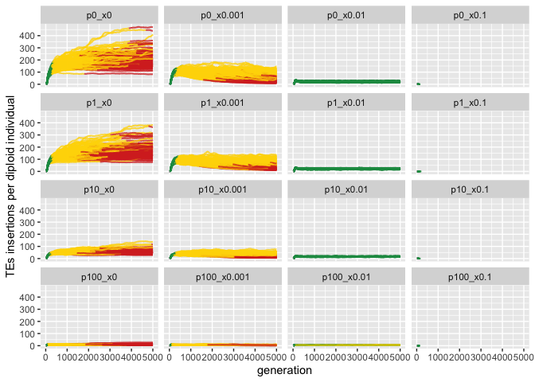
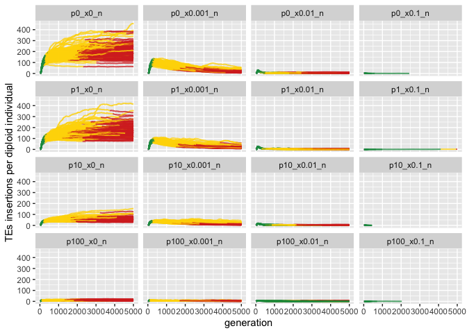
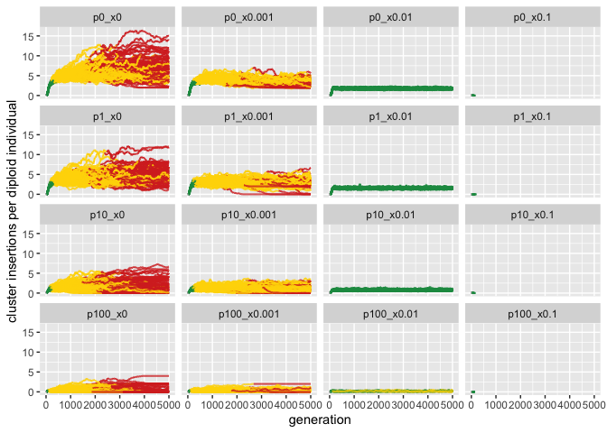
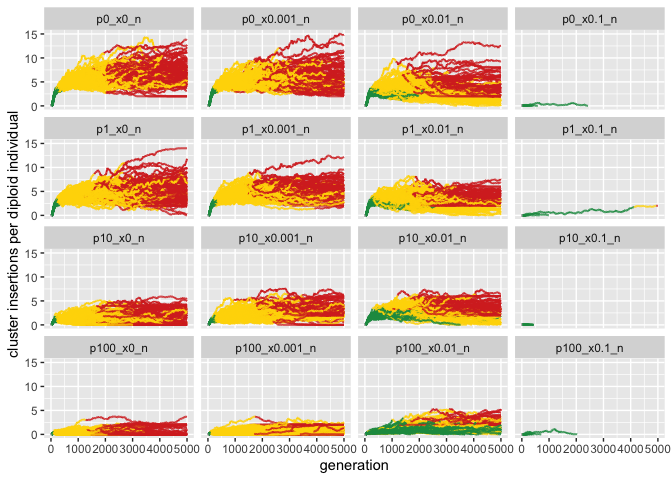
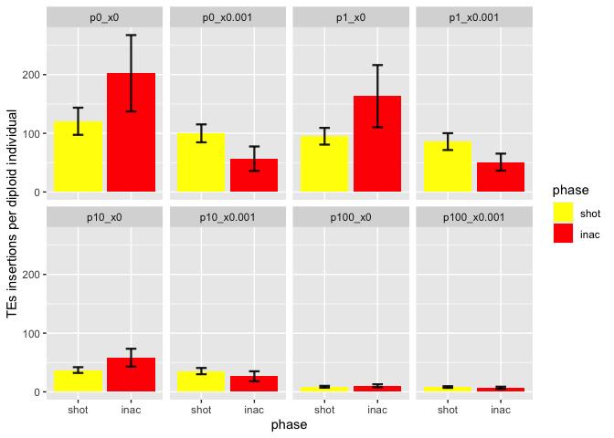
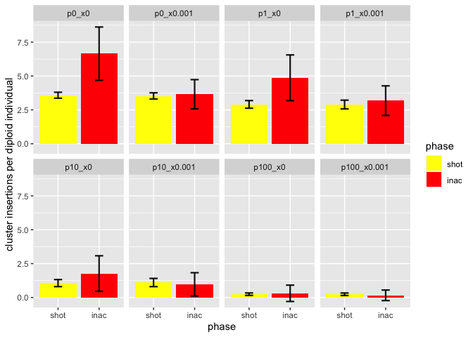
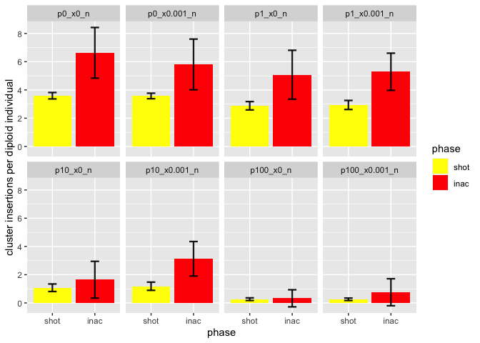
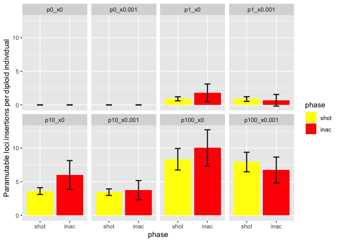
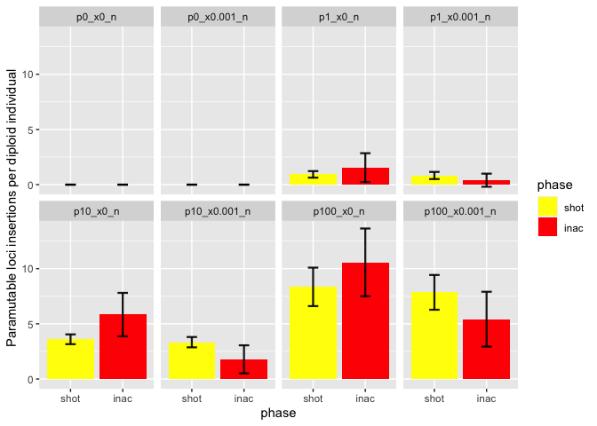

2022_08_31_Simulation_5\_Selection
================
Almo
2022-09-01

## Introduction

### Initial conditions:

## Materials & Methods

version: invadego0.2.1

-   seed p0_x0

-   seed p0_x0.001

-   seed p0_x0.01

-   seed p0_x0.1

-   seed p1_x0

-   seed p1_x0.001

-   seed p1_x0.01

-   seed p1_x0.1

### Commands for the simulation:

``` bash
folder="/Users/ascarpa/Paramutations_TEs/Simulation/Raw"
tool="/Users/ascarpa/invade-invadego/invadego022"

$tool --N 1000 --gen 5000 --genome mb:10,10,10,10,10 --cluster kb:300,300,300,300,300 --rr 4,4,4,4,4 --rep 100 --u 0.1 --basepop 100 --steps 20 --sampleid p0_x0 > $folder/2022_09_31_simulation_5_1 &

$tool --N 1000 --gen 5000 --genome mb:10,10,10,10,10 --cluster kb:300,300,300,300,300 --rr 4,4,4,4,4 --rep 100 --u 0.1 --basepop 100 -x 0.001 --steps 20 --sampleid p0_x0.001 > $folder/2022_09_31_simulation_5_2 &

$tool --N 1000 --gen 5000 --genome mb:10,10,10,10,10 --cluster kb:300,300,300,300,300 --rr 4,4,4,4,4 --rep 100 --u 0.1 --basepop 100 -x 0.01 --steps 20 --sampleid p0_x0.01 > $folder/2022_09_31_simulation_5_3 &

$tool --N 1000 --gen 5000 --genome mb:10,10,10,10,10 --cluster kb:300,300,300,300,300 --rr 4,4,4,4,4 --rep 100 --u 0.1 --basepop 100 -x 0.1 --steps 20 --sampleid p0_x0.1 > $folder/2022_09_31_simulation_5_4 &

$tool --N 1000 --gen 5000 --genome mb:10,10,10,10,10 --cluster kb:300,300,300,300,300 --rr 4,4,4,4,4 --rep 100 --u 0.1 --basepop 100 --paramutation 100:1 --steps 20 --sampleid p1_x0 > $folder/2022_09_31_simulation_5_5 &

$tool --N 1000 --gen 5000 --genome mb:10,10,10,10,10 --cluster kb:300,300,300,300,300 --rr 4,4,4,4,4 --rep 100 --u 0.1 --basepop 100 -x 0.001 --paramutation 100:1 --steps 20 --sampleid p1_x0.001 > $folder/2022_09_31_simulation_5_6 &

$tool --N 1000 --gen 5000 --genome mb:10,10,10,10,10 --cluster kb:300,300,300,300,300 --rr 4,4,4,4,4 --rep 100 --u 0.1 --basepop 100 -x 0.01 --paramutation 100:1 --steps 20 --sampleid p1_x0.01 > $folder/2022_09_31_simulation_5_7 &

$tool --N 1000 --gen 5000 --genome mb:10,10,10,10,10 --cluster kb:300,300,300,300,300 --rr 4,4,4,4,4 --rep 100 --u 0.1 --basepop 100 -x 0.1 --paramutation 100:1 --steps 20 --sampleid p1_x0.1 > $folder/2022_09_31_simulation_5_8 &

$tool --N 1000 --gen 5000 --genome mb:10,10,10,10,10 --cluster kb:300,300,300,300,300 --rr 4,4,4,4,4 --rep 100 --u 0.1 --basepop 100 --paramutation 10:1 --steps 20 --sampleid p10_x0 > $folder/2022_09_31_simulation_5_9 &

$tool --N 1000 --gen 5000 --genome mb:10,10,10,10,10 --cluster kb:300,300,300,300,300 --rr 4,4,4,4,4 --rep 100 --u 0.1 --basepop 100 -x 0.001 --paramutation 10:1 --steps 20 --sampleid p10_x0.001 > $folder/2022_09_31_simulation_5_10 &

$tool --N 1000 --gen 5000 --genome mb:10,10,10,10,10 --cluster kb:300,300,300,300,300 --rr 4,4,4,4,4 --rep 100 --u 0.1 --basepop 100 -x 0.01 --paramutation 10:1 --steps 20 --sampleid p10_x0.01 > $folder/2022_09_31_simulation_5_11 &

$tool --N 1000 --gen 5000 --genome mb:10,10,10,10,10 --cluster kb:300,300,300,300,300 --rr 4,4,4,4,4 --rep 100 --u 0.1 --basepop 100 -x 0.1 --paramutation 10:1 --steps 20 --sampleid p10_x0.1 > $folder/2022_09_31_simulation_5_12 &

$tool --N 1000 --gen 5000 --genome mb:10,10,10,10,10 --cluster kb:300,300,300,300,300 --rr 4,4,4,4,4 --rep 100 --u 0.1 --basepop 100 --paramutation 1:0 --steps 20 --sampleid p100_x0 > $folder/2022_09_31_simulation_5_13 &

$tool --N 1000 --gen 5000 --genome mb:10,10,10,10,10 --cluster kb:300,300,300,300,300 --rr 4,4,4,4,4 --rep 100 --u 0.1 --basepop 100 -x 0.001 --paramutation 1:0 --steps 20 --sampleid p100_x0.001 > $folder/2022_09_31_simulation_5_14 &

$tool --N 1000 --gen 5000 --genome mb:10,10,10,10,10 --cluster kb:300,300,300,300,300 --rr 4,4,4,4,4 --rep 100 --u 0.1 --basepop 100 -x 0.01 --paramutation 1:0 --steps 20 --sampleid p100_x0.01 > $folder/2022_09_31_simulation_5_15 &

$tool --N 1000 --gen 5000 --genome mb:10,10,10,10,10 --cluster kb:300,300,300,300,300 --rr 4,4,4,4,4 --rep 100 --u 0.1 --basepop 100 -x 0.1 --paramutation 1:0 --steps 20 --sampleid p100_x0.1 > $folder/2022_09_31_simulation_5_16 &

$tool --N 1000 --gen 5000 --genome mb:10,10,10,10,10 --cluster kb:300,300,300,300,300 --rr 4,4,4,4,4 --rep 100 --u 0.1 --basepop 100 -no-x-cluins --steps 20 --sampleid p0_x0_n > $folder/2022_09_31_simulation_5_1_noxclu &

$tool --N 1000 --gen 5000 --genome mb:10,10,10,10,10 --cluster kb:300,300,300,300,300 --rr 4,4,4,4,4 --rep 100 --u 0.1 --basepop 100 -x 0.001 -no-x-cluins --steps 20 --sampleid p0_x0.001_n > $folder/2022_09_31_simulation_5_2_noxclu &

$tool --N 1000 --gen 5000 --genome mb:10,10,10,10,10 --cluster kb:300,300,300,300,300 --rr 4,4,4,4,4 --rep 100 --u 0.1 --basepop 100 -x 0.01 -no-x-cluins --steps 20 --sampleid p0_x0.01_n > $folder/2022_09_31_simulation_5_3_noxclu &

$tool --N 1000 --gen 5000 --genome mb:10,10,10,10,10 --cluster kb:300,300,300,300,300 --rr 4,4,4,4,4 --rep 100 --u 0.1 --basepop 100 -x 0.1 -no-x-cluins --steps 20 --sampleid p0_x0.1_n > $folder/2022_09_31_simulation_5_4_noxclu &

$tool --N 1000 --gen 5000 --genome mb:10,10,10,10,10 --cluster kb:300,300,300,300,300 --rr 4,4,4,4,4 --rep 100 --u 0.1 --basepop 100 --paramutation 100:1 -no-x-cluins --steps 20 --sampleid p1_x0_n > $folder/2022_09_31_simulation_5_5_noxclu &

$tool --N 1000 --gen 5000 --genome mb:10,10,10,10,10 --cluster kb:300,300,300,300,300 --rr 4,4,4,4,4 --rep 100 --u 0.1 --basepop 100 -x 0.001 --paramutation 100:1 -no-x-cluins --steps 20 --sampleid p1_x0.001_n > $folder/2022_09_31_simulation_5_6_noxclu &

$tool --N 1000 --gen 5000 --genome mb:10,10,10,10,10 --cluster kb:300,300,300,300,300 --rr 4,4,4,4,4 --rep 100 --u 0.1 --basepop 100 -x 0.01 --paramutation 100:1 -no-x-cluins --steps 20 --sampleid p1_x0.01_n > $folder/2022_09_31_simulation_5_7_noxclu &

$tool --N 1000 --gen 5000 --genome mb:10,10,10,10,10 --cluster kb:300,300,300,300,300 --rr 4,4,4,4,4 --rep 100 --u 0.1 --basepop 100 -x 0.1 --paramutation 100:1 -no-x-cluins --steps 20 --sampleid p1_x0.1_n > $folder/2022_09_31_simulation_5_8_noxclu &

$tool --N 1000 --gen 5000 --genome mb:10,10,10,10,10 --cluster kb:300,300,300,300,300 --rr 4,4,4,4,4 --rep 100 --u 0.1 --basepop 100 --paramutation 10:1 -no-x-cluins --steps 20 --sampleid p10_x0_n > $folder/2022_09_31_simulation_5_9_noxclu &

$tool --N 1000 --gen 5000 --genome mb:10,10,10,10,10 --cluster kb:300,300,300,300,300 --rr 4,4,4,4,4 --rep 100 --u 0.1 --basepop 100 -x 0.001 --paramutation 10:1 -no-x-cluins --steps 20 --sampleid p10_x0.001_n > $folder/2022_09_31_simulation_5_10_noxclu &

$tool --N 1000 --gen 5000 --genome mb:10,10,10,10,10 --cluster kb:300,300,300,300,300 --rr 4,4,4,4,4 --rep 100 --u 0.1 --basepop 100 -x 0.01 --paramutation 10:1 -no-x-cluins --steps 20 --sampleid p10_x0.01_n > $folder/2022_09_31_simulation_5_11_noxclu &

$tool --N 1000 --gen 5000 --genome mb:10,10,10,10,10 --cluster kb:300,300,300,300,300 --rr 4,4,4,4,4 --rep 100 --u 0.1 --basepop 100 -x 0.1 --paramutation 10:1 -no-x-cluins --steps 20 --sampleid p10_x0.1_n > $folder/2022_09_31_simulation_5_12_noxclu &

$tool --N 1000 --gen 5000 --genome mb:10,10,10,10,10 --cluster kb:300,300,300,300,300 --rr 4,4,4,4,4 --rep 100 --u 0.1 --basepop 100 --paramutation 1:0 -no-x-cluins --steps 20 --sampleid p100_x0_n > $folder/2022_09_31_simulation_5_13_noxclu &

$tool --N 1000 --gen 5000 --genome mb:10,10,10,10,10 --cluster kb:300,300,300,300,300 --rr 4,4,4,4,4 --rep 100 --u 0.1 --basepop 100 -x 0.001 --paramutation 1:0 -no-x-cluins --steps 20 --sampleid p100_x0.001_n > $folder/2022_09_31_simulation_5_14_noxclu &

$tool --N 1000 --gen 5000 --genome mb:10,10,10,10,10 --cluster kb:300,300,300,300,300 --rr 4,4,4,4,4 --rep 100 --u 0.1 --basepop 100 -x 0.01 --paramutation 1:0 -no-x-cluins --steps 20 --sampleid p100_x0.01_n > $folder/2022_09_31_simulation_5_15_noxclu &

$tool --N 1000 --gen 5000 --genome mb:10,10,10,10,10 --cluster kb:300,300,300,300,300 --rr 4,4,4,4,4 --rep 100 --u 0.1 --basepop 100 -x 0.1 --paramutation 1:0 -no-x-cluins --steps 20 --sampleid p100_x0.1_n > $folder/2022_09_31_simulation_5_16_noxclu
```

### Visualization in R

Setting the environment

``` r
library(tidyverse)
library(ggplot2)
```

Visualization:

``` r
p<-c("grey","#1a9850","#ffd700","#d73027")

setwd("/Users/ascarpa/Paramutations_TEs/Simulation/Raw")


df<-read.table("2022_08_31_Simulation_5_Selection", fill = TRUE, sep = "\t")
names(df)<-c("rep", "gen", "popstat", "fmale", "spacer_1", "fwte", "avw", "avtes", "avpopfreq", "fixed",
             "spacer_2", "phase", "fwpirna", "spacer_3", "fwcli", "avcli", "fixcli", "spacer_4", "fwpar_yespi",
             "fwpar_nopi", "avpar","fixpar","spacer_5","piori","orifreq","spacer 6", "sampleid", "extra")

df$phase <- factor(df$phase, levels=c("rapi", "trig", "shot", "inac"))

df_x<-subset(df, grepl("^.+(0|1)$", sampleid))
df_noxclu<-subset(df, grepl("^.+(_n)$", sampleid))

g_x<-ggplot()+
  geom_line(data=df_x,aes(x=gen,y=avtes,group=rep,color=phase),alpha=1,size=0.7)+
  ylab("TEs insertions per diploid individual")+xlab("generation")+
  theme(legend.position="none")+
  scale_colour_manual(values=p)+
  facet_wrap(~sampleid)

plot(g_x)
```

<!-- -->

``` r
g_noxclu<-ggplot()+
  geom_line(data=df_noxclu,aes(x=gen,y=avtes,group=rep,color=phase),alpha=1,size=0.7)+
  ylab("TEs insertions per diploid individual")+xlab("generation")+
  theme(legend.position="none")+
  scale_colour_manual(values=p)+
  facet_wrap(~sampleid)

plot(g_noxclu)
```

<!-- -->

``` r
g_x_2<-ggplot()+
  geom_line(data=df_x,aes(x=gen,y=(avcli),group=rep,color=phase),alpha=1,size=0.7)+
  ylab("cluster insertions per diploid individual")+xlab("generation")+
  theme(legend.position="none")+
  scale_colour_manual(values=p)+
  facet_wrap(~sampleid)

plot(g_x_2)
```

<!-- -->

``` r
g_noxclu<-ggplot()+
  geom_line(data=df_noxclu,aes(x=gen,y=avcli,group=rep,color=phase),alpha=1,size=0.7)+
  ylab("cluster insertions per diploid individual")+xlab("generation")+
  theme(legend.position="none")+
  scale_colour_manual(values=p)+
  facet_wrap(~sampleid)

plot(g_noxclu)
```

<!-- -->

``` r
df_x_2 <- subset(df_x, phase %in% c("shot", "inac"))
df_x_3 <- data.frame()
repcheck = 1
x = 1
y = 1

while (x<nrow(df_x_2)) {
  if (repcheck != df_x_2[x, 1]){
    y = 1
  }
  if (y == 1){
    if(df_x_2[x, 12]  == "shot"){
      df_x_3<-rbind(df_x_3,df_x_2[x,])
      y = 2
      repcheck = df_x_2[x, 1]
    }
  }
  if (y == 2){
    if(df_x_2[x, 12] == "inac"){
      df_x_3<-rbind(df_x_3,df_x_2[x,])
      y = 1
    }
  }
  x = x+1
}


e_x <- df_x_3 %>% 
  group_by(sampleid, phase) %>% 
  summarize(mean_avtes = mean(avtes), sd_avtes = sd(avtes), mean_avcli = mean(avcli), sd_avcli = sd(avcli), mean_avpar = mean(avpar), sd_avpar = sd(avpar))

e_x <- e_x[-c(17),]


g_x_3 <- ggplot(e_x, aes(x=phase, y=mean_avtes, fill = phase)) + 
  geom_bar(stat = "identity") +
  geom_errorbar( aes(x=phase, ymin=mean_avtes-sd_avtes, ymax=mean_avtes+sd_avtes), width=0.2, colour="black", alpha=0.9, size=0.8)+
  ylab("TEs insertions per diploid individual")+
  xlab("phase")+
  scale_fill_manual(values = c("yellow", "red"))+
  facet_wrap(~sampleid, ncol=4)

plot(g_x_3)
```

<!-- -->

There is a decrease in TEs insertions over the generations. This is
interesting because this means that in a real scenario if selection is
strong average TEs insertions in a population would reach a maximum and
then decrease, while in the case without selection they would plateau at
the maximum.

``` r
g_x_4 <- ggplot(e_x, aes(x=phase, y=mean_avcli, fill = phase)) + 
  geom_bar(stat = "identity") +
  geom_errorbar( aes(x=phase, ymin=mean_avcli-sd_avcli, ymax=mean_avcli+sd_avcli), width=0.2, colour="black", alpha=0.9, size=0.8)+
  ylab("cluster insertions per diploid individual")+
  xlab("phase")+
  scale_fill_manual(values = c("yellow", "red"))+
  facet_wrap(~sampleid, ncol=4)

plot(g_x_4)
```

<!-- -->

``` r
df_x_4 <- subset(df_noxclu, phase %in% c("shot", "inac"))
df_x_5 <- data.frame()
repcheck = 1
x = 1
y = 1
while (x<nrow(df_x_4)) {
  if (repcheck != df_x_4[x, 1]){
    y = 1
  }
  if (y == 1){
    if(df_x_4[x, 12]  == "shot"){
      df_x_5<-rbind(df_x_5,df_x_4[x,])
      y = 2
      repcheck = df_x_4[x, 1]
    }
  }
  if (y == 2){
    if(df_x_4[x, 12] == "inac"){
      df_x_5<-rbind(df_x_5,df_x_4[x,])
      y = 1
    }
  }
  x = x+1
}


e_noxclu <- df_x_5 %>% 
  group_by(sampleid, phase) %>% 
  summarize(mean_avcli = mean(avcli), sd_avcli = sd(avcli), mean_avpar = mean(avpar), sd_avpar = sd(avpar))

e_noxclu <- e_noxclu[-c(5,6,11,12,13,14,19,20,25,26),]


g_noxclu_4 <- ggplot(e_noxclu, aes(x=phase, y=mean_avcli, fill = phase)) + 
  geom_bar(stat = "identity") +
  geom_errorbar( aes(x=phase, ymin=mean_avcli-sd_avcli, ymax=mean_avcli+sd_avcli), width=0.2, colour="black", alpha=0.9, size=0.8)+
  ylab("cluster insertions per diploid individual")+
  xlab("phase")+
  scale_fill_manual(values = c("yellow", "red"))+
  facet_wrap(~sampleid, ncol=4)

plot(g_noxclu_4)
```

<!-- -->

In the second case, in which selection does not affect cluster
insertions, there were more plots, but only the same as the previous
case were mantained. This was done to allow a more easy comparison. The
second case show more cluster insertions because they are not removed by
selection. It is interesting to see the trend and how it changes with
different levels of paramutations.

``` r
g_x_5 <- ggplot(e_x, aes(x=phase, y=mean_avpar, fill = phase)) + 
  geom_bar(stat = "identity") +
  geom_errorbar( aes(x=phase, ymin=mean_avpar-sd_avpar, ymax=mean_avpar+sd_avpar), width=0.2, colour="black", alpha=0.9, size=0.8)+
  ylab("Paramutable loci insertions per diploid individual")+
  xlab("phase")+
  scale_fill_manual(values = c("yellow", "red"))+
  facet_wrap(~sampleid, ncol=4)

plot(g_x_5)
```

<!-- -->

``` r
g_noxclu_5 <- ggplot(e_noxclu, aes(x=phase, y=mean_avpar, fill = phase)) + 
  geom_bar(stat = "identity") +
  geom_errorbar( aes(x=phase, ymin=mean_avpar-sd_avpar, ymax=mean_avpar+sd_avpar), width=0.2, colour="black", alpha=0.9, size=0.8)+
  ylab("Paramutable loci insertions per diploid individual")+
  xlab("phase")+
  scale_fill_manual(values = c("yellow", "red"))+
  facet_wrap(~sampleid, ncol=4)

plot(g_noxclu_5)
```

<!-- -->

## Conclusions

I think the case in which selection does not act on clusters should be
generalized to paramutations. If cluster and in general piRNA producing
exist it is to prevent the TE invasions, therefore selection should not
act on them when they start to produce piRNAs since this is their
purpose. It make sense to mantain both the option in the models, but I
think a third one where neither clusters or paramutable loci are
affected by selection should be added.
