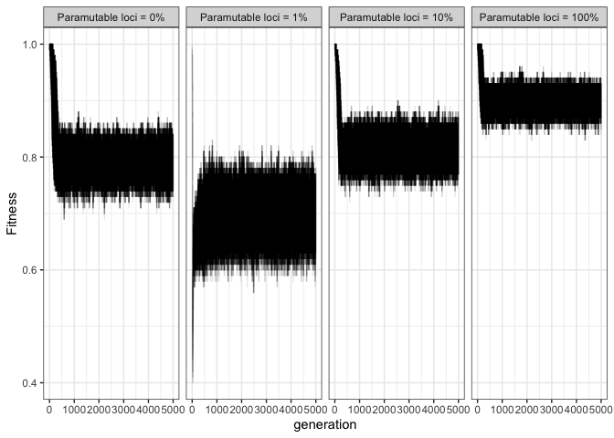

2022_10_18_Simulation_6\_Fitness
================
Almo
2022-10-18

## Introduction

With this simulation we wanted to understand the role of paramutations
on fitness during a TEs invasion.

### Initial conditions:

A population of 1000, 5 chromosomes of size 10 Mb, 5 piRNA clusters of
size 300 Kb and an initial number of TEs in the population equal to 100.

We used 100 replicates for each simulation.

## Materials & Methods

version: invadego0.2.1

### Commands for the simulation:

``` bash
```

### Visualization in R

Setting the environment

``` r
library(tidyverse)
library(ggplot2)
theme_set(theme_bw())
```

Visualization:

``` r
setwd("/Users/ascarpa/Paramutations_TEs/Simulation/Raw")


df_0.02<-read.table("2022_10_18_Simulation_6_Fitness_0.02", fill = TRUE, sep = "\t")
df_0.03<-read.table("2022_10_18_Simulation_6_Fitness_0.03", fill = TRUE, sep = "\t")
df_0.05<-read.table("2022_10_18_Simulation_6_Fitness_0.05", fill = TRUE, sep = "\t")
df_0.02_noxclu<-read.table("2022_10_18_Simulation_6_Fitness_0.02_noxclu", fill = TRUE, sep = "\t")
df_0.03_noxclu<-read.table("2022_10_18_Simulation_6_Fitness_0.03_noxclu", fill = TRUE, sep = "\t")
df_0.05_noxclu<-read.table("2022_10_18_Simulation_6_Fitness_0.05_noxclu", fill = TRUE, sep = "\t")

naming <- c("rep", "gen", "popstat", "fmale", "spacer_1", "fwte", "avw", "avtes", "avpopfreq", "fixed",
             "spacer_2", "phase", "fwpirna", "spacer_3", "fwcli", "avcli", "fixcli", "spacer_4", "fwpar_yespi",
             "fwpar_nopi", "avpar","fixpar","spacer_5","piori","orifreq","spacer 6", "sampleid", "extra")
names(df_0.02) <- naming
names(df_0.03) <- naming
names(df_0.05) <- naming
names(df_0.02_noxclu) <- naming
names(df_0.03_noxclu) <- naming
names(df_0.05_noxclu) <- naming


g_A_0.02 <- ggplot(df_0.02,aes(x = gen, y = avtes))+
  geom_line(alpha=0.1)+
  xlab("generation")+
  ylab("TEs insertions per diploid individual")+
  facet_wrap(~sampleid, ncol=4, labeller = labeller(sampleid =
                                            c("p0_x0.02" = "Paramutable loci = 0%",
                                              "p1_x0.02" = "Paramutable loci = 1%",
                                              "p10_x0.02" = "Paramutable loci = 10%",
                                              "p100_x0.02" = "Paramutable loci = 100%")))
plot(g_A_0.02)
```

<!-- -->

``` r
g_B_0.02 <- ggplot(df_0.02,aes(x = gen, y = avw))+
  geom_line(alpha=0.1)+
  xlab("generation")+
  ylab("Fitness")+
  facet_wrap(~sampleid, ncol=4, labeller = labeller(sampleid =
                                            c("p0_x0.02" = "Paramutable loci = 0%",
                                              "p1_x0.02" = "Paramutable loci = 1%",
                                              "p10_x0.02" = "Paramutable loci = 10%",
                                              "p100_x0.02" = "Paramutable loci = 100%")))
plot(g_B_0.02)
```

<!-- -->

``` r
g_A_0.03 <- ggplot(df_0.03,aes(x = gen, y = avtes))+
  geom_line(alpha=0.1)+
  xlab("generation")+
  ylab("TEs insertions per diploid individual")+
  facet_wrap(~sampleid, ncol=4, labeller = labeller(sampleid =
                                              c("p0_x0.03" = "Paramutable loci = 0%",
                                                "p1_x0.03" = "Paramutable loci = 1%",
                                                "p10_x0.03" = "Paramutable loci = 10%",
                                                "p100_x0.03" = "Paramutable loci = 100%")))
plot(g_A_0.03)
```

<!-- -->

``` r
g_B_0.03 <- ggplot(df_0.03,aes(x = gen, y = avw))+
  geom_line(alpha=0.1)+
  xlab("generation")+
  ylab("Fitness")+
  facet_wrap(~sampleid, ncol=4, labeller = labeller(sampleid =
                                              c("p0_x0.03" = "Paramutable loci = 0%",
                                                "p1_x0.03" = "Paramutable loci = 1%",
                                                "p10_x0.03" = "Paramutable loci = 10%",
                                                "p100_x0.03" = "Paramutable loci = 100%")))
plot(g_B_0.03)
```

<!-- -->

``` r
g_A_0.05 <- ggplot(df_0.05,aes(x = gen, y = avtes))+
  geom_line(alpha=0.1)+
  xlab("generation")+
  ylab("TEs insertions per diploid individual")+
  facet_wrap(~sampleid, ncol=4, labeller = labeller(sampleid =
                                              c("p0_x0.05" = "Paramutable loci = 0%",
                                                "p1_x0.05" = "Paramutable loci = 1%",
                                                "p10_x0.05" = "Paramutable loci = 10%",
                                                "p100_x0.05" = "Paramutable loci = 100%")))
plot(g_A_0.05)
```

<!-- -->

``` r
g_B_0.05 <- ggplot(df_0.05,aes(x = gen, y = avw))+
  geom_line(alpha=0.1)+
  xlab("generation")+
  ylab("Fitness")+
  facet_wrap(~sampleid, ncol=4, labeller = labeller(sampleid =
                                              c("p0_x0.05" = "Paramutable loci = 0%",
                                                "p1_x0.05" = "Paramutable loci = 1%",
                                                "p10_x0.05" = "Paramutable loci = 10%",
                                                "p100_x0.05" = "Paramutable loci = 100%")))
plot(g_B_0.05)
```

<!-- -->

``` r
g_A_0.02_noxclu <- ggplot(df_0.02_noxclu,aes(x = gen, y = avtes))+
  geom_line(alpha=0.1)+
  xlab("generation")+
  ylab("TEs insertions per diploid individual")+
  facet_wrap(~sampleid, ncol=4, labeller = labeller(sampleid =
                                              c("p0_x0.02" = "Paramutable loci = 0%",
                                                "p1_x0.02" = "Paramutable loci = 1%",
                                                "p10_x0.02" = "Paramutable loci = 10%",
                                                "p100_x0.02" = "Paramutable loci = 100%")))
plot(g_A_0.02_noxclu)
```

<!-- -->

``` r
g_B_0.02_noxclu <- ggplot(df_0.02_noxclu,aes(x = gen, y = avw))+
  geom_line(alpha=0.1)+
  xlab("generation")+
  ylab("Fitness")+
  facet_wrap(~sampleid, ncol=4, labeller = labeller(sampleid =
                                              c("p0_x0.02" = "Paramutable loci = 0%",
                                                "p1_x0.02" = "Paramutable loci = 1%",
                                                "p10_x0.02" = "Paramutable loci = 10%",
                                                "p100_x0.02" = "Paramutable loci = 100%")))
plot(g_B_0.02_noxclu)
```

<!-- -->

``` r
g_A_0.03_noxclu <- ggplot(df_0.03_noxclu,aes(x = gen, y = avtes))+
  geom_line(alpha=0.1)+
  xlab("generation")+
  ylab("TEs insertions per diploid individual")+
  facet_wrap(~sampleid, ncol=4, labeller = labeller(sampleid = 
                                              c("p0_x0.03" = "Paramutable loci = 0%",
                                                "p1_x0.03" = "Paramutable loci = 1%",
                                                "p10_x0.03" = "Paramutable loci = 10%",
                                                "p100_x0.03" = "Paramutable loci = 100%")))
plot(g_A_0.03_noxclu)
```

<!-- -->

``` r
g_B_0.03_noxclu <- ggplot(df_0.03_noxclu,aes(x = gen, y = avw))+
  geom_line(alpha=0.12)+
  xlim(0,2500)+
  xlab("generation")+
  ylab("Fitness")+
  facet_wrap(~sampleid, ncol=4, labeller = labeller(sampleid =
                                                      c("p0_x0.03" = "Paramutable loci = 0%",
                                                        "p1_x0.03" = "Paramutable loci = 1%",
                                                        "p10_x0.03" = "Paramutable loci = 10%",
                                                        "p100_x0.03" = "Paramutable loci = 100%")))
plot(g_B_0.03_noxclu)
```

<!-- -->

``` r
df_summary <- df_0.03_noxclu %>% 
  group_by(sampleid, rep) %>%
  summarize(min_fitness = min(avw))

df_summary$sampleid[df_summary$sampleid == "p0_x0.03"] <- "0% (Trap model)"
df_summary$sampleid[df_summary$sampleid == "p1_x0.03"] <- "1%"
df_summary$sampleid[df_summary$sampleid == "p10_x0.03"] <- "10%"
df_summary$sampleid[df_summary$sampleid == "p100_x0.03"] <- "100%"

boxplot(1-(df_summary$min_fitness) ~ df_summary$sampleid, xlab="Paramutable loci", ylab = "Fitness cost")
```

<!-- -->

``` r
g_A_0.05_noxclu <- ggplot(df_0.05_noxclu,aes(x = gen, y = avtes))+
  geom_line(alpha=0.1)+
  xlab("generation")+
  ylab("Fitness")+
  facet_wrap(~sampleid, ncol=4, labeller = labeller(sampleid =
                                              c("p0_x0.05" = "Paramutable loci = 0%",
                                                "p1_x0.05" = "Paramutable loci = 1%",
                                                "p10_x0.05" = "Paramutable loci = 10%",
                                                "p100_x0.05" = "Paramutable loci = 100%")))
plot(g_A_0.05_noxclu)
```

<!-- -->

``` r
g_B_0.05_noxclu <- ggplot(df_0.05_noxclu,aes(x = gen, y = avw))+
  geom_line(alpha=0.1)+
  xlab("generation")+
  ylab("Fitness")+
  facet_wrap(~sampleid, ncol=4, labeller = labeller(sampleid =
                                              c("p0_x0.05" = "Paramutable loci = 0%",
                                                "p1_x0.05" = "Paramutable loci = 1%",
                                                "p10_x0.05" = "Paramutable loci = 10%",
                                                "p100_x0.05" = "Paramutable loci = 100%")))
plot(g_B_0.05_noxclu)
```

<!-- -->

## Conclusions

An increase in paramutations reduces the fitness cost of the TEs during
an invasion.
