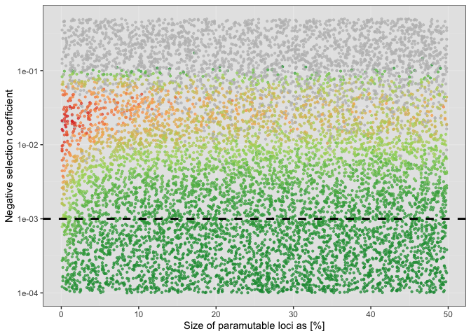
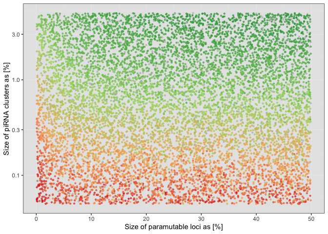
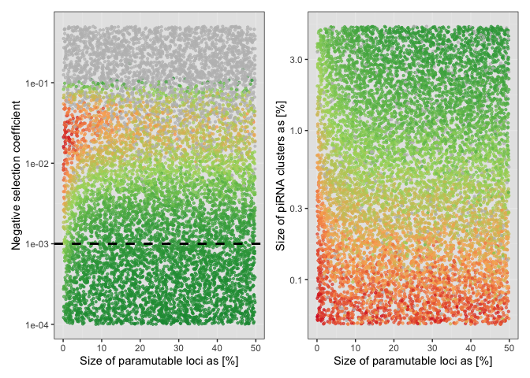

2022_11_07_Simulation_7\_Storm
================
Almo
2022-11-07

## Introduction

With this simulation we wanted to understand the role of paramutations
on minimu fitness during a TEs invasion.

### Initial conditions:

A population of 1000, 5 chromosomes of size 10 Mb

Every dot in the red to green gradient is a simulation at generation
5000, or less if it failed. If it failed due to the extinction of the
population the dot will be white, if it failed because all TEs were
removed from the population it will be grey.

## Materials & Methods

version: invadego0.2.3

### Commands for the simulation:

The simulations were generated using the code from:

-   simstorm_para_vs_selection
-   simstorm_para_vs_clusters

### Visualization in R

Setting the environment

``` r
library(tidyverse)
library(RColorBrewer)
library(ggplot2)
library(patchwork)
theme_set(theme_bw())
```

Visualization:

``` r
setwd("/Users/ascarpa/Paramutations_TEs/Simulation/Raw")
df<-read.table("2022_11_07_Simulation_7_sel_para_u02_clu100", sep = "\t", fill = TRUE, row.names=NULL)
df_2<-read.table("2022_11_7_Simulation_7_clu_para_u02_x001", sep = "\t", fill = TRUE, row.names=NULL)


naming <- c("rep", "gen", "popstat", "fmale", "spacer_1", "fwte", "avw", "min_w", "avtes", "avpopfreq", "fixed",
            "spacer_2", "phase", "fwpirna", "spacer_3", "fwcli", "avcli", "fixcli", "spacer_4", "fwpar_yespi",
            "fwpar_nopi", "avpar","fixpar","spacer_5","piori","orifreq","spacer 6", "sampleid_x", "sampleid_para","extra")

naming_2 <- c("rep", "gen", "popstat", "fmale", "spacer_1", "fwte", "avw", "min_w", "avtes", "avpopfreq", "fixed",
              "spacer_2", "phase", "fwpirna", "spacer_3", "fwcli", "avcli", "fixcli", "spacer_4", "fwpar_yespi",
              "fwpar_nopi", "avpar","fixpar","spacer_5","piori","orifreq","spacer 6", "sampleid_clu", "sampleid_para","extra")


names(df) <- naming
names(df_2) <- naming_2


df$sampleid_x <- as.numeric(df$sampleid_x)
df$sampleid_para <- as.numeric(df$sampleid_para)
df$min_w <- as.numeric(df$min_w)

df_2$sampleid_clu <- as.numeric(df_2$sampleid_clu)
df_2$sampleid_para <- as.numeric(df_2$sampleid_para)
df_2$min_w <- as.numeric(df_2$min_w)


#Keep only last generation, will be less then 5000 if fail
df<-subset(df, gen > 0)
df_2<-subset(df_2, gen > 0)


color.gradient <- function(x, colors=c("#D7191C","#FDAE61","#A6D96A","#1A9641"), colsteps=100) {
  return( colorRampPalette(colors) (colsteps) [ findInterval(x, seq(min(df$min_w),1.0, length.out=colsteps)) ] )
}

color.gradient_2 <- function(x, colors=c("#D7191C","#FDAE61","#A6D96A","#1A9641"), colsteps=100) {
  return( colorRampPalette(colors) (colsteps) [ findInterval(x, seq(min(df_2$min_w),1.0, length.out=colsteps)) ] )
}

df$col<-color.gradient(df$min_w)
df[df$popstat=="fail-0",]$col<-"grey"
df$col<-as.factor(df$col)

df_2$col<-color.gradient_2(df_2$min_w)
df_2[df_2$popstat=="fail-0",]$col<-"grey"
df_2$col<-as.factor(df_2$col)

g_para_selection<-ggplot(df,aes(x=sampleid_para/10,y=sampleid_x,color=col))+scale_color_manual(values=levels(df$col))+
  geom_point(alpha=0.7,size=0.8)+scale_y_log10()+
  ylab("Negative selection coefficient")+
  xlab("Size of paramutable loci as [%]")+
  geom_hline(aes(yintercept=0.001), linetype = "dashed", size=1)+
  theme(legend.position = "none",panel.background = element_rect(fill="grey90"))

plot(g_para_selection)
```

<!-- -->

``` r
g_para_cluster<-ggplot(df_2,aes(x=sampleid_para/10,y=sampleid_clu/100000,color=col))+scale_color_manual(values=levels(df_2$col))+
  geom_point(alpha=0.7,size=0.8)+scale_y_log10()+
  ylab("Size of piRNA clusters as [%]")+
  xlab("Size of paramutable loci as [%]")+
  theme(legend.position = "none",panel.background = element_rect(fill="grey90"))

plot(g_para_cluster)
```

<!-- -->

``` r
g_para_selection +g_para_cluster
```

<!-- -->

## Conclusions

There is a clear role in protecting the population from a serious
decrease of fitness. Given all other conditions equal a simulation with
more paramutable loci will have a higher minimum fitness, therefore the
chance for extinction is highly reduced.
