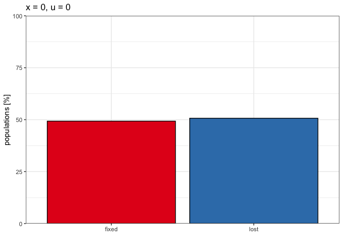

2022_11_18_Simulation_8\_Paramutation_fix
================
Almo
2022-11-18

## Introduction

With this simulation we wanted to study the possibility of fixation of a
paramutation in a population.

### Initial conditions:

A population of 1000, 1 chromosomes of size 10 Mb, no piRNA clusters and
a TE for each chromosome in position 1, the same position is also a
paramutable locus. Half of the population with maternal piRNA
deposition.

We used 1000 replicates for each simulation.

## Materials & Methods

version: invadego0.23

-   seed 8_1: 1668790104187535070

-   seed 8_2: 1669023324203668900

-   seed 8_3: 1669038874472705808

-   seed 8_4: 1669051103177746034

-   seed 8_5: 1669063981462188015

-   seed 8_6: 1674480537147505000

-   seed 8_7: 1669211281819967942

-   seed 8_8: 1669230616799732492

-   seed 8_9: 1669246284970453259

### Commands for the simulation:

``` bash
echo "500 R 1;1;1
500 R 0;1;1" > 2022_11_18_input_08

folder="/Users/ascarpa/Paramutations_TEs/Simulation/Raw"
tool="/Users/ascarpa/invade-invadego/invadego023"

$tool --N 1000 --basepop $folder/2022_11_18_input_08 --cluster kb:0 --u 0 --gen 5000 --genome mb:10 --steps 5000 --rr 4 --paramutation 999999:1 --rep 1000 --silent > $folder/2022_11_18_simulation_8_1

$tool --N 1000 --basepop $folder/2022_11_18_input_08 --cluster kb:0 --u 0.01 -x 0.01 --gen 500 --genome mb:10 --steps 100 --rr 4 --paramutation 999999:1 --rep 100 --silent > $folder/2022_11_18_simulation_8_2

$tool --N 1000 --basepop $folder/2022_11_18_input_08 --cluster kb:0 --u 0.01 -x 0.1 --gen 500 --genome mb:10 --steps 100 --rr 4 --paramutation 999999:1 --rep 100 --silent > $folder/2022_11_18_simulation_8_3

$tool --N 1000 --basepop $folder/2022_11_18_input_08 --cluster kb:0 --u 0.1 -x 0.01 --gen 500 --genome mb:10 --steps 100 --rr 4 --paramutation 999999:1 --rep 100 --silent > $folder/2022_11_18_simulation_8_4

$tool --N 1000 --basepop $folder/2022_11_18_input_08 --cluster kb:0 --u 0.1 -x 0.1 --gen 500 --genome mb:10 --steps 100 --rr 4 --paramutation 999999:1 --rep 100 --silent > $folder/2022_11_18_simulation_8_5

$tool --N 1000 --basepop $folder/2022_11_18_input_08 --cluster kb:0,0,0,0,0 --u 0 --gen 5000 --genome mb:10,10,10,10,10 --steps 5000 --rr 4,4,4,4,4 --paramutation 60000000:1 --rep 1000 --silent > $folder/2022_11_18_simulation_8_6

$tool --N 1000 --basepop $folder/2022_11_18_input_08 --cluster kb:0,0,0,0,0 --u 0.01 -x 0.01 --gen 5000 --genome mb:10,10,10,10,10 --steps 5000 --rr 4,4,4,4,4 --paramutation 60000000:1 --rep 1000 --silent > $folder/2022_11_18_simulation_8_7

$tool --N 1000 --basepop $folder/2022_11_18_input_08 --cluster kb:0,0,0,0,0 --u 0.01 -x 0.1 --gen 5000 --genome mb:10,10,10,10,10 --steps 5000 --rr 4,4,4,4,4 --paramutation 60000000:1 --rep 1000 --silent > $folder/2022_11_18_simulation_8_8

$tool --N 1000 --basepop $folder/2022_11_18_input_08 --cluster kb:0,0,0,0,0 --u 0.01 -x 0.2 --gen 5000 --genome mb:10,10,10,10,10 --steps 5000 --rr 4,4,4,4,4 --paramutation 60000000:1 --rep 1000 --silent > $folder/2022_11_18_simulation_8_9
```

### Visualization in R

Setting the environment

``` r
library(tidyverse)
library(ggplot2)
library(patchwork)
library(dplyr)
library(ggpubr)
theme_set(theme_bw())
```

Visualization:

``` r
setwd("/Users/ascarpa/Paramutations_TEs/Simulation/Raw")

df<-read.table("2022_11_18_Simulation_8_1", fill = TRUE, sep = "\t")

names_vector <- c("rep", "gen", "popstat", "fmale", "spacer_1", "fwte", "avw", "min_w", "avtes", "avpopfreq",
             "fixed","spacer_2", "phase", "fwpirna", "spacer_3", "fwcli", "avcli", "fixcli", "spacer_4",
             "fwpar_yespi","fwpar_nopi", "avpar","fixpar","spacer_5","piori","orifreq","spacer 6")

names(df) <- names_vector

df$phase <- factor(df$phase, levels=c("rapi", "trig", "shot", "inac"))

g<-ggplot()+
  geom_line(data=df,aes(x=gen,y=fwpar_yespi,group=rep),alpha=1,size=0.7)+
  xlab("generation")+
  ylab("")+
  theme(legend.position="none")

plot(g)
```

<!-- -->

``` r
df_2 <- data.frame()
df_2 <- subset(df, gen == 5000)

df_2_1 <- df_2
df_2_1$fwpar_yespi <- c("No piRNAs", "Fixed paramutation")

df_3 <- df_2 %>%
  dplyr::count(fwpar_yespi)

g_2<-ggplot(df_3, aes(x=fwpar_yespi, y=n/10, fill=factor(fwpar_yespi)))+
  geom_col(color = "black")+
  scale_fill_brewer(palette = "Set1")+
  scale_y_continuous(limits = c(0,100), expand = c(0, 0))+
  ggtitle("x = 0, u = 0")+
  ylab("populations [%]")+
  xlab("")+
  theme(legend.position = "none",
      plot.title = element_text(size=24),
      axis.text.x = element_text(size=20),
      axis.text.y = element_text(size=20),
      axis.title.x = element_text(size=24),
      axis.title.y = element_text(size=24),
      strip.text = element_text(size = 24))

plot(g_2)
```

<!-- -->

``` r
df_3$fwpar_yespi <- c("no piRNAs", "Fixed paramutation")

g_3 <- ggplot(df_3, aes(x="", y=n, fill=factor(fwpar_yespi)))+
  geom_col(color = "black") +
  coord_polar(theta = "y") +
  scale_fill_brewer(palette = "Set1") +
  theme(axis.text = element_blank(),
        axis.ticks = element_blank(),
        axis.title = element_blank(),
        panel.grid = element_blank())

plot(g_3)
```

<!-- -->

``` r
#--cluster kb:0 --u 0.01 -x 0.01
df_x1 <- read.table("2022_11_18_Simulation_8_2", fill = TRUE, sep = "\t")
names(df_x1) <- names_vector
df_x2 <- data.frame()
df_x2 <- subset(df_x1, gen == 5000)

df_x3 <- df_x2 %>%
  dplyr::count(fwpar_yespi)

df_x3$fwpar_yespi <- c("No piRNAs", "Some piRNAs", "Fixed paramutation")


g_x1 <-ggplot(df_x3, aes(x="", y=n, fill=factor(fwpar_yespi)))+
  geom_col(color = "black") +
  coord_polar(theta = "y") +
  scale_fill_brewer(palette = "Set1") +
  theme(axis.text = element_blank(),
        axis.ticks = element_blank(),
        axis.title = element_blank(),
        panel.grid = element_blank())+
        ggtitle("--cluster kb:0 --u 0.01 -x 0.01")

plot(g_x1)
```

<!-- -->

``` r
#--cluster kb:0 --u 0.01 -x 0.1
df_x1_2 <- read.table("2022_11_18_Simulation_8_3", fill = TRUE, sep = "\t")
names(df_x1_2) <- names_vector
df_x2_2 <- data.frame()
df_x2_2 <- subset(df_x1_2, gen == 5000)

df_x3_2 <- df_x2_2 %>%
  dplyr::count(fwpar_yespi)

df_x3_2$fwpar_yespi <- c("No piRNAs", "Fixed paramutation")


g_x2 <-ggplot(df_x3_2, aes(x="", y=n, fill=factor(fwpar_yespi)))+
  geom_col(color = "black") +
  coord_polar(theta = "y") +
  scale_fill_brewer(palette = "Set1") +
  theme(axis.text = element_blank(),
        axis.ticks = element_blank(),
        axis.title = element_blank(),
        panel.grid = element_blank())+
        ggtitle("--cluster kb:0 --u 0.01 -x 0.1")

plot(g_x2)
```

<!-- -->

``` r
#--cluster kb:0 --u 0.1 -x 0.01
df_x1_3 <- read.table("2022_11_18_Simulation_8_4", fill = TRUE, sep = "\t")
names(df_x1_3) <- names_vector
df_x2_3 <- data.frame()
df_x2_3 <- subset(df_x1_3, gen == 5000)

df_x3_3 <- df_x2_3 %>%
  dplyr::count(fwpar_yespi)

df_x3_3$fwpar_yespi <- c("Fixed paramutation")


g_x3 <-ggplot(df_x3_3, aes(x="", y=n, fill=factor(fwpar_yespi)))+
  geom_col(color = "black") +
  coord_polar(theta = "y") +
  scale_fill_brewer(palette = "Set1") +
  theme(axis.text = element_blank(),
        axis.ticks = element_blank(),
        axis.title = element_blank(),
        panel.grid = element_blank())+
        ggtitle("--cluster kb:0 --u 0.1 -x 0.01")

plot(g_x3)
```

<!-- -->

``` r
#--cluster kb:0 --u 0.1 -x 0.1
df_x1_4 <- read.table("2022_11_18_Simulation_8_5", fill = TRUE, sep = "\t")
names(df_x1_4) <- names_vector
df_x2_4 <- data.frame()
df_x2_4 <- subset(df_x1_4, gen == 5000)

df_x3_4 <- df_x2_4 %>%
  dplyr::count(fwpar_yespi)

df_x3_4$fwpar_yespi <- c("Fixed paramutation")


g_x4 <-ggplot(df_x3_4, aes(x="", y=n, fill=factor(fwpar_yespi)))+
  geom_col(color = "black") +
  coord_polar(theta = "y") +
  scale_fill_brewer(palette = "Set1") +
  theme(axis.text = element_blank(),
        axis.ticks = element_blank(),
        axis.title = element_blank(),
        panel.grid = element_blank())+
        ggtitle("--cluster kb:0 --u 0.1 -x 0.1")

plot(g_x4)
```

<!-- -->

``` r
#--cluster kb:0 --u 0 -x 0
df_x1_5 <- read.table("2022_11_18_Simulation_8_6", fill = TRUE, sep = "\t")
names(df_x1_5) <- names_vector
df_x2_5 <- data.frame()
df_x2_5 <- subset(df_x1_5, gen == 5000)

df_x3_5 <- df_x2_5 %>%
  dplyr::count(fwpar_yespi)

df_x3_5$fwpar_yespi <- c("lost", "fixed")


g_x5 <-ggplot(df_x3_5, aes(x=fwpar_yespi, y=n/10, fill=factor(fwpar_yespi)))+
  geom_col(color = "black") +
  scale_fill_brewer(palette = "Set1") +
  theme(legend.position = "none")+
  scale_y_continuous(limits = c(0,100), expand = c(0, 0))+
  ggtitle("x = 0, u = 0")+
  ylab("populations [%]")+
  xlab("")+
  theme(legend.position = "none")

plot(g_x5)
```

<!-- -->

``` r
#--cluster kb:0,0,0,0,0 --u 0.01 -x 0.01
df_x1_6 <- read.table("2022_11_18_simulation_8_7", fill = TRUE, sep = "\t")
names(df_x1_6) <- names_vector
df_x2_6 <- data.frame()
df_x2_6 <- subset(df_x1_6, gen == 5000)

df_x3_6 <- df_x2_6 %>%
  dplyr::count(fwpar_yespi)

df_x3_6$fwpar_yespi <- c("lost", "fixed")


g_x6 <-ggplot(df_x3_6, aes(x=fwpar_yespi, y=n/10, fill=factor(fwpar_yespi)))+
  geom_col(color = "black") +
  scale_fill_brewer(palette = "Set1") +
  theme(legend.position = "none")+
  scale_y_continuous(limits = c(0,100), expand = c(0, 0))+
  ggtitle("x = 0.01, u = 0.01")+
  ylab("populations [%]")+
  xlab("")+
  theme(legend.position = "none")

plot(g_x6)
```

<!-- -->

``` r
g_x6_2 <-ggplot(df_x3_6, aes(x="", y=n, fill=factor(fwpar_yespi)))+
  geom_col(color = "black") +
  coord_polar(theta = "y") +
  scale_fill_brewer(palette = "Set1") +
  theme(axis.text = element_blank(),
        axis.ticks = element_blank(),
        axis.title = element_blank(),
        panel.grid = element_blank())+
  ggtitle("5 chromosomes, 1 paramutable locus per haploid genome, no clusters --u 0.01 -x 0.01")

plot(g_x6_2)
```

<!-- -->

``` r
#--cluster kb:0,0,0,0,0 --u 0.01 -x 0.1
df_x1_7 <- read.table("2022_11_18_simulation_8_8", fill = TRUE, sep = "\t")
names(df_x1_7) <- names_vector
df_x2_7 <- data.frame()
df_x2_7 <- subset(df_x1_7, gen == 5000)

df_x3_7 <- df_x2_7 %>%
  dplyr::count(fwpar_yespi)

df_x3_7$fwpar_yespi <- c("lost", "fixed")

g_x7 <-ggplot(df_x3_7, aes(x=fwpar_yespi, y=n/10, fill=factor(fwpar_yespi)))+
  geom_col(color = "black") +
  scale_fill_brewer(palette = "Set1") +
  theme(legend.position = "none")+
  scale_y_continuous(limits = c(0,100), expand = c(0, 0))+
  ggtitle("x = 0.1, u = 0.01")+
  ylab("populations [%]")+
  xlab("")+
  theme(legend.position = "none")

plot(g_x7)
```

<!-- -->

``` r
g_x7_2 <-ggplot(df_x3_7, aes(x="", y=n, fill=factor(fwpar_yespi)))+
  geom_col(color = "black") +
  coord_polar(theta = "y") +
  scale_fill_brewer(palette = "Set1") +
  theme(axis.text = element_blank(),
        axis.ticks = element_blank(),
        axis.title = element_blank(),
        panel.grid = element_blank())+
  ggtitle("5 chromosomes, 1 paramutable locus per haploid genome, no clusters --u 0.01 -x 0.1")

plot(g_x7_2)
```

<!-- -->

``` r
#--cluster kb:0,0,0,0,0 --u 0.01 -x 0.2
df_x1_8 <- read.table("2022_11_18_simulation_8_9", fill = TRUE, sep = "\t")
names(df_x1_8) <- names_vector
df_x2_8 <- data.frame()
df_x2_8 <- subset(df_x1_8, gen == 5000)

df_x3_8 <- df_x2_8 %>%
  dplyr::count(fwpar_yespi)

df_x3_8$fwpar_yespi <- c("lost", "fixed")

g_x8 <-ggplot(df_x3_8, aes(x=fwpar_yespi, y=n/10, fill=factor(fwpar_yespi)))+
  geom_col(color = "black") +
  scale_fill_brewer(palette = "Set1") +
  theme(legend.position = "none")+
  scale_y_continuous(limits = c(0,100), expand = c(0, 0))+
  ggtitle("x = 0.2, u = 0.01")+
  ylab("populations [%]")+
  xlab("")+
  theme(legend.position = "none")

plot(g_x8)
```

<!-- -->

``` r
g_x8_2 <-ggplot(df_x3_8, aes(x="", y=n, fill=factor(fwpar_yespi)))+
  geom_col(color = "black") +
  coord_polar(theta = "y") +
  scale_fill_brewer(palette = "Set1") +
  theme(axis.text = element_blank(),
        axis.ticks = element_blank(),
        axis.title = element_blank(),
        panel.grid = element_blank())+
  ggtitle("5 chromosomes, 1 paramutable locus per haploid genome, no clusters --u 0.01 -x 0.2")

plot(g_x8_2)
```

<!-- -->

``` r
ggarrange(g_x5, g_x6, g_x7, g_x8,
          ncol = 2, nrow = 2, align = ("v"),
          labels = c("B", "C", "D", "E"), heights = c(2,2), widths = c(2,2)
)
```

<!-- -->

## Conclusions

A paramutation can be fixed in the population under selection for TEs.
