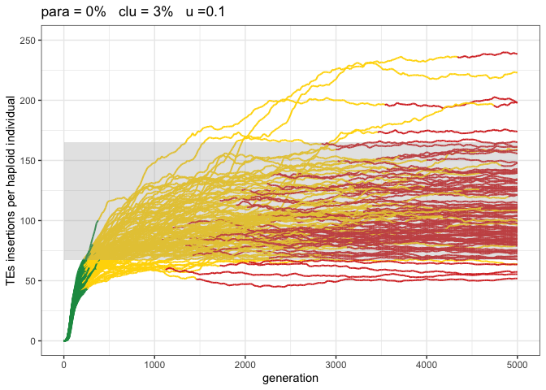
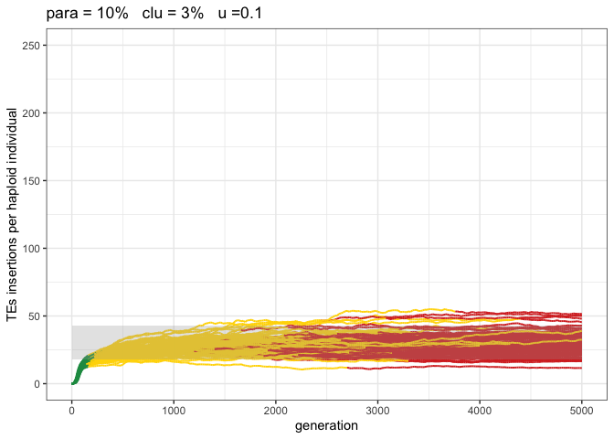
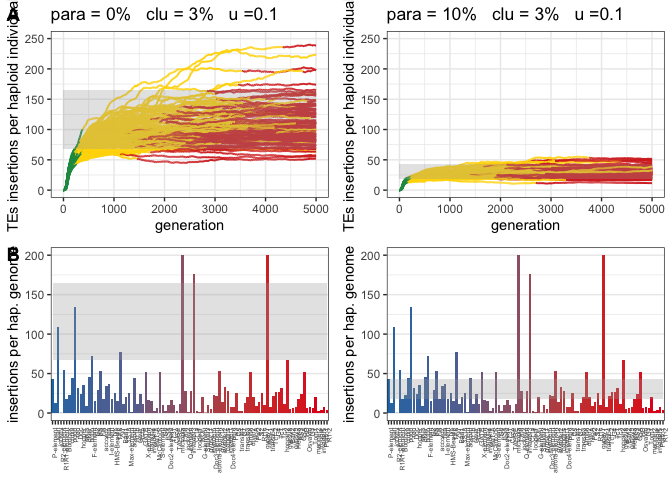

2021_11_21_Simulation_9\_Paramutations_on_real_data
================
Almo
2022-11-21

## Introduction

With this simulation we wanted to compare the trap model scenario
outcome with one where paramutations are taken into account and see
which of the two gives better expectations on real data.

### Initial conditions:

A population of 1000, 5 chromosomes of size 10 Mb, a recombination rate
of 4cM, 300Kb piRNA clusters and an initial number of TEs equal to 100.

We used 1000 replicates for each simulation.

## Materials & Methods

version: invadego0.23

-   seed p_1: 1669034593025997575

-   seed p_10: 1669034593026170439

### Commands for the simulation:

``` bash
folder="/home/vetlinux05/Almo/Simulation_9"
tool="/home/vetlinux05/Almo/invade-invadego/invadego023"

$tool --N 1000 --gen 5000 --genome mb:10,10,10,10,10 --cluster kb:300,300,300,300,300 --rr 4,4,4,4,4 --rep 100 --u 0.1 --basepop 100 --steps 20 --sampleid p0 > $folder/2022_11_11_simulation_9_1 &

$tool --N 1000 --gen 5000 --genome mb:10,10,10,10,10 --cluster kb:300,300,300,300,300 --rr 4,4,4,4,4 --rep 100 --u 0.1 --basepop 100 --paramutation 10:1 --steps 20 --sampleid p10 > $folder/2022_11_21_simulation_9_2
```

### Visualization in R

Setting the environment

``` r
library(tidyverse)
library(ggplot2)
library(ggpubr)
library(dplyr)
library(plyr)
theme_set(theme_bw())
```

Visualization:

``` r
p<-c("grey","#1a9850","#ffd700","#d73027")

setwd("/Users/ascarpa/Paramutations_TEs/Simulation/Raw")

df <- read.table("2022_11_21_Simulation_9_Paramutations_on_real_data", fill = TRUE, sep = "\t")
names(df) <- c("rep", "gen", "popstat", "fmale", "spacer_1", "fwte", "avw", "min_w", "avtes", "avpopfreq",
              "fixed","spacer_2", "phase", "fwpirna", "spacer_3", "fwcli", "avcli", "fixcli", "spacer_4",
              "fwpar_yespi","fwpar_nopi", "avpar","fixpar","spacer_5","piori","orifreq","spacer 6", "sampleid")

df$phase <- factor(df$phase, levels=c("rapi", "trig", "shot", "inac"))
df$sampleid <- factor(df$sampleid, levels=c("p0", "p10"))


g<-ggplot()+
  geom_line(data=df,aes(x=gen,y=avtes,group=rep,color=phase),alpha=1,size=0.7)+
  xlab("generation")+
  ylab("TEs insertions per diploid individual")+
  theme(legend.position="none")+
  theme_bw()+
  scale_colour_manual(values=p)+
  ylim(0,500)+
  facet_wrap(~sampleid, labeller = labeller(sampleid = 
                                              c("p0" = "Paramutable loci = 0% (Trap model)",
                                                "p10" = "Paramutable loci = 10%")))

plot(g)
```

<!-- -->

``` r
#gen 5000
df_2_t <- subset(df, sampleid == "p0" & gen == 5000)
df_2_10p <- subset(df, sampleid == "p10" & gen == 5000)

#Sort by avtes
df_2_t <- df_2_t[order(df_2_t$avtes),]
df_2_10p <- df_2_10p[order(df_2_10p$avtes),]

#Select the central 90 observations
df_2_t <- df_2_t[6:95,]
df_2_10p <- df_2_10p[6:95,]

#Find max and min for the haploid genomes
max_df_2_t_haplo <- max(df_2_t$avtes)/2
max_df_2_10p_haplo <- max(df_2_10p$avtes)/2
min_df_2_t_haplo <- min(df_2_t$avtes)/2
min_df_2_10p_haplo <- min(df_2_10p$avtes)/2

df_trap <- subset(df, sampleid == "p0")
df_para <- subset(df, sampleid == "p10")


g_2_trap <- ggplot()+
  geom_line(data=df_trap,aes(x=gen,y=avtes/2,group=rep,color=phase),alpha=1,size=0.7)+
  xlab("generation")+
  ylab("TEs insertions per haploid individual")+
  theme(legend.position="none")+
  scale_colour_manual(values=p)+
  ylim(0,250)+
  xlim(0,5000)+
  annotate("rect",ymin=min_df_2_t_haplo, ymax=max_df_2_t_haplo, xmin=0, xmax=5000, fill="darkgrey",alpha=.3)+
  ggtitle("para = 0%   clu = 3%   u =0.1")

plot(g_2_trap)
```

<!-- -->

``` r
g_2_para <- ggplot()+
  geom_line(data=df_para,aes(x=gen,y=avtes/2,group=rep,color=phase),alpha=1,size=0.7)+
  xlab("generation")+
  ylab("TEs insertions per haploid individual")+
  theme(legend.position="none")+
  scale_colour_manual(values=p)+
  ylim(0,250)+
  xlim(0,5000)+
  annotate("rect",ymin=min_df_2_10p_haplo, ymax=max_df_2_10p_haplo, xmin=0, xmax=5000, fill="darkgrey",alpha=.3)+
  ggtitle("para = 10%   clu = 3%   u =0.1")

plot(g_2_para)
```

<!-- -->

``` r
t<-read.table("Kofler-2015-Dmel-SA.mc30.euchr.polytes")
names(t)<-c("chr","pos","support","family","popfreq","order")

flam<-c("gypsy","ZAM","Idefix","gypsy5","gtwin","blood","gypsy6","412","HMS-Beagle2","Stalker",
        "mdg1","Stalker2","Quasimodo","springer","Stalker4","mdg3","gypsy2","gypsy4","Transpac","gypsy3","Tirant","gypsy10","Tabor")


s<- ddply(.data=t, 
          .(family),
          summarize, 
          count= length(popfreq),
          sum=sum(popfreq)) 
s$avpopfreq=s$sum/s$count
so<-s[order(s$avpopfreq),]


so$family<-factor(so$family,levels=s[order(s$avpopfreq),]$family)

te_germ<-subset(so,!(family %in% flam))


ylimgerm<-200

te_germ[te_germ$sum>=ylimgerm,]$sum<-ylimgerm


g_tes_trap<-ggplot(data=te_germ, aes(x=family, y=sum,fill=avpopfreq)) +ylab("insertions per hap. genome")+
  geom_bar(stat="identity")+ylim(0,ylimgerm)+scale_fill_gradient(low = "#1f78b4", high = "#e41a1c")+
  theme(legend.position="none",panel.grid.major.x=element_blank() , axis.text.x = element_text(angle = 90, size=5,hjust=1),axis.title.x=element_blank())+
  annotate("rect",ymin=min_df_2_t_haplo, ymax=max_df_2_t_haplo, xmin=1, xmax=nrow(te_germ), fill="darkgrey",alpha=.3)
  
  

plot(g_tes_trap)
```

<!-- -->

``` r
g_tes_para<-ggplot(data=te_germ, aes(x=family, y=sum,fill=avpopfreq)) +ylab("insertions per hap. genome")+
  geom_bar(stat="identity")+ylim(0,ylimgerm)+scale_fill_gradient(low = "#1f78b4", high = "#e41a1c")+
  theme(legend.position="none",panel.grid.major.x=element_blank() , axis.text.x = element_text(angle = 90, size=5,hjust=1),axis.title.x=element_blank())+
  annotate("rect",ymin=min_df_2_10p_haplo, ymax=max_df_2_10p_haplo, xmin=1, xmax=nrow(te_germ), fill="darkgrey",alpha=.3)
  

plot(g_tes_para)
```

<!-- -->

``` r
ggarrange(g_2_trap, g_2_para, g_tes_trap, g_tes_para,
          ncol = 2, nrow = 2, align = ("v"),
          labels = c("A", "", "B", ""), heights = c(2,2), widths = c(2,2)
)
```

<!-- -->

## Conclusions

The extended trap model, due to the inclusion of paramutations, better
fits the real data.
