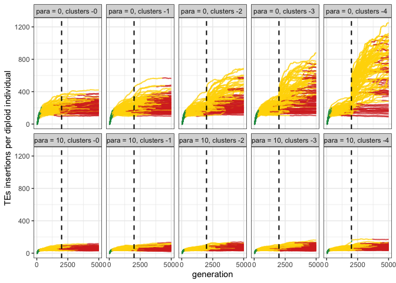

2022_12_06_Simulation_10_Cluster_Removal
================
Almo
2022-12-06

## Introduction

In this simulation we wanted to test what happens in the event of a
major cluster removal, this possibility was inspired by the work of
[Gebert et al.](https://pubmed.ncbi.nlm.nih.gov/34352205/)

### Initial conditions:

A population of 1000, 5 chromosomes of size 10 Mb, 5 piRNA clusters of
size 300 Kb and an initial number of TEs in the population equal to 100.
A variable number of cluster (between 0 and 4) was removed to compare
the effects of paramutations (present at 10% or absent).

## Materials & Methods

version: invadegobrc023

-   seed 10_0\_6: 1671105378395241000

-   seed 10_0\_7: 1671105378392827000

-   seed 10_0\_8: 1671105378394822000

-   seed 10_0\_9: 1671105378394887000

-   seed 10_0\_10: 1671105378392766000

-   seed 10_10_6: 1671105378393354000

-   seed 10_10_7: 1671105378395489000

-   seed 10_10_8: 1671105378394723000

-   seed 10_10_9: 1671105378395338000

-   seed 10_10_10: 1671105378392767000

### Commands for the simulation:

``` bash
folder="/Users/ascarpa/Paramutations_TEs/Simulation/Raw"
tool="/Users/ascarpa/invadego_removal/invadego_removal"

$tool --N 1000 --gen 5000 --genome mb:10,10,10,10,10 --cluster kb:300,300,300,300,300 --rr 4,4,4,4,4 --rep 100 --u 0.1 --basepop 100 --steps 20 --sampleid p0_0 > $folder/2022_12_06_simulation_10_0_6 &

$tool --N 1000 --gen 5000 --genome mb:10,10,10,10,10 --cluster kb:300,300,300,300,300 --rr 4,4,4,4,4 --rep 100 --u 0.1 --basepop 100 --remove-cluster 2000,1 --steps 20 --sampleid p0_1 > $folder/2022_12_06_simulation_10_0_7 &

$tool --N 1000 --gen 5000 --genome mb:10,10,10,10,10 --cluster kb:300,300,300,300,300 --rr 4,4,4,4,4 --rep 100 --u 0.1 --basepop 100 --remove-cluster 2000,2 --steps 20 --sampleid p0_2 > $folder/2022_12_06_simulation_10_0_8 &

$tool --N 1000 --gen 5000 --genome mb:10,10,10,10,10 --cluster kb:300,300,300,300,300 --rr 4,4,4,4,4 --rep 100 --u 0.1 --basepop 100 --remove-cluster 2000,3 --steps 20 --sampleid p0_3 > $folder/2022_12_06_simulation_10_0_9 &

$tool --N 1000 --gen 5000 --genome mb:10,10,10,10,10 --cluster kb:300,300,300,300,300 --rr 4,4,4,4,4 --rep 100 --u 0.1 --basepop 100 --remove-cluster 2000,4 --steps 20 --sampleid p0_4 > $folder/2022_12_06_simulation_10_0_10 &

$tool --N 1000 --gen 5000 --genome mb:10,10,10,10,10 --cluster kb:300,300,300,300,300 --rr 4,4,4,4,4 --rep 100 --u 0.1 --basepop 100 --paramutation 10:1 --steps 20 --sampleid p10_0 > $folder/2022_12_06_simulation_10_10_6 &

$tool --N 1000 --gen 5000 --genome mb:10,10,10,10,10 --cluster kb:300,300,300,300,300 --rr 4,4,4,4,4 --rep 100 --u 0.1 --basepop 100 --paramutation 10:1 --remove-cluster 2000,1 --steps 20 --sampleid p10_1 > $folder/2022_12_06_simulation_10_10_7 &

$tool --N 1000 --gen 5000 --genome mb:10,10,10,10,10 --cluster kb:300,300,300,300,300 --rr 4,4,4,4,4 --rep 100 --u 0.1 --basepop 100 --paramutation 10:1 --remove-cluster 2000,2 --steps 20 --sampleid p10_2 > $folder/2022_12_06_simulation_10_10_8 &

$tool --N 1000 --gen 5000 --genome mb:10,10,10,10,10 --cluster kb:300,300,300,300,300 --rr 4,4,4,4,4 --rep 100 --u 0.1 --basepop 100 --paramutation 10:1 --remove-cluster 2000,3 --steps 20 --sampleid p10_3 > $folder/2022_12_06_simulation_10_10_9 &

$tool --N 1000 --gen 5000 --genome mb:10,10,10,10,10 --cluster kb:300,300,300,300,300 --rr 4,4,4,4,4 --rep 100 --u 0.1 --basepop 100 --paramutation 10:1 --remove-cluster 2000,4 --steps 20 --sampleid p10_4 > $folder/2022_12_06_simulation_10_10_10
```

### Visualization in R

Setting the environment

``` r
library(tidyverse)
library(ggplot2)
library(RColorBrewer)
library(ggpubr)
theme_set(theme_bw())
```

Visualization:

``` r
p<-c("grey","#1a9850","#ffd700","#d73027")

setwd("/Users/ascarpa/Paramutations_TEs/Simulation/Raw")

df<-read.table("2022_12_10_Simulation_10_Clusters_removal", fill = TRUE, sep = "\t")
names(df)<-c("rep", "gen", "popstat", "fmale", "spacer_1", "fwte", "avw", "min_w", "avtes", "avpopfreq",
             "fixed","spacer_2", "phase", "fwpirna", "spacer_3", "fwcli", "avcli", "fixcli", "spacer_4",
             "fwpar_yespi","fwpar_nopi", "avpar","fixpar","spacer_5","piori","orifreq","spacer 6", "sampleid")

df$phase <- factor(df$phase, levels=c("rapi", "trig", "shot", "inac"))
df$sampleid <- factor(df$sampleid, levels=c("p0_0", "p0_1", "p0_2", "p0_3", "p0_4", "p10_0", "p10_1", "p10_2", "p10_3", "p10_4"))


g<-ggplot()+
  geom_line(data=df,aes(x=gen,y=avtes,group=rep,color=phase), alpha = 1, linewidth = 0.7)+
  geom_vline(xintercept = 2000, linetype="dashed", color = "black", linewidth = 0.7)+
  xlab("generation")+
  ylab("TEs insertions per diploid individual")+
  theme(legend.position="none")+
  scale_colour_manual(values=p)+
  scale_x_continuous(breaks = seq(0, 5000, by = 2500))+
  facet_wrap(~sampleid, ncol = 5, nrow = 2, labeller = labeller(sampleid = 
                                                                  c("p0_0" = "para = 0, clusters -0 ",
                                                                    "p0_1" = "para = 0, clusters -1 ",
                                                                    "p0_2" = "para = 0, clusters -2 ",
                                                                    "p0_3" = "para = 0, clusters -3 ",
                                                                    "p0_4" = "para = 0, clusters -4 ",
                                                                    "p10_0" = "para = 10, clusters -0 ",
                                                                    "p10_1" = "para = 10, clusters -1 ",
                                                                    "p10_2" = "para = 10, clusters -2 ",
                                                                    "p10_3" = "para = 10, clusters -3 ",
                                                                    "p10_4" = "para = 10, clusters -4 ")))


plot(g)
```

<!-- -->

## Conclusions

Paramutations prevent the reactivation of a TE in the event of a cluster
loss. Not only the cluster but the single genomic copies of the TE able
to produce piRNAs (paramutated) are fundamental in the TE silencing,
since in the event of a piRNA cluster loss they will work producing
piRNA the piRNAs. Thus the redundancy between the paramutations and the
cluster is important for both a faster silencing and a more robust
mantainance.
