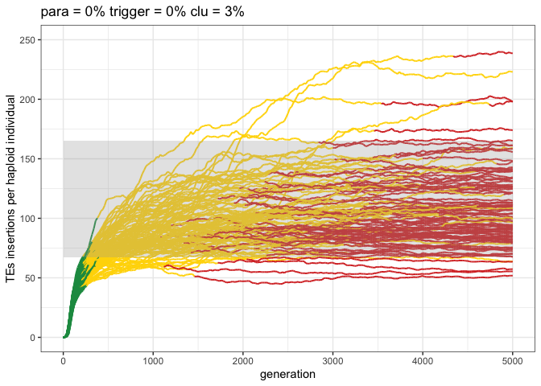
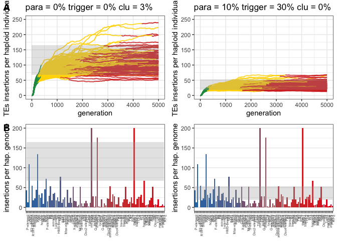
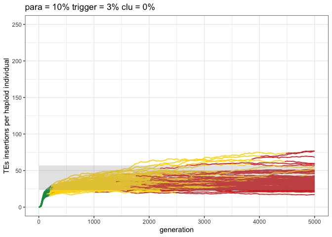
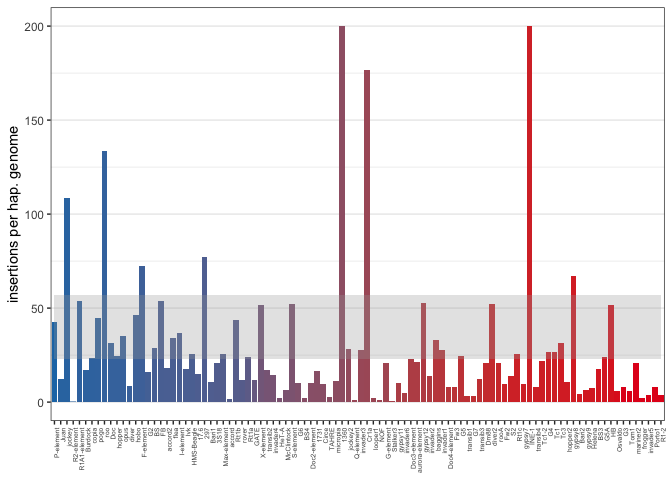
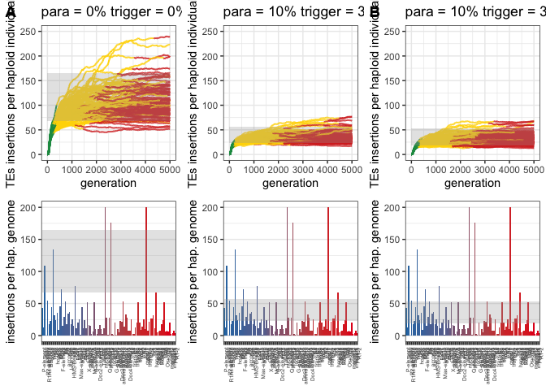

2023_02_15_Supplement_Trigger
================
Almo
2023-02-15

## Introduction

In this simulation we compared the effects of different shares of
trigger loci in a genome made of:

-   0% paramutable loci & 0% piRNA clusters,

-   10% paramutable loci & 0% piRNA clusters,

Then we compared the results with real data.

### Initial conditions:

A population of 1000, 5 chromosomes of size 10 Mb, 10% of the genome as
paramutable loci and an initial number of TEs in the population equal to
100.

We used 100 replicates for each simulation.

## Materials & Methods:

version: invadego0.2.1

-   seed p0: 1669034593025997575

-   seed p3_10: 1676468031205626000

-   seed p30_10: 1676048051406475000

### Commands for the simulation:

``` bash
folder="/Users/ascarpa/Desktop"
tool="/Users/ascarpa/invade-invadego/invadego023"
$tool --N 1000 --gen 5000 --genome mb:10,10,10,10,10 --rr 4,4,4,4,4 --rep 100 --u 0.1 --basepop 100 --paramutation 10:1 --trigger 100:1,2,3 --steps 20 --sampleid p30_10 > $folder/2023_02_10_Simulation_supp_trigger_3_para_10 &
$tool --N 1000 --gen 5000 --genome mb:10,10,10,10,10 --rr 4,4,4,4,4 --rep 100 --u 0.1 --basepop 100 --paramutation 10:1 --trigger 10:1,2,3 --steps 20 --sampleid p30_10 > $folder/2023_02_10_Simulation_supp_trigger_30_para_10
```

### Visualization in R

Setting the environment

``` r
library(tidyverse)
library(ggplot2)
library(ggpubr)
library(dplyr)
library(plyr)
theme_set(theme_bw())
```

Visualization: comparing the simulations with the prediction

``` r
p<-c("grey","#1a9850","#ffd700","#d73027")
p2<-c("#1a9850","#ffd700","#d73027")


setwd("/Users/ascarpa/Paramutations_TEs/Simulation/Raw")

df<-read.table("2023_02_10_Simulation_supp_trigger_30_para_10", fill = TRUE, sep = "\t")
df2 <- read.table("2022_11_21_Simulation_9_Paramutations_on_real_data", fill = TRUE, sep = "\t")


names(df) <- c("rep", "gen", "popstat", "fmale", "spacer_1", "fwte", "avw", "min_w", "avtes", "avpopfreq",
               "fixed","spacer_2", "phase", "fwpirna", "spacer_3", "fwcli", "avcli", "fixcli", "spacer_4",
               "fwpar_yespi","fwpar_nopi", "avpar","fixpar","spacer_5","piori","orifreq","spacer 6", "sampleid")

names(df2) <- c("rep", "gen", "popstat", "fmale", "spacer_1", "fwte", "avw", "min_w", "avtes", "avpopfreq",
               "fixed","spacer_2", "phase", "fwpirna", "spacer_3", "fwcli", "avcli", "fixcli", "spacer_4",
               "fwpar_yespi","fwpar_nopi", "avpar","fixpar","spacer_5","piori","orifreq","spacer 6", "sampleid")


df2 <- subset(df2, sampleid == "p0")

df <- rbind(df, df2)

df$phase <- factor(df$phase, levels=c("rapi", "trig", "shot", "inac"))

g<-ggplot()+
  geom_line(data=df,aes(x=gen,y=avtes,group=rep,color=phase),alpha=1,size=0.7)+
  xlab("generation")+
  ylab("TEs insertions per diploid individual")+
  theme(legend.position="none")+
  theme_bw()+
  scale_colour_manual(values=p)+
  ylim(0,500)+
  facet_wrap(~sampleid, labeller = labeller(sampleid = 
                                              c("p0" = "para = 0% trigger = 0% clu = 3%",
                                                "p30_10" = "para = 10% trigger = 30% clu = 0%")))

plot(g)
```

<!-- -->

``` r
#gen 5000
df_2_t <- subset(df, sampleid == "p0" & gen == 5000)
df_2_10p <- subset(df, sampleid == "p30_10" & gen == 5000)

#Sort by avtes
df_2_t <- df_2_t[order(df_2_t$avtes),]
df_2_10p <- df_2_10p[order(df_2_10p$avtes),]

#Select the central 90 observations
df_2_t <- df_2_t[6:95,]
df_2_10p <- df_2_10p[6:95,]

#Find max and min for the haploid genomes
max_df_2_t_haplo <- max(df_2_t$avtes)/2
max_df_2_10p_haplo <- max(df_2_10p$avtes)/2
min_df_2_t_haplo <- min(df_2_t$avtes)/2
min_df_2_10p_haplo <- min(df_2_10p$avtes)/2

df_trap <- subset(df, sampleid == "p0")
df_trigger <- subset(df, sampleid == "p30_10")


g_2_trap <- ggplot()+
  geom_line(data=df_trap,aes(x=gen,y=avtes/2,group=rep,color=phase),alpha=1,size=0.7)+
  xlab("generation")+
  ylab("TEs insertions per haploid individual")+
  theme(legend.position="none")+
  scale_colour_manual(values=p)+
  ylim(0,250)+
  xlim(0,5000)+
  annotate("rect",ymin=min_df_2_t_haplo, ymax=max_df_2_t_haplo, xmin=0, xmax=5000, fill="darkgrey",alpha=.3)+
  ggtitle("para = 0% trigger = 0% clu = 3%")

plot(g_2_trap)
```

<!-- -->

``` r
g_2_trigger <- ggplot()+
  geom_line(data=df_trigger,aes(x=gen,y=avtes/2,group=rep,color=phase),alpha=1,size=0.7)+
  xlab("generation")+
  ylab("TEs insertions per haploid individual")+
  theme(legend.position="none")+
  scale_colour_manual(values=p2)+
  ylim(0,250)+
  xlim(0,5000)+
  annotate("rect",ymin=min_df_2_10p_haplo, ymax=max_df_2_10p_haplo, xmin=0, xmax=5000, fill="darkgrey",alpha=.3)+
  ggtitle("para = 10% trigger = 30% clu = 0%")

plot(g_2_trigger)
```

<!-- -->

``` r
t<-read.table("Kofler-2015-Dmel-SA.mc30.euchr.polytes")
names(t)<-c("chr","pos","support","family","popfreq","order")

flam<-c("gypsy","ZAM","Idefix","gypsy5","gtwin","blood","gypsy6","412","HMS-Beagle2","Stalker",
        "mdg1","Stalker2","Quasimodo","springer","Stalker4","mdg3","gypsy2","gypsy4","Transpac","gypsy3","Tirant","gypsy10","Tabor")

t <- t[ -c(7:23) ]
s <- t %>% 
  dplyr::group_by(family) %>% 
  dplyr::summarize(count = n(),
            sum = sum(popfreq),
            avpopfreq = mean(popfreq))
so<-s[order(s$avpopfreq),]


so$family<-factor(so$family,levels=s[order(s$avpopfreq),]$family)

te_germ<-subset(so,!(family %in% flam))


#Limit to 200 so the 2 TEs with high copy numbers don't distort the graph
ylimgerm<-200


te_germ$sum[te_germ$sum > 200] <- ylimgerm

g_tes_trap<-ggplot(data=te_germ, aes(x=family, y=sum,fill=avpopfreq)) +ylab("insertions per hap. genome")+
  geom_bar(stat="identity")+ylim(0,ylimgerm)+scale_fill_gradient(low = "#1f78b4", high = "#e41a1c")+
  theme(legend.position="none",panel.grid.major.x=element_blank() , axis.text.x = element_text(angle = 90, size=5,hjust=1),axis.title.x=element_blank())+
  annotate("rect",ymin=min_df_2_t_haplo, ymax=max_df_2_t_haplo, xmin=1, xmax=nrow(te_germ), fill="darkgrey",alpha=.3)

plot(g_tes_trap)
```

<!-- -->

``` r
g_tes_trigger<-ggplot(data=te_germ, aes(x=family, y=sum,fill=avpopfreq)) +ylab("insertions per hap. genome")+
  geom_bar(stat="identity")+ylim(0,ylimgerm)+scale_fill_gradient(low = "#1f78b4", high = "#e41a1c")+
  theme(legend.position="none",panel.grid.major.x=element_blank() , axis.text.x = element_text(angle = 90, size=5,hjust=1),axis.title.x=element_blank())+
  annotate("rect",ymin=min_df_2_10p_haplo, ymax=max_df_2_10p_haplo, xmin=1, xmax=nrow(te_germ), fill="darkgrey",alpha=.3)

plot(g_tes_trigger)
```

<!-- -->

``` r
ggarrange(g_2_trap, g_2_trigger, g_tes_trap, g_tes_trigger,
          ncol = 2, nrow = 2, align = ("v"),
          labels = c("A", "", "B", ""), heights = c(2,2), widths = c(2,2)
)
```

<!-- -->

``` r
# Same with 3% trigger

p<-c("grey","#1a9850","#ffd700","#d73027")
p2<-c("#1a9850","#ffd700","#d73027")


setwd("/Users/ascarpa/Paramutations_TEs/Simulation/Raw")

df<-read.table("2023_02_10_Simulation_supp_trigger_3_para_10", fill = TRUE, sep = "\t")
df2 <- read.table("2022_11_21_Simulation_9_Paramutations_on_real_data", fill = TRUE, sep = "\t")


names(df) <- c("rep", "gen", "popstat", "fmale", "spacer_1", "fwte", "avw", "min_w", "avtes", "avpopfreq",
               "fixed","spacer_2", "phase", "fwpirna", "spacer_3", "fwcli", "avcli", "fixcli", "spacer_4",
               "fwpar_yespi","fwpar_nopi", "avpar","fixpar","spacer_5","piori","orifreq","spacer 6", "sampleid")

names(df2) <- c("rep", "gen", "popstat", "fmale", "spacer_1", "fwte", "avw", "min_w", "avtes", "avpopfreq",
                "fixed","spacer_2", "phase", "fwpirna", "spacer_3", "fwcli", "avcli", "fixcli", "spacer_4",
                "fwpar_yespi","fwpar_nopi", "avpar","fixpar","spacer_5","piori","orifreq","spacer 6", "sampleid")


df2 <- subset(df2, sampleid == "p0")

df <- rbind(df, df2)

df$phase <- factor(df$phase, levels=c("rapi", "trig", "shot", "inac"))

g<-ggplot()+
  geom_line(data=df,aes(x=gen,y=avtes,group=rep,color=phase),alpha=1,size=0.7)+
  xlab("generation")+
  ylab("TEs insertions per diploid individual")+
  theme(legend.position="none")+
  theme_bw()+
  scale_colour_manual(values=p)+
  ylim(0,500)+
  facet_wrap(~sampleid, labeller = labeller(sampleid = 
                                              c("p0" = "para = 0% trigger = 0% clu = 3%",
                                                "p3_10" = "para = 10% trigger = 3% clu = 0%")))

plot(g)
```

<!-- -->

``` r
#gen 5000
df_2_t <- subset(df, sampleid == "p0" & gen == 5000)
df_2_10p <- subset(df, sampleid == "p3_10" & gen == 5000)

#Sort by avtes
df_2_t <- df_2_t[order(df_2_t$avtes),]
df_2_10p <- df_2_10p[order(df_2_10p$avtes),]

#Select the central 90 observations
df_2_t <- df_2_t[6:95,]
df_2_10p <- df_2_10p[6:95,]

#Find max and min for the haploid genomes
max_df_2_t_haplo <- max(df_2_t$avtes)/2
max_df_2_10p_haplo <- max(df_2_10p$avtes)/2
min_df_2_t_haplo <- min(df_2_t$avtes)/2
min_df_2_10p_haplo <- min(df_2_10p$avtes)/2

df_trap <- subset(df, sampleid == "p0")
df_trigger <- subset(df, sampleid == "p3_10")


g_2_trap <- ggplot()+
  geom_line(data=df_trap,aes(x=gen,y=avtes/2,group=rep,color=phase),alpha=1,size=0.7)+
  xlab("generation")+
  ylab("TEs insertions per haploid individual")+
  theme(legend.position="none")+
  scale_colour_manual(values=p)+
  ylim(0,250)+
  xlim(0,5000)+
  annotate("rect",ymin=min_df_2_t_haplo, ymax=max_df_2_t_haplo, xmin=0, xmax=5000, fill="darkgrey",alpha=.3)+
  ggtitle("para = 0% trigger = 0% clu = 3%")

plot(g_2_trap)
```

<!-- -->

``` r
g_2_trigger2 <- ggplot()+
  geom_line(data=df_trigger,aes(x=gen,y=avtes/2,group=rep,color=phase),alpha=1,size=0.7)+
  xlab("generation")+
  ylab("TEs insertions per haploid individual")+
  theme(legend.position="none")+
  scale_colour_manual(values=p)+
  ylim(0,250)+
  xlim(0,5000)+
  annotate("rect",ymin=min_df_2_10p_haplo, ymax=max_df_2_10p_haplo, xmin=0, xmax=5000, fill="darkgrey",alpha=.3)+
  ggtitle("para = 10% trigger = 3% clu = 0%")

plot(g_2_trigger2)
```

<!-- -->

``` r
t<-read.table("Kofler-2015-Dmel-SA.mc30.euchr.polytes")
names(t)<-c("chr","pos","support","family","popfreq","order")

flam<-c("gypsy","ZAM","Idefix","gypsy5","gtwin","blood","gypsy6","412","HMS-Beagle2","Stalker",
        "mdg1","Stalker2","Quasimodo","springer","Stalker4","mdg3","gypsy2","gypsy4","Transpac","gypsy3","Tirant","gypsy10","Tabor")

t <- t[ -c(7:23) ]
s <- t %>% 
  dplyr::group_by(family) %>% 
  dplyr::summarize(count = n(),
            sum = sum(popfreq),
            avpopfreq = mean(popfreq))
so<-s[order(s$avpopfreq),]


so$family<-factor(so$family,levels=s[order(s$avpopfreq),]$family)

te_germ<-subset(so,!(family %in% flam))


#Limit to 200 so the 2 TEs with high copy numbers don't distort the graph
ylimgerm<-200


te_germ$sum[te_germ$sum > 200] <- ylimgerm

g_tes_trap<-ggplot(data=te_germ, aes(x=family, y=sum,fill=avpopfreq)) +ylab("insertions per hap. genome")+
  geom_bar(stat="identity")+ylim(0,ylimgerm)+scale_fill_gradient(low = "#1f78b4", high = "#e41a1c")+
  theme(legend.position="none",panel.grid.major.x=element_blank() , axis.text.x = element_text(angle = 90, size=5,hjust=1),axis.title.x=element_blank())+
  annotate("rect",ymin=min_df_2_t_haplo, ymax=max_df_2_t_haplo, xmin=1, xmax=nrow(te_germ), fill="darkgrey",alpha=.3)

plot(g_tes_trap)
```

<!-- -->

``` r
g_tes_trigger2<-ggplot(data=te_germ, aes(x=family, y=sum,fill=avpopfreq)) +ylab("insertions per hap. genome")+
  geom_bar(stat="identity")+ylim(0,ylimgerm)+scale_fill_gradient(low = "#1f78b4", high = "#e41a1c")+
  theme(legend.position="none",panel.grid.major.x=element_blank() , axis.text.x = element_text(angle = 90, size=5,hjust=1),axis.title.x=element_blank())+
  annotate("rect",ymin=min_df_2_10p_haplo, ymax=max_df_2_10p_haplo, xmin=1, xmax=nrow(te_germ), fill="darkgrey",alpha=.3)

plot(g_tes_trigger2)
```

<!-- -->

``` r
ggarrange(g_2_trap, g_2_trigger2, g_tes_trap, g_tes_trigger2,
          ncol = 2, nrow = 2, align = ("v"),
          labels = c("A", "", "B", ""), heights = c(2,2), widths = c(2,2)
)
```

<!-- -->

``` r
ggarrange(g_2_trap, g_2_trigger2, g_2_trigger, g_tes_trap, g_tes_trigger2, g_tes_trigger,
          ncol = 3, nrow = 2, align = ("v"),
          labels = c("A", "", "B", ""), heights = c(2,2), widths = c(2,2)
)
```

<!-- -->

## Conclusions

The trigger loci allow to better recapitulate the real insertions data
than the trap model.
