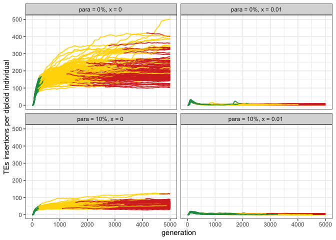

2023_02_16_Supplement_min_fit
================
Almo
2023-02-16

## Introduction

In this simulation we wanted to show the effects of selection on the TEs
invasion dynamics.

### Initial conditions:

A population of 1000, 5 chromosomes of size 10 Mb, 5 piRNA clusters of
size 300 Kb and an initial number of TEs in the population equal to 100.

## Materials & Methods

version: invadegobrc023

-   seed p10_x0: 1676552278030771000

-   seed p10_x0.03: 1676552278030750000

### Commands for the simulation:

``` bash
folder="/Users/ascarpa/Paramutations_TEs/Simulation/Raw"
tool="/Users/ascarpa/invade-invadego/invadego023"
$tool --N 1000 --gen 5000 --genome mb:10,10,10,10,10 --cluster kb:300,300,300,300,300 --rr 4,4,4,4,4 --rep 100 --u 0.1 --basepop 100 --paramutation 10:1 --steps 20 --sampleid p10_x0 > $folder/2023_02_16_Simulation_supp_min_fit_x0 &
$tool --N 1000 --gen 5000 --genome mb:10,10,10,10,10 --cluster kb:300,300,300,300,300 --rr 4,4,4,4,4 --rep 100 --u 0.1 --basepop 100 --paramutation 10:1 -x 0.03 -no-x-cluins --steps 20 --sampleid p10_x0.03 > $folder/2023_02_16_Simulation_supp_min_fit_x0.03

cat 2023_02_16_Simulation_supp_min_fit_x0 2023_02_16_Simulation_supp_min_fit_x0.03 |grep -v "^Invade"|grep -v "^#" > 
2023_02_16_Simulation_supp_min_fit
```

### Visualization in R

Setting the environment

``` r
library(tidyverse)
library(ggplot2)
library(RColorBrewer)
library(ggpubr)
theme_set(theme_bw())
```

Visualization:

``` r
p<-c("grey","#1a9850","#ffd700","#d73027")

setwd("/Users/ascarpa/Paramutations_TEs/Simulation/Raw")

df<-read.table("2023_02_16_Simulation_supp_min_fit", fill = TRUE, sep = "\t")
names(df)<-c("rep", "gen", "popstat", "fmale", "spacer_1", "fwte", "avw", "min_w", "avtes", "avpopfreq",
             "fixed","spacer_2", "phase", "fwpirna", "spacer_3", "fwcli", "avcli", "fixcli", "spacer_4",
             "fwpar_yespi","fwpar_nopi", "avpar","fixpar","spacer_5","piori","orifreq","spacer 6", "sampleid")

df$phase <- factor(df$phase, levels=c("rapi", "trig", "shot", "inac"))
df$sampleid <- factor(df$sampleid, levels=c("p10_x0", "p10_x0.03"))


g<-ggplot()+
  geom_line(data=df,aes(x=gen,y=avtes,group=rep,color=phase), alpha = 1, linewidth = 0.7)+
  xlab("generation")+
  ylab("TEs insertions per diploid individual")+
  theme(legend.position="none")+
  scale_colour_manual(values=p)+
  facet_wrap(~sampleid, ncol = 5, nrow = 2, labeller = labeller(sampleid = 
                                                                  c("p10_x0" = "para = 10%, x = 0 ",
                                                                    "p10_x0.03" = "para = 10%, x = 0.03 ")))


plot(g)
```

<!-- -->
