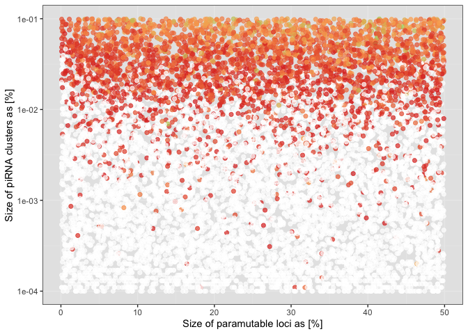

2023_02_17_Simulation_extinction
================
Almo
2023-02-16

## Introduction

In this simulation we wanted to show the effects of paramutations on
fitness during the TEs invasion dynamics.

### Initial conditions:

A population of 1000, 5 chromosomes of size 10 Mb, 5 piRNA clusters of
size 300 Kb and an initial number of TEs in the population equal to 100.
10000 simulations.

## Materials & Methods

version: invadego0.2.3

### Commands for the simulation:

``` bash
nohup sh -c 'python simstorm_para_vs_logcluster_extinction.py --number 10000 --threads 40 --output supp_exticntion- --invade ../invade-invadego/invadego023 --silent' &
cat 2023_02_16_Simulation_supp_fit_p* |grep -v "^Invade"|grep -v "^#" > 2023_02_16_Simulation_supp_fit
```

### Visualization in R

Setting the environment

``` r
library(tidyverse)
library(ggplot2)
library(RColorBrewer)
library(ggpubr)
theme_set(theme_bw())
```

Visualization:

``` r
setwd("/Users/ascarpa/Paramutations_TEs/Simulation/Raw")
df_2<-read.table("2023_02_17_Simulation_extinction", sep = "\t", fill = TRUE, row.names=NULL)


naming_2 <- c("rep", "gen", "popstat", "fmale", "spacer_1", "fwte", "avw", "min_w", "avtes", "avpopfreq", "fixed",
              "spacer_2", "phase", "fwpirna", "spacer_3", "fwcli", "avcli", "fixcli", "spacer_4", "fwpar_yespi",
              "fwpar_nopi", "avpar","fixpar","spacer_5","piori","orifreq","spacer 6", "sampleid_clu", "sampleid_para","extra")


names(df_2) <- naming_2


df_2$sampleid_clu <- as.numeric(df_2$sampleid_clu)
df_2$sampleid_para <- as.numeric(df_2$sampleid_para)
df_2$min_w <- as.numeric(df_2$min_w)


#Keep only last generation, will be less then 5000 if fail
df_2<-subset(df_2, gen > 0)


color.gradient_2 <- function(x, colors=c("#D7191C","#FDAE61","#A6D96A","#1A9641"), colsteps=100) {
  return( colorRampPalette(colors) (colsteps) [ findInterval(x, seq(min(df_2$min_w),1.0, length.out=colsteps)) ] )
}


df_2$col<-color.gradient_2(df_2$min_w)
df_2[df_2$popstat=="fail-w",]$col<-"white"
df_2$col<-as.factor(df_2$col)

g_para_cluster<-ggplot(df_2)+scale_color_manual(values=levels(df_2$col))+
  geom_point(aes(x=sampleid_para/10,y=sampleid_clu/100000,color=col), alpha=0.7,size=1.8)+scale_y_log10()+
  ylab("Size of piRNA clusters as [%]")+
  xlab("Size of paramutable loci as [%]")+
  theme(legend.position = "none",panel.background = element_rect(fill="grey90"))

plot(g_para_cluster)
```

<!-- -->

### Conclusions

In this scenario doesn’t look like paramutations prevent extincions,
probably due to the fact that the min fintess is reached before they
take over. It is important to remember that the extinction at w = 0.1 is
an arbitrary parameter, paramutations can play a role ifthe extinction
rate is set at at an higher value of w.
