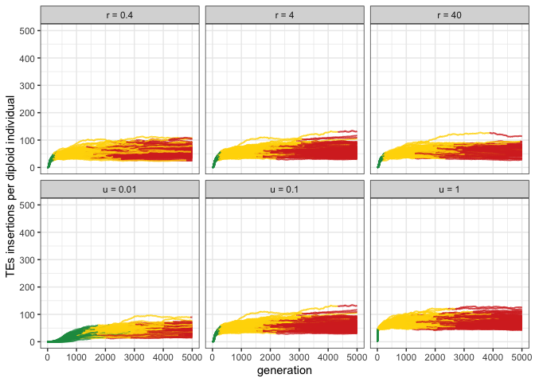
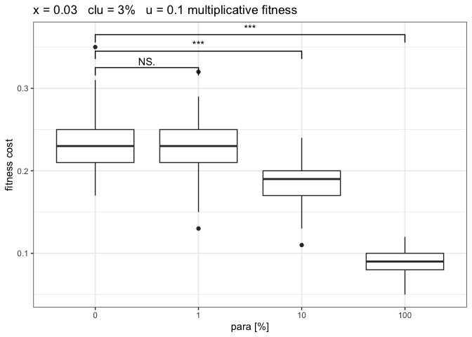
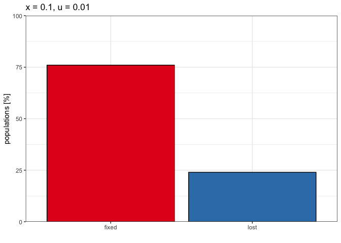

2023_05_12_Supplement_Addendum
================
Almorò Scarpa

Setting the environment

``` r
library(tidyverse)
library(RColorBrewer)
library(ggpubr)
library(stringr)
theme_set(theme_bw())
```

Different recombination rates

``` r
p<-c("grey","#1a9850","#ffd700","#d73027")

setwd("/Users/ascarpa/Paramutations_TEs/Simulation/Raw")

df<-read.table("2023_05_12_Supplement_scaling", fill = TRUE, sep = "\t")
naming <- c("rep", "gen", "popstat", "fmale", "spacer_1", "fwte", "avw", "min_w", "avtes", "avpopfreq",
            "fixed","spacer_2", "phase", "fwpirna", "spacer_3", "fwcli", "avcli", "fixcli", "spacer_4",
            "fwpar_yespi","fwpar_nopi", "avpar","fixpar","spacer_5","piori","orifreq","spacer 6", "sampleid")
names(df) <- naming

df$phase <- factor(df$phase, levels=c("rapi", "trig", "shot", "inac"))
df$sampleid <- factor(df$sampleid, levels=c("p1.5", "p2", "p4", "p5", "p2_c", "p6"))

g<-ggplot()+
  geom_line(data=df,aes(x=gen,y=avtes,group=rep,color=phase),alpha=1,size=0.7)+
  xlab("generation")+
  ylab("TEs insertions per diploid individual")+
  theme(legend.position="none")+
  scale_colour_manual(values=p)+
  ylim(0,500)+
  facet_wrap(~sampleid, nrow = 2, labeller = labeller(sampleid = 
                                                        c("p1.5" = "r = 0.4",
                                                          "p2" = "r = 4",
                                                          "p4" = "r = 40",
                                                          "p5" = "u = 0.01",
                                                          "p2_c" = "u = 0.1",
                                                          "p6" = "u = 1"
                                                        )))

plot(g)
```

<!-- -->

``` r
df1 <- subset(df, phase %in% c("shot", "inac"))
df2 <- data.frame()

#new dataframe with only the first shotgun & the first inactive phase of each replicate
repcheck = 1
x = 1
y = 1
while (x<nrow(df1)) {
  if (repcheck != df1[x, 1]){
    y = 1
  }
  if (y == 1){
    if(df1[x, 13]  == "shot"){
      df2<-rbind(df2,df1[x,])
      y = 2
      repcheck = df1[x, 1]
    }
  }
  if (y == 2){
    if(df1[x, 13] == "inac"){
      df2<-rbind(df2,df1[x,])
      y = 1
    }
  }
  x = x+1
}

#Summary statistics
df2<-select (df2,-c(29))

df_count <- df2 %>%
  dplyr::count(sampleid, phase)

df_summary <- df2 %>% 
  dplyr::group_by(sampleid, phase) %>%
  dplyr::summarize(av_fwcli = mean(fwcli), sd_fwcli = sd(fwcli),
                   av_cli = mean(avcli), sd_cli = sd(avcli), cv_cli_percent = sd(avcli)/mean(avcli),
                   av_tes = mean(avtes), sd_tes = sd(avtes), cv_tes_percent = sd(avtes)/mean(avtes),
                   av_par = mean(avpar), sd_par = sd(avpar),
                   av_fwpar_yespi = mean(fwpar_yespi), sd_fwpar_yespi = sd(fwpar_yespi),
                   length_previous_phase = mean(gen),
                   sd_gen_phases = sd(gen))
```

    ## `summarise()` has grouped output by 'sampleid'. You can override using the
    ## `.groups` argument.

``` r
df_summary <- cbind(df_count$n, df_summary)
```

    ## New names:
    ## • `` -> `...1`

``` r
colnames(df_summary)[1] ="n"

#CI 95%: z* sd/sqrt(population)
df_summary$ci_fwcli <- qt(0.975,df=df_summary$n-1)*(df_summary$sd_fwcli/sqrt(df_summary$n))
df_summary$ci_cli <- qt(0.975,df=df_summary$n-1)*(df_summary$sd_cli/sqrt(df_summary$n))
df_summary$ci_tes <- qt(0.975,df=df_summary$n-1)*(df_summary$sd_tes/sqrt(df_summary$n))
df_summary$ci_par <- qt(0.975,df=df_summary$n-1)*(df_summary$sd_par/sqrt(df_summary$n))
df_summary$ci_fwpar_yespi <- qt(0.975,df=df_summary$n-1)*(df_summary$sd_fwpar_yespi/sqrt(df_summary$n))

g_c <- ggplot(df_summary, aes(x=phase, y=av_tes, fill = phase)) + 
  geom_bar(stat = "identity") +
  geom_errorbar( aes(x=phase, ymin=av_tes-sd_tes, ymax=av_tes+sd_tes), width=0.2, colour="black", alpha=0.9, size=0.8)+
  ylab("Number of TE insertions per individual")+
  xlab("Phase")+
  scale_y_continuous(expand = expansion(mult = c(0, 0.01)))+
  scale_fill_manual(values = c("#ffd700", "#d73027"))+
  theme(legend.position="none", axis.text.x = element_text(angle = 90, vjust = 0.5, hjust=1))+
  facet_wrap(~sampleid, nrow = 2, labeller = labeller(sampleid = 
                                                        c("p1.5" = "r = 0.4",
                                                          "p2" = "r = 4",
                                                          "p4" = "r = 40",
                                                          "p5" = "u = 0.01",
                                                          "p2_c" = "u = 0.1",
                                                          "p6" = "u = 1"
                                                        )))

plot(g_c)
```

<!-- -->

``` r
#Multiplicative fitness

df_0.03_noxclu_m<-read.table("2023_06_22_Simulation_6_Fitness_0.03_noxclu_m", fill = TRUE, sep = "\t")
names(df_0.03_noxclu_m) <- c("rep", "gen", "popstat", "fmale", "spacer_1", "fwte", "avw", "min_w", "avtes", "avpopfreq", "fixed",
                             "spacer_2", "phase", "fwpirna", "spacer_3", "fwcli", "avcli", "fixcli", "spacer_4", "fwpar_yespi",
                             "fwpar_nopi", "avpar","fixpar","spacer_5","piori","orifreq","spacer 6", "sampleid", "extra")

df_0.03_noxclu_m<- subset(df_0.03_noxclu_m, gen == 5000)

df_0.03_noxclu_m2 <- df_0.03_noxclu_m[grepl("_m$", df_0.03_noxclu_m$sampleid), ]
df_0.03_noxclu   <- df_0.03_noxclu_m[!grepl("_m$", df_0.03_noxclu_m$sampleid), ]


df_0.03_noxclu$sampleid[df_0.03_noxclu$sampleid == "p0_x0.03"] <- "0"
df_0.03_noxclu$sampleid[df_0.03_noxclu$sampleid == "p1_x0.03"] <- "1"
df_0.03_noxclu$sampleid[df_0.03_noxclu$sampleid == "p10_x0.03"] <- "10"
df_0.03_noxclu$sampleid[df_0.03_noxclu$sampleid == "p100_x0.03"] <- "100"


df_0.03_noxclu_m2$sampleid[df_0.03_noxclu_m2$sampleid == "p0_x0.03_m"] <- "0"
df_0.03_noxclu_m2$sampleid[df_0.03_noxclu_m2$sampleid == "p1_x0.03_m"] <- "1"
df_0.03_noxclu_m2$sampleid[df_0.03_noxclu_m2$sampleid == "p10_x0.03_m"] <- "10"
df_0.03_noxclu_m2$sampleid[df_0.03_noxclu_m2$sampleid == "p100_x0.03_m"] <- "100"


g_B_0.03_m <- ggplot(df_0.03_noxclu_m2, aes(x = sampleid, y = 1 - min_w))+
  geom_boxplot()+
  geom_signif(comparisons = list(c("0", "1"),
                                 c("0", "10"),
                                 c("0", "100")),
              map_signif_level = TRUE, y_position = c(0.31, 0.33, 0.35))+
  ggtitle("x = 0.03   clu = 3%   u = 0.1 multiplicative fitness")+
  xlab("para [%]") +
  ylab("fitness cost")

plot(g_B_0.03_m)
```

<!-- -->

``` r
g_B_0.03 <- ggplot(df_0.03_noxclu, aes(x = sampleid, y = 1 - min_w))+
  geom_boxplot()+
  geom_signif(comparisons = list(c("0", "1"),
                                 c("0", "10"),
                                 c("0", "100")),
              map_signif_level = TRUE, y_position = c(0.31, 0.33, 0.35))+
  ggtitle("x = 0.03   clu = 3%   u = 0.1 linear fitness")+
  xlab("para [%]") +
  ylab("fitness cost")

plot(g_B_0.03)
```

<!-- -->

``` r
ggarrange(g_B_0.03_m, g_B_0.03+  ylab(""),
          ncol = 2, nrow = 1, align = ("v"),
          heights = c(2,2), widths = c(2,2)
)
```

<!-- -->

``` r
#PDPP

names_vector <- c("rep", "gen", "popstat", "fmale", "spacer_1", "fwte", "avw", "min_w", "avtes", "avpopfreq",
                  "fixed","spacer_2", "phase", "fwpirna", "spacer_3", "fwcli", "avcli", "fixcli", "spacer_4",
                  "fwpar_yespi","fwpar_nopi", "avpar","fixpar","spacer_5","piori","orifreq","spacer 6")

generate_plot <- function(data_file, title) {
  df_x1 <- read.table(data_file, fill = TRUE, sep = "\t")
  names(df_x1) <- names_vector
  df_x2 <- subset(df_x1, gen == 5000)
  df_x3 <- df_x2 %>%
    count(fwpar_yespi)
  df_x3$fwpar_yespi <- c("lost", "fixed")
  
  g <- ggplot(df_x3, aes(x = fwpar_yespi, y = n/10, fill = factor(fwpar_yespi))) +
    geom_col(color = "black") +
    scale_fill_brewer(palette = "Set1") +
    theme(legend.position = "none") +
    scale_y_continuous(limits = c(0, 100), expand = c(0, 0)) +
    ggtitle(title) +
    ylab("populations [%]") +
    xlab("") +
    theme(legend.position = "none")
  
  plot(g)
}

# --cluster kb:0,0,0,0,0 --u 0 -x 0
p1_r04_x0_l<-generate_plot("2023_06_21_PDPP_1_rec0_4", "x = 0, u = 0 rec = 0.4")
```

<!-- -->

``` r
p1_r4_x0_l<-generate_plot("2023_06_21_PDPP_1", "x = 0, u = 0")
```

<!-- -->

``` r
p1_r40_x0_l<-generate_plot("2023_06_21_PDPP_1_rec40", "x = 0, u = 0 rec = 40")
```

<!-- -->

``` r
p1_r4_x0_m<-generate_plot("2023_06_21_PDPP_1_x_multiplicative", "x = 0, u = 0 (multiplicative)")
```

<!-- -->

``` r
# --cluster kb:0,0,0,0,0 --u 0.01 -x 0.01
p2_r04_x001_l<-generate_plot("2023_06_21_PDPP_2_rec0_4", "x = 0.01, u = 0.01 rec = 0.4")
```

<!-- -->

``` r
p2_r4_x001_l<-generate_plot("2023_06_21_PDPP_2", "x = 0.01, u = 0.01")
```

<!-- -->

``` r
p2_r40_x001_l<-generate_plot("2023_06_21_PDPP_2_rec40", "x = 0.01, u = 0.01 rec = 40")
```

<!-- -->

``` r
p2_r4_x001_m<-generate_plot("2023_06_21_PDPP_2_x_multiplicative", "x = 0.01, u = 0.01 (multiplicative)")
```

<!-- -->

``` r
# --cluster kb:0,0,0,0,0 --u 0.01 -x 0.1
p3_r04_x01_l<-generate_plot("2023_06_21_PDPP_3_rec0_4", "x = 0.1, u = 0.01 rec = 0.4")
```

<!-- -->

``` r
p3_r4_x01_l<-generate_plot("2023_06_21_PDPP_3", "x = 0.1, u = 0.01")
```

<!-- -->

``` r
p3_r40_x01_l<-generate_plot("2023_06_21_PDPP_3_rec40", "x = 0.1, u = 0.01 rec = 40")
```

<!-- -->

``` r
p3_r4_x01_m<-generate_plot("2023_06_21_PDPP_3_x_multiplicative", "x = 0.1, u = 0.01 (multiplicative)")
```

<!-- -->

``` r
# --cluster kb:0,0,0,0,0 --u 0.01 -x 0.2
p4_r04_x02_l<-generate_plot("2023_06_21_PDPP_4_rec0_4", "x = 0.2, u = 0.01 rec = 0.4")
```

<!-- -->

``` r
p4_r4_x02_l<-generate_plot("2023_06_21_PDPP_4", "x = 0.2, u = 0.01")
```

<!-- -->

``` r
p4_r40_x02_l<-generate_plot("2023_06_21_PDPP_4_rec40", "x = 0.2, u = 0.01 rec = 40")
```

<!-- -->

``` r
p4_r4_x02_m<-generate_plot("2023_06_21_PDPP_4_x_multiplicative", "x = 0.2, u = 0.01 (multiplicative)")
```

<!-- -->

``` r
ggarrange(p1_r04_x0_l, p2_r04_x001_l+ylab(""), p3_r04_x01_l+ylab(""), p4_r04_x02_l+ylab(""),
          p1_r4_x0_l+ggtitle(""), p2_r4_x001_l+ylab("")+ggtitle(""), p3_r4_x01_l+ylab("")+ggtitle(""), p4_r4_x02_l+ylab("")+ggtitle(""),
          p1_r40_x0_l+ggtitle(""), p2_r40_x001_l+ylab("")+ggtitle(""), p3_r40_x01_l+ylab("")+ggtitle(""),  p4_r40_x02_l+ylab("")+ggtitle(""),
          p1_r4_x0_m+ggtitle(""), p2_r4_x001_m+ylab("")+ggtitle(""), p3_r4_x01_m+ylab("")+ggtitle(""),  p4_r4_x02_m+ylab("")+ggtitle(""),
          ncol = 4, nrow = 4, align = ("v"),
          heights = c(2,2), widths = c(2,2)
)
```

<!-- -->

``` r
#Rev 2 comment 2
df_mhp_0 <- read.table("2023_06_21_simulation_1_0_MP", fill = TRUE, sep = "\t")
df_mhp_1 <- read.table("2023_06_21_simulation_1_1_MP", fill = TRUE, sep = "\t")
df_mhp_10 <- read.table("2023_06_21_simulation_1_10_MP", fill = TRUE, sep = "\t")
df_mhp_100 <- read.table("2023_06_21_simulation_1_100_MP", fill = TRUE, sep = "\t")


names(df_mhp_0) <- c("rep", "gen", "chr", "position", "region", "frequencies")
names(df_mhp_1) <- c("rep", "gen", "chr", "position", "region", "frequencies")
names(df_mhp_10) <- c("rep", "gen", "chr", "position", "region", "frequencies")
names(df_mhp_100) <- c("rep", "gen", "chr", "position", "region", "frequencies")

df_mhp_0_5000 <- subset(df_mhp_0, gen == 5000)
df_mhp_1_5000 <- subset(df_mhp_1, gen == 5000)
df_mhp_10_5000 <- subset(df_mhp_10, gen == 5000)
df_mhp_100_5000 <- subset(df_mhp_100, gen == 5000)


calculate_rate <- function(df) {
  # Create a new DataFrame for storing the counts
  df_mhp_c <- data.frame(region = c('noe', 'clu', 'par'), fixed = numeric(3), segregating = numeric(3))
  
  # Loop through each row of the input DataFrame
  for (i in 1:nrow(df)) {
    region <- df[i, "region"]
    frequencies <- df[i, "frequencies"]
    
    if (region == "noe" && frequencies == 1) {
      df_mhp_c[df_mhp_c$region == "noe", "fixed"] <- df_mhp_c[df_mhp_c$region == "noe", "fixed"] + 1
    } else if (region == "noe" && frequencies < 1) {
      df_mhp_c[df_mhp_c$region == "noe", "segregating"] <- df_mhp_c[df_mhp_c$region == "noe", "segregating"] + 1
    } else if (region == "clu" && frequencies == 1) {
      df_mhp_c[df_mhp_c$region == "clu", "fixed"] <- df_mhp_c[df_mhp_c$region == "clu", "fixed"] + 1
    } else if (region == "clu" && frequencies < 1) {
      df_mhp_c[df_mhp_c$region == "clu", "segregating"] <- df_mhp_c[df_mhp_c$region == "clu", "segregating"] + 1
    } else if (region == "par" && frequencies == 1) {
      df_mhp_c[df_mhp_c$region == "par", "fixed"] <- df_mhp_c[df_mhp_c$region == "par", "fixed"] + 1
    } else if (region == "par" && frequencies < 1) {
      df_mhp_c[df_mhp_c$region == "par", "segregating"] <- df_mhp_c[df_mhp_c$region == "par", "segregating"] + 1
    }
  }
  
  # Calculate the fix_ratio column
  df_mhp_c$fix_ratio <- df_mhp_c$fixed / (df_mhp_c$fixed + df_mhp_c$segregating)
  
  # Return the resulting DataFrame
  return(df_mhp_c)
}


result_0 <- calculate_rate(df_mhp_0_5000)
print(result_0)
```

    ##   region fixed segregating fix_ratio
    ## 1    noe  7271        9655 0.4295758
    ## 2    clu   206         266 0.4364407
    ## 3    par     0           0       NaN

``` r
result_1 <- calculate_rate(df_mhp_1_5000)
print(result_1)
```

    ##   region fixed segregating fix_ratio
    ## 1    noe  5438        7356 0.4250430
    ## 2    clu   160         276 0.3669725
    ## 3    par    54          76 0.4153846

``` r
result_10 <- calculate_rate(df_mhp_10_5000)
print(result_10)
```

    ##   region fixed segregating fix_ratio
    ## 1    noe  1868        1930 0.4918378
    ## 2    clu    61          56 0.5213675
    ## 3    par   182         224 0.4482759

``` r
result_100 <- calculate_rate(df_mhp_100_5000)
print(result_100)
```

    ##   region fixed segregating fix_ratio
    ## 1    noe     0           0       NaN
    ## 2    clu    12          11 0.5217391
    ## 3    par   378         257 0.5952756

``` r
g_mhp <- ggplot(df_mhp_10, aes(x=region, y = frequencies))+
  geom_boxplot()+
  geom_signif(comparisons = list(c("clu", "noe"),
                                 c("noe", "par"),
                                 c("clu", "par")),
              map_signif_level = TRUE, y_position = c(1.01, 1.01, 1.05))+
  ylab("TE insertions frequencies")+
  ggtitle("clu = 3%, para = 10%")+
  facet_wrap(~gen)

print(g_mhp)
```

<!-- -->

``` r
# 3% piRNA producing loci

df_3paraclu<-read.table("2023_07_06_para_clu", fill = TRUE, sep = "\t")
names(df_3paraclu) <- c("rep", "gen", "popstat", "fmale", "spacer_1", "fwte", "avw", "min_w", "avtes", "avpopfreq",
               "fixed","spacer_2", "phase", "fwpirna", "spacer_3", "fwcli", "avcli", "fixcli", "spacer_4",
               "fwpar_yespi","fwpar_nopi", "avpar","fixpar","spacer_5","piori","orifreq","spacer 6", "sampleid")

df_3paraclu$phase <- factor(df_3paraclu$phase, levels=c("rapi", "trig", "shot", "inac"))
df_3paraclu$sampleid <- factor(df_3paraclu$sampleid, levels=c("c3_p0", "c2_p1", "c1_p2", "c0.5_p2.5", "c0.05_p2.95", "c0.03_p2.97"))

g_3<-ggplot()+
  geom_line(data=df_3paraclu,aes(x=gen,y=avtes,group=rep,color=phase),alpha=1,linewidth=0.7)+
  xlab("generation")+
  ylab("TEs insertions per diploid individual")+
  theme(legend.position="none")+
  scale_colour_manual(values=p)+
  facet_wrap(~sampleid, nrow = 2, labeller = labeller(sampleid = 
                                                        c("c3_p0" = "clu 3% para 0%",
                                                          "c2_p1" = "clu 2% para 1%",
                                                          "c1_p2" = "clu 1% para 2%",
                                                          "c0.5_p2.5" = "clu 0.5% para 2.5%",
                                                          "c0.05_p2.95" = "clu 0.05% para 2.95%",
                                                          "c0.03_p2.97" = "clu 0.03% para 2.97%"
                                                        )))

plot(g_3)
```

<!-- -->

``` r
df_3paraclu1 <- subset(df_3paraclu, phase %in% c("shot", "inac"))
df_3paraclu2 <- data.frame()

repcheck = 1
x = 1
y = 1
while (x<nrow(df_3paraclu1)) {
  if (repcheck != df_3paraclu1[x, 1]){
    y = 1
  }
  if (y == 1){
    if(df_3paraclu1[x, 13]  == "shot"){
      df_3paraclu2<-rbind(df_3paraclu2,df_3paraclu1[x,])
      y = 2
      repcheck = df_3paraclu1[x, 1]
    }
  }
  if (y == 2){
    if(df_3paraclu1[x, 13] == "inac"){
      df_3paraclu2<-rbind(df_3paraclu2,df_3paraclu1[x,])
      y = 1
    }
  }
  x = x+1
}

#Summary statistics
df_3paraclu2<-select (df_3paraclu2,-c(29))

df_count <- df_3paraclu2 %>%
  dplyr::count(sampleid, phase)

df_summary <- df_3paraclu2 %>% 
  dplyr::group_by(sampleid, phase) %>%
  dplyr::summarize(av_fwcli = mean(fwcli), sd_fwcli = sd(fwcli),
                   av_cli = mean(avcli), sd_cli = sd(avcli), cv_cli_percent = sd(avcli)/mean(avcli),
                   av_tes = mean(avtes), sd_tes = sd(avtes), cv_tes_percent = sd(avtes)/mean(avtes),
                   av_par = mean(avpar), sd_par = sd(avpar),
                   av_fwpar_yespi = mean(fwpar_yespi), sd_fwpar_yespi = sd(fwpar_yespi),
                   length_previous_phase = mean(gen),
                   sd_gen_phases = sd(gen))
```

    ## `summarise()` has grouped output by 'sampleid'. You can override using the
    ## `.groups` argument.

``` r
df_paraclu_summary <- cbind(df_count$n, df_summary)
```

    ## New names:
    ## • `` -> `...1`

``` r
colnames(df_summary)[1] ="n"


g_paraclu <- ggplot(df_summary, aes(x=phase, y=av_tes, fill = phase)) + 
  geom_bar(stat = "identity") +
  geom_errorbar( aes(x=phase, ymin=av_tes-sd_tes, ymax=av_tes+sd_tes), width=0.2, colour="black", alpha=0.9, size=0.8)+
  ylab("TEs insertions per diploid individual")+
  xlab("Phase")+
  scale_y_continuous(expand = expansion(mult = c(0, 0.01)))+
  scale_fill_manual(values = c("#ffd700", "#d73027"))+
  theme(legend.position="none")+
  facet_wrap(~n, nrow = 2, labeller = labeller(n = 
                                                        c("c3_p0" = "clu 3% para 0%",
                                                          "c2_p1" = "clu 2% para 1%",
                                                          "c1_p2" = "clu 1% para 2%",
                                                          "c0.5_p2.5" = "clu 0.5% para 2.5%",
                                                          "c0.05_p2.95" = "clu 0.05% para 2.95%",
                                                          "c0.03_p2.97" = "clu 0.03% para 2.97%"
                                                        )))

plot(g_paraclu)
```

<!-- -->

``` r
ggarrange(g_3,g_paraclu,
          labels = c("A", "B"),
          nrow = 2, align = ("v"),
          heights = c(2,2), widths = c(2,2))
```

<!-- -->

``` r
kw1 <- subset(df_3paraclu2,phase == "shot" & (sampleid == "c3_p0" | sampleid == "c2_p1"))
kruskal.test(avtes ~ as.factor(sampleid), data = kw1)
```

    ## 
    ##  Kruskal-Wallis rank sum test
    ## 
    ## data:  avtes by as.factor(sampleid)
    ## Kruskal-Wallis chi-squared = 27.392, df = 1, p-value = 1.661e-07

``` r
kw2 <- subset(df_3paraclu2,phase == "shot" & (sampleid == "c3_p0" | sampleid == "c1_p2"))
kruskal.test(avtes ~ as.factor(sampleid), data = kw2)
```

    ## 
    ##  Kruskal-Wallis rank sum test
    ## 
    ## data:  avtes by as.factor(sampleid)
    ## Kruskal-Wallis chi-squared = 78.343, df = 1, p-value < 2.2e-16

``` r
kw3 <- subset(df_3paraclu2,phase == "shot" & (sampleid == "c3_p0" | sampleid == "c0.5_p2.5"))
kruskal.test(avtes ~ as.factor(sampleid), data = kw3)
```

    ## 
    ##  Kruskal-Wallis rank sum test
    ## 
    ## data:  avtes by as.factor(sampleid)
    ## Kruskal-Wallis chi-squared = 128.76, df = 1, p-value < 2.2e-16

``` r
kw4 <- subset(df_3paraclu2,phase == "shot" & (sampleid == "c3_p0" | sampleid == "c0.05_p2.95"))
kruskal.test(avtes ~ as.factor(sampleid), data = kw4)
```

    ## 
    ##  Kruskal-Wallis rank sum test
    ## 
    ## data:  avtes by as.factor(sampleid)
    ## Kruskal-Wallis chi-squared = 149.25, df = 1, p-value < 2.2e-16

``` r
kw5 <- subset(df_3paraclu2,phase == "shot" & (sampleid == "c3_p0" | sampleid == "c0.03_p2.97"))
kruskal.test(avtes ~ as.factor(sampleid), data = kw5)
```

    ## 
    ##  Kruskal-Wallis rank sum test
    ## 
    ## data:  avtes by as.factor(sampleid)
    ## Kruskal-Wallis chi-squared = 149.25, df = 1, p-value < 2.2e-16

``` r
#Supplement trigger fitness

df_trigger_fit <- read.table("2023_07_06_Trigger_sup_fitness", fill = TRUE, sep = "\t")
names(df_trigger_fit) <- c("rep", "gen", "popstat", "fmale", "spacer_1", "fwte", "avw", "min_w", "avtes", "avpopfreq",
                  "fixed","spacer_2", "phase", "fwpirna", "spacer_3", "fwcli", "avcli", "fixcli", "spacer_4",
                  "fwpar_yespi","fwpar_nopi", "avpar","fixpar","spacer_5","piori","orifreq","spacer 6", "sampleid")

df_trigger_fit$phase <- factor(df_trigger_fit$phase, levels=c("rapi", "trig", "shot", "inac"))
df_trigger_fit$sampleid <- factor(df_trigger_fit$sampleid, levels=c("t3_p0.1", "t3_p1", "t3_p10", "t3_p100"))


g_trigger_fit <- ggplot(df_trigger_fit, aes(x = sampleid, y = 1 - min_w))+
  geom_boxplot()+
  geom_signif(comparisons = list(c("t3_p0.1", "t3_p1"),
                                 c("t3_p0.1", "t3_p10"),
                                 c("t3_p0.1", "t3_p100")),
              map_signif_level = TRUE, y_position = c(0.65, 0.68, 0.71))+
  xlab("trigger [%] & para [%]") +
  ylab("fitness cost")

plot(g_trigger_fit)
```

<!-- -->

``` r
#uc
df_uc <- read.table("2023_07_06_Supp_para_uc_v4", fill = TRUE, sep = "\t")
names(df_uc) <- c("rep", "gen", "popstat", "fmale", "spacer_1", "fwte", "avw", "min_w", "avtes", "avpopfreq",
                           "fixed","spacer_2", "phase", "fwpirna", "spacer_3", "fwcli", "avcli", "fixcli", "spacer_4",
                           "fwpar_yespi","fwpar_nopi", "avpar","fixpar","spacer_5","piori","orifreq","spacer 6", "sampleid")

df_uc$phase <- factor(df_uc$phase, levels=c("rapi", "trig", "shot", "inac"))
#df_uc$sampleid <- factor(df_uc$sampleid, levels=c("uc0_001_p0", "uc0_001_p10", "uc0_01_p0", "uc0_01_p10", "uc0_05_p0", "uc0_05_p10"))
df_uc$sampleid <- factor(df_uc$sampleid, levels=c("uc0_001_p0", "uc0_001_p10", "uc0_003_p0", "uc0_003_p10", "uc0_005_p0", "uc0_005_p10", "uc0_007_p0", "uc0_007_p10"))

df_uc <- df_uc[ -c(29) ]


df_uc2 <- df_uc %>%
  mutate(
    uc = str_extract(sampleid, "(?<=_)[0-9]{3}(?=_[a-z0-9]+)"),
    para = str_extract(sampleid, "(?<=[0-9]{3}_)[a-z0-9]+$")
  )

df_uc2 <- df_uc2 %>%
  mutate(para = str_replace(para, "p0", "para = 0%")) %>%
  mutate(para = str_replace(para, "p10", "para = 10%")) %>% 
  mutate(uc = str_replace(uc, "001", "uc = 0.001%")) %>% 
  mutate(uc = str_replace(uc, "003", "uc = 0.003%")) %>% 
  mutate(uc = str_replace(uc, "005", "uc = 0.005%")) %>% 
  mutate(uc = str_replace(uc, "007", "uc = 0.007%"))


g_uc <- ggplot()+
  geom_line(data=df_uc2,aes(x=gen,y=avcli,group=rep,color=phase),alpha=1,size=0.7)+
  xlab("generation")+
  ylab("Cluster insertions per diploid individual")+
  theme(legend.position="none")+
  ggtitle("x = 0.01")+
  scale_colour_manual(values=p)+
  facet_grid(uc~para)

plot(g_uc)
```

<!-- -->

``` r
# uc neutral

df_uc_n <- read.table("2023_07_06_Supp_para_uc_vn", fill = TRUE, sep = "\t")
names(df_uc_n) <- c("rep", "gen", "popstat", "fmale", "spacer_1", "fwte", "avw", "min_w", "avtes", "avpopfreq",
                  "fixed","spacer_2", "phase", "fwpirna", "spacer_3", "fwcli", "avcli", "fixcli", "spacer_4",
                  "fwpar_yespi","fwpar_nopi", "avpar","fixpar","spacer_5","piori","orifreq","spacer 6", "sampleid")

df_uc_n$phase <- factor(df_uc_n$phase, levels=c("rapi", "trig", "shot", "inac"))
df_uc_n$sampleid <- factor(df_uc_n$sampleid, levels=c("uc0_005_p0", "uc0_005_p10", "uc0_007_p0", "uc0_007_p10"))

df_uc_n <- df_uc_n[ -c(29) ]

df_uc_n <- df_uc_n %>%
  mutate(
    uc = str_extract(sampleid, "(?<=_)[0-9]{3}(?=_[a-z0-9]+)"),
    para = str_extract(sampleid, "(?<=[0-9]{3}_)[a-z0-9]+$")
  )

df_uc005_n_p0 <- subset(df_uc_n, para == "p0")
df_uc005_n_p0 <- subset(df_uc005_n_p0, uc == "005")


df_uc_n <- df_uc_n %>%
  mutate(para = str_replace(para, "p0", "para = 0%")) %>%
  mutate(para = str_replace(para, "p10", "para = 10%")) %>% 
  mutate(uc = str_replace(uc, "001", "uc = 0.001%")) %>% 
  mutate(uc = str_replace(uc, "003", "uc = 0.003%")) %>% 
  mutate(uc = str_replace(uc, "005", "uc = 0.005%")) %>% 
  mutate(uc = str_replace(uc, "007", "uc = 0.007%"))


df_uc_small <- subset(df_uc_n, as.integer(gen) < 501)


g_uc_n <- ggplot()+
  geom_line(data=df_uc_small,aes(x=gen,y=avcli,group=rep,color=phase),alpha=1,size=0.7)+
  xlab("generation")+
  ylab("Cluster insertions per diploid individual")+
  theme(legend.position="none")+
  scale_colour_manual(values=p)+
  facet_grid(uc~para)

plot(g_uc_n)
```

<!-- -->

``` r
# Rev 2 
df_uc005_n_p0 <- df_uc005_n_p0 %>%
  mutate(para = str_replace(para, "p0", "para = 0%")) %>%
  mutate(uc = str_replace(uc, "005", "uc = 0.005%"))

df_uc005_n_p0_s <- subset(df_uc005_n_p0, as.integer(gen) < 401)

g_uc_n_p0 <- ggplot()+
  geom_line(data=df_uc005_n_p0_s,aes(x=gen,y=avcli,group=rep,color=phase),alpha=1,size=0.7)+
  xlab("generation")+
  ylab("Cluster insertions per diploid individual")+
  ggtitle("x = 0")+
  theme(legend.position="none")+
  scale_colour_manual(values=p)+
  facet_grid(uc~para)

plot(g_uc_n_p0)
```

<!-- -->

``` r
# uc Rev 1 Comment 1

df_uc_r_n <- read.table("2023_07_12_Supp_para_uc_r1c1_n", fill = TRUE, sep = "\t")
df_uc_r_x <- read.table("2023_07_12_Supp_para_uc_r1c1_x", fill = TRUE, sep = "\t")

names(df_uc_r_n) <- naming
names(df_uc_r_x) <- naming

df_uc_r_n$phase <- factor(df_uc_r_n$phase, levels=c("rapi", "trig", "shot", "inac"))
df_uc_r_n$sampleid <- factor(df_uc_r_n$sampleid, levels=c("uc0_005_p0", "uc0_005_p10", "uc0_007_p0", "uc0_007_p10"))

df_uc_r_x$phase <- factor(df_uc_r_x$phase, levels=c("rapi", "trig", "shot", "inac"))
df_uc_r_x$sampleid <- factor(df_uc_r_x$sampleid, levels=c("uc0_005_p0", "uc0_005_p10", "uc0_007_p0", "uc0_007_p10"))

df_uc_r_n <- df_uc_r_n[ -c(29) ]
df_uc_r_x <- df_uc_r_x[ -c(29) ]

df_uc_r_n$x <- 0
df_uc_r_x$x <- 0.01


df_uc_r_n <- df_uc_r_n %>%
  mutate(
    para = str_extract(sampleid, "(?<=[0-9]{3}_)[a-z0-9]+$")
  )

df_uc_r_x <- df_uc_r_x%>%
  mutate(
    para = str_extract(sampleid, "(?<=[0-9]{3}_)[a-z0-9]+$")
  )


df_uc_r <- rbind(df_uc_r_n, df_uc_r_x)

df_uc_r2 <- df_uc_r %>%
  mutate(para = str_replace(para, "p0", "para = 0%")) %>%
  mutate(para = str_replace(para, "p10", "para = 10%"))

df_uc_r_small <- subset(df_uc_r2, as.integer(gen) < 501)


g_uc_r <- ggplot()+
  geom_line(data=df_uc_r_small,aes(x=gen,y=avtes,group=rep,color=phase),alpha=1,size=0.7)+
  xlab("generation")+
  ylab("Tes insertions per diploid individual")+
  ggtitle("uc = 0.05")+
  theme(legend.position="none")+
  scale_colour_manual(values=p)+
  facet_grid(x~para, scales="free")

plot(g_uc_r)
```

<!-- -->
