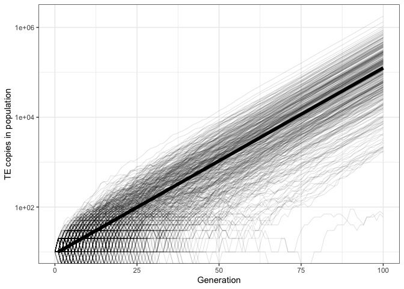

Validation of invasion
================
Almorò Scarpa

## Introduction

With this validation we wanted to prove that the simulator will generate
on average the number of insertions predicted by the equation:

^t")


TE copies at generation t


TE copies at generation 0


Transposition rate


Generation

### Initial conditions:


A chromosome of size 1Mb and no piRNA clusters. We used 500 replicates

## Materials & Methods

version: invadego0.2.1 seed: 1659093816078434000

### Commands for the simulation:

``` bash
folder="/Users/ascarpa/Paramutations_TEs/Validation/Raw"
tool="/Users/ascarpa/invade-invadego/invadego021"

$tool --N 1000 --gen 100 --genome mb:1 --cluster kb:0 --rr 4 --rep 500 --u 0.1 --basepop 10 --silent --steps 1 > $folder/2022_08_01_Validation_1_invasion
```

### Visualization in R

Setting the environment

``` r
library(ggplot2)
library(RColorBrewer)
library(plyr)
library(gridExtra)
theme_set(theme_bw())
```

Visualization: comparing the simulations with the prediction

``` r
cn<-seq(0,99,1)
res<-10*1.1^cn
theo<-data.frame(x=1:100,y=res)
validation<-read.table("Raw/2022_08_01_Validation_1_invasion")
names(validation)<-c("rep", "gen", "popstat", "fmale", "spacer_1", "fwte", "avw", "avtes", "avpopfreq", "fixed","spacer_2","phase","fwpirna","spacer_3","fwcli","avcli","fixcli","spacer_4","fwpar_yespi","fwpar_nopi",
                     "avpar","fixpar","spacer_5","piori")

gl<-ggplot()+geom_line(data=validation,aes(x=gen,group=rep,y=avtes*1000),alpha=0.15,size=0.3)+scale_y_log10()+geom_line(data=theo,aes(x=x,y=y),size=2)+theme(legend.position="none")+ylab("log10 TE copies in population")+xlab("Generation")
plot(gl)
```

<!-- -->

## Conclusions

The simulation matched the expectations. Invadego accurately reproduces
the expected exponential increase of TE copy numbers in a population
with no piRNA clusters.
