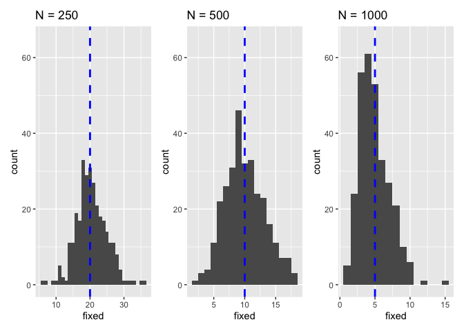

Validation of drift
================
Almorò Scarpa

## Introduction

This validation was inspired by the work of [Le Rouzic and
Capy](http://www.genetics.org/content/169/2/1033).

To test if drift is simulated correctly we exploit a basic population
genetic insight: the probability of fixation of a neutral singleton in a
diploid organism is:

=\frac{1}{2Ne}")

For different population sizes we thus expect the following number of
fixed loci:

-   for N=250 we expect 20 fixed loci, by substituting in the previous
    equation:


-   for N=500 we expect 10 fixed loci, by substituting in the previous
    equation:


-   for N=1000 we expect 5 fixed loci, by substituting in the previous
    equation:


To test if our simulations reproduce this fundamental property we
randomly distributed 10000 neutral TE insertions that do NOT transpose
in a population. Each TE insertion had a starting frequency of 1/2N. We
followed these loci for 20000 generations and recorded the number of
fixed insertions at the end.

### Initial conditions:

5 chromosomes of size 10 Mb, 5 piRNA clusters of size 1 Mb and an
initial number of TEs in the population equal to 10000.

We used 300 replicates for each simulation.

## Materials & Methods

version: invadego0.2.1

-   seed pd250: 1659361504473361000

-   seed pd500: 1659361504473374000

-   seed pd1000: 1659361504473280000

### Commands for the simulation:

``` bash
folder="/Users/ascarpa/Paramutations_TEs/Validation/Raw"
tool="/Users/ascarpa/invade-invadego/invadego021"

$tool --N 250 --gen 20000 --genome mb:10,10,10,10,10 --cluster mb:1,1,1,1,1 --rr 4,4,4,4,4 --rep 300 --u 0.0 --basepop 10000 --steps 10000 --sampleid pd250> $folder/validation_2_1 &       
$tool --N 500 --gen 20000 --genome mb:10,10,10,10,10 --cluster mb:1,1,1,1,1 --rr 4,4,4,4,4 --rep 300 --u 0.0 --basepop 10000 --steps 10000 --sampleid pd500> $folder/validation_2_2 &  
$tool --N 1000 --gen 20000 --genome mb:10,10,10,10,10 --cluster mb:1,1,1,1,1 --rr 4,4,4,4,4 --rep 300 --u 0.0 --basepop 10000 --steps 10000 --sampleid pd1000> $folder/validation_2_3

cat validation_2_1 validation_2_2 validation_2_3|awk '$2==20000' > 2022_08_01_Validation_2_Drift
```

### Visualization in R

Setting the environment

``` r
library(ggplot2)
library(dplyr)
library(patchwork)
```

Visualization: comparing the simulations with the prediction

``` r
validation<-read.table("Raw/2022_08_01_Validation_2_Drift", fill = TRUE, sep = "\t")
names(validation)<-c("rep", "gen", "popstat", "fmale", "spacer_1", "fwte", "avw", "avtes", "avpopfreq", "fixed","spacer_2","phase","fwpirna","spacer_3","fwcli","avcli","fixcli","spacer_4","fwpar_yespi","fwpar_nopi","avpar","fixpar","spacer_5","piori","orifreq","spacer 6", "sampleid")

data_1 <- validation[which(validation$sampleid == "pd250"),names(validation) %in% c("rep","fixed")]
gl_1<-ggplot(data_1,aes(x=fixed))+
      geom_histogram(binwidth = 1)+
      ylim(0,65)+
      ggtitle("N = 250")+
      geom_vline(xintercept=20, lwd=1,lty=2, colour="blue")

data_2 <- validation[which(validation$sampleid == "pd500"),names(validation) %in% c("rep","fixed")]
gl_2<-ggplot(data_2,aes(x=fixed))+
      geom_histogram(binwidth = 1)+
      ylim(0,65)+
      ggtitle("N = 500")+
      geom_vline(xintercept=10, lwd=1,lty=2, colour="blue")

data_3 <- validation[which(validation$sampleid == "pd1000"),names(validation) %in% c("rep","fixed")]
gl_3<-ggplot(data_3,aes(x=fixed))+
      geom_histogram(binwidth = 1)+
      ylim(0,65)+
      ggtitle("N = 1000")+
      geom_vline(xintercept=5, lwd=1,lty=2, colour="blue")

gl_1+gl_2+gl_3
```

<!-- -->

## Conclusions

The simulation matched the expectations.

The simulator correctly reproduces genetic drift.
