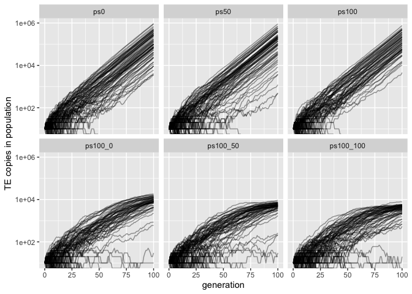

Validation paramutable loci
================
Almorò Scarpa

## Introduction

With these simulations we wanted to validate the role of trigger loci,
trigger loci can activate paramutable loci, therefore we expect an
effect only when they are in combination with paramutable loci.

### Scenarios

In these 3 validations we used no piRNA clusters and incremental
paramutable loci, we expected no effect on TE copy number in the
population, since nothing can activate the paramutable loci

-   ps0: 0% piRNA clusters, 0% paramutable loci

-   ps50: 0% piRNA clusters, 50% paramutable loci

-   ps100: 0% piRNA clusters, 100% paramutable loci

In these 3 validations we used piRNA clusters and incremental
paramutable loci, we expected an effect on TE copy number in the
population

-   ps100_0: 10% piRNA clusters, 0% paramutable loci

-   ps100_50: 10% piRNA clusters, 50% paramutable loci

-   ps100_100: 10% piRNA clusters, 100% paramutable loci

### Commands for the simulation:

``` bash
folder="/Users/ascarpa/Paramutations_TEs/Validation"
tool="/Users/ascarpa/invade-invadego/invadego021"

$tool --N 1000 --gen 100 --genome mb:1 --cluster kb:0 --rr 4 --rep 100 --u 0.1 --basepop 10 --steps 1 --sampleid ps0> $folder/validation_4_1 &
$tool --N 1000 --gen 100 --genome mb:1 --cluster kb:0 --paramutation 2:1 --rr 4 --rep 100 --u 0.1 --basepop 10 --steps 1 --sampleid ps50> $folder/validation_4_2 &
$tool --N 1000 --gen 100 --genome mb:1 --cluster kb:0 --paramutation 2:0,1 --rr 4 --rep 100 --u 0.1 --basepop 10 --steps 1 --sampleid ps100> $folder/validation_4_3

$tool --N 1000 --gen 100 --genome mb:1 --cluster kb:100 --rr 4 --rep 100 --u 0.1 --basepop 10 --steps 1 --sampleid ps100_0> $folder/validation_4_4 &
$tool --N 1000 --gen 100 --genome mb:1 --cluster kb:100 --paramutation 2:1 --rr 4 --rep 100 --u 0.1 --basepop 10 --steps 1 --sampleid ps100_50> $folder/validation_4_5 &
$tool --N 1000 --gen 100 --genome mb:1 --cluster kb:100 --paramutation 2:0,1 --rr 4 --rep 100 --u 0.1 --basepop 10 --steps 1 --sampleid ps100_100> $folder/validation_4_6
cat validation_4_1 validation_4_2 validation_4_3 validation_4_4 validation_4_5 validation_4_6 |grep -v "^Invade"|grep -v "^#" > validation_4_paramutable_loci 
```

## Materials & Methods

version: invadego0.2.1

-   seed ps0: 1659110332968957000

-   seed ps50: 1659110332969249000

-   seed ps100: 1659110332970028000

-   seed ps100_0: 1659174762730552000

-   seed ps100_50: 1659174762730550000

-   seed ps100_100: 1659174762730548000

### Visualization in R

Setting the environment

``` r
library(ggplot2)
library(dplyr)
```

Visualization: comparing the simulations with the prediction

``` r
validation<-read.table("2022_08_01_Validation_4_paramutable_loci", fill = TRUE, sep = "\t")
names(validation)<-c("rep", "gen", "popstat", "fmale", "spacer_1", "fwte", "avw", "avtes", "avpopfreq", "fixed","spacer_2","phase","fwpirna","spacer_3","fwcli","avcli","fixcli","spacer_4","fwpar_yespi","fwpar_nopi",
                       "avpar","fixpar","spacer_5","piori","orifreq","spacer 6", "sampleid")


data_new <- validation
data_new$sampleid <- factor(data_new$sampleid,
                            levels = c("ps0", "ps50", "ps100", "ps100_0", "ps100_50", "ps100_100"))

gl<-ggplot()+geom_line(data=data_new,aes(x=gen,group=rep,y=avtes*1000),alpha=0.4)+scale_y_log10()+theme(legend.position="none")+ylab("TE copies in population")+xlab("generation")+facet_wrap(~sampleid)
plot(gl)
```

<!-- -->

## Conclusions

The simulations matched the expectations.

In the first three simulations there was no effect since paramutable
loci were not activated

In the last three simulations piRNA clusters stop the invasion, and
therefore the increase in copy numbers, as expected when paramutable
loci are introduced there is a further decrease in the TEs copies in the
population.
