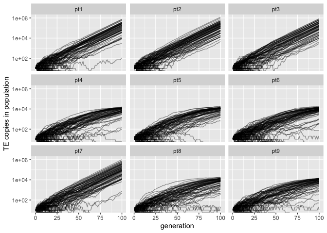

Validation trigger loci
================
Almorò Scarpa

## Introduction

With these simulations we wanted to validate the role of trigger loci,
trigger loci can activate paramutable loci, therefore we expect an
effect only when they are in combination with paramutable loci.

### Scenarios

In these 3 validations we used no piRNA clusters no paramutable loci
incremental triggering loci, we expected no effect on TE copy number in
the population

-   pt1: 0% piRNA clusters, 0% paramutable loci, 0% trigger loci

-   pt2: 0% piRNA clusters, 0% paramutable loci, 50% trigger loci

-   pt3: 0% piRNA clusters, 0% paramutable loci, 100% trigger loci

In these 3 validations we used piRNA clusters, no paramutable loci,
incremental triggering loci we expected an effect on TE copy number in
the population

-   pt4: 10% piRNA clusters, 0% paramutable loci, 0% trigger loci

-   pt5: 10% piRNA clusters, 0% paramutable loci, 50% trigger loci

-   pt6: 10% piRNA clusters, 0% paramutable loci, 100% trigger loci

In these 3 validations we used no piRNA clusters, paramutable loci,
incremental triggering loci incremental we expected an effect on TE copy
number in the population when both paramutable loci and trigger loci
were present

-   pt7: 0% piRNA clusters, 10% paramutable loci, 0% trigger loci

-   pt8: 0% piRNA clusters, 10% paramutable loci, 50% trigger loci

-   pt9: 0% piRNA clusters, 10% paramutable loci, 100% trigger loci

## Materials & Methods

version: invadego0.2.1

-   seed pt1: 1659110351535798000

-   seed pt2: 1659110351536462000

-   seed pt3: 1659110351537237000

-   seed pt4: 1659175808671575000

-   seed pt5: 1659175808671559000

-   seed pt6: 1659175808671579000

-   seed pt7: 1659175855840884000

-   seed pt8: 1659175855841493000

-   seed pt9: 1659175855842373000

### Commands for the simulation:

``` bash
folder="/Users/ascarpa/Paramutations_TEs/Validation/Raw"
tool="/Users/ascarpa/invade-invadego/invadego021"
$tool --N 1000 --gen 100 --genome mb:1 --cluster kb:0 --rr 4 --rep 100 --u 0.1 --basepop 10 --steps 1 --sampleid pt1> $folder/validation_5_1 &
$tool --N 1000 --gen 100 --genome mb:1 --cluster kb:0 --trigger 2:1 --rr 4 --rep 100 --u 0.1 --basepop 10 --steps 1 --sampleid pt2> $folder/validation_5_2 &
$tool --N 1000 --gen 100 --genome mb:1 --cluster kb:0 --trigger 2:0,1 --rr 4 --rep 100 --u 0.1 --basepop 10 --steps 1 --sampleid pt3> $folder/validation_5_3

$tool --N 1000 --gen 100 --genome mb:1 --cluster kb:100 --rr 4 --rep 100 --u 0.1 --basepop 10 --steps 1 --sampleid pt4> $folder/validation_5_4 &
$tool --N 1000 --gen 100 --genome mb:1 --cluster kb:100 --trigger 2:1 --rr 4 --rep 100 --u 0.1 --basepop 10 --steps 1 --sampleid pt5> $folder/validation_5_5 &
$tool --N 1000 --gen 100 --genome mb:1 --cluster kb:100 --trigger 2:0,1 --rr 4 --rep 100 --u 0.1 --basepop 10 --steps 1 --sampleid pt6> $folder/validation_5_6

$tool --N 1000 --gen 100 --genome mb:1 --cluster kb:0 --paramutation 10:1 --rr 4 --rep 100 --u 0.1 --basepop 10 --steps 1 --sampleid pt7> $folder/validation_5_7 &
$tool --N 1000 --gen 100 --genome mb:1 --cluster kb:0 --paramutation 10:1 --trigger 2:1 --rr 4 --rep 100 --u 0.1 --basepop 10 --steps 1 --sampleid pt8> $folder/validation_5_8 &
$tool --N 1000 --gen 100 --genome mb:1 --cluster kb:0 --paramutation 10:1 --trigger 2:0,1 --rr 4 --rep 100 --u 0.1 --basepop 10 --steps 1 --sampleid pt9> $folder/validation_5_9

cat validation_5_1 validation_5_2 validation_5_3 validation_5_4 validation_5_5 validation_5_6 validation_5_7 validation_5_8 validation_5_9 |grep -v "^Invade"|grep -v "^#" > 2022_08_01_Validation_5_trigger_loci
```

### Visualization in R

Setting the environment

``` r
library(ggplot2)
library(plyr)
```

Visualization: comparing the simulations with the prediction

``` r
validation<-read.table("Raw/2022_08_01_Validation_5_trigger_loci", fill = TRUE, sep = "\t")
names(validation)<-c("rep", "gen", "popstat", "fmale", "spacer_1", "fwte", "avw", "avtes", "avpopfreq", "fixed","spacer_2","phase","fwpirna","spacer_3","fwcli","avcli","fixcli","spacer_4","fwpar_yespi","fwpar_nopi",
                     "avpar","fixpar","spacer_5","piori","orifreq","spacer 6", "sampleid")

data_new <- validation
data_new$sampleid <- factor(data_new$sampleid,
                            levels = c("pt1", "pt2", "pt3", "pt4", "pt5", "pt6", "pt7", "pt8", "pt9"))

gl<-ggplot()+geom_line(data=data_new,aes(x=gen,group=rep,y=avtes*1000),alpha=0.4)+scale_y_log10()+theme(legend.position="none")+ylab("TE copies in population")+xlab("generation")+facet_wrap(~sampleid, ncol=3)
plot(gl)
```

<!-- -->

## Conclusions

The simulation matched the expectations.

In the first three simulations there was no effect since trigger loci
had nothing to activate.

In the second triplet of simulations there was no contribution from the
trigger loci since piRNA clusters don’t need them to be activated.

In the simulation 7 the paramutable loci can’t be activated since there
are no trigger loci and no piRNA clusters, while in the last two
simulations the TE copy number is reduced since there are both trigger
loci and paramutable loci.
