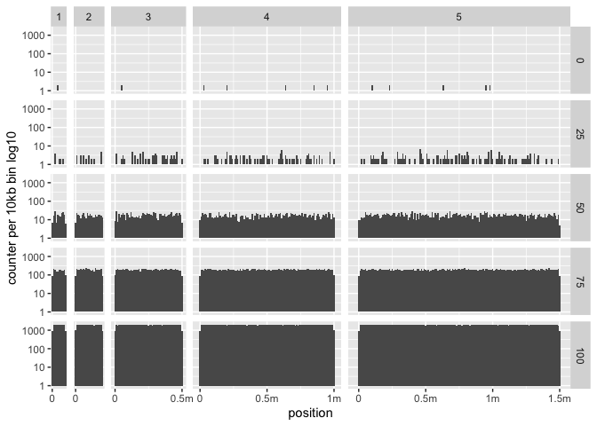
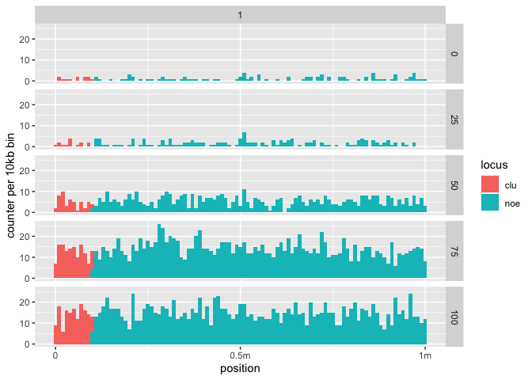
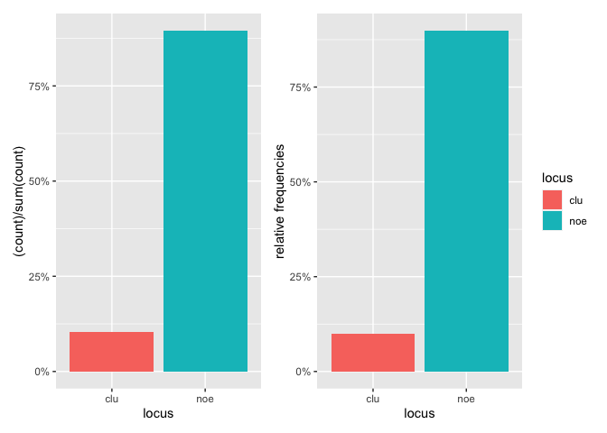
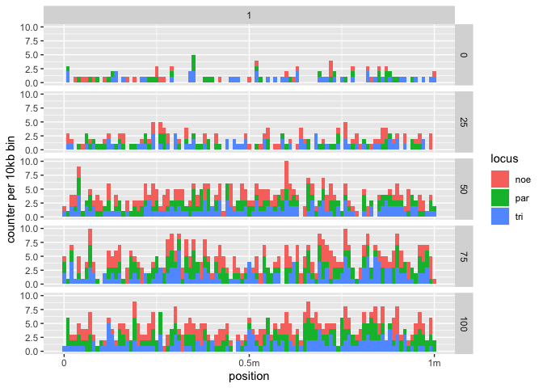
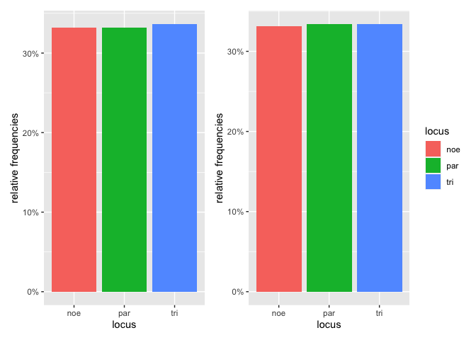
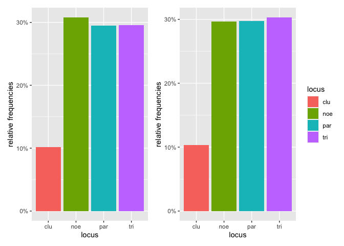
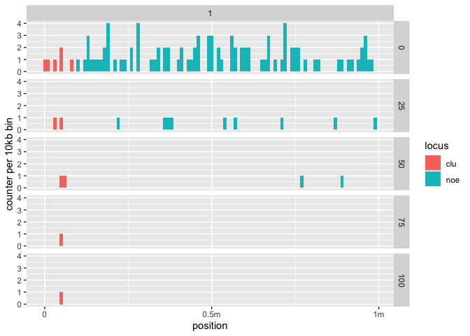
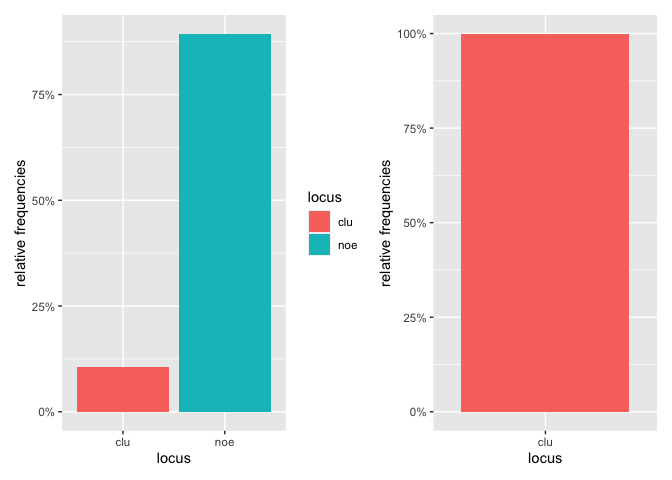

Validation of TEs distribution
================
Almorò Scarpa

## Introduction

## Scenarios

-   Scenario 1: TEs distribution seed: 1659621601411877000

-   Scenario 2: TEs distribution + piRNAs cluster seed:
    1659622365605253000

-   Scenario 3: TEs distribution + 1/3 paramutable loci + 1/3 trigger
    loci seed: 1659622392758172000

-   Scenario 4: TEs distribution + piRNAs cluster + 0.3 paramutable
    loci + 0.3 trigger loci seed: 1659622413360704000

-   Scenario 5: TEs distribution + piRNAs cluster + selection on
    non-cluster insertions seed: 1659622431727389000

## Materials & Methods

version: invadego 0.2.2

### Commands for the simulation:

``` bash
folder="/Users/ascarpa/Paramutations_TEs/Validation/"
tool="/Users/ascarpa/invade-invadego/invadego022"

$tool --N 1000 --gen 100 --genome kb:100,200,500,1000,1500 --cluster kb:0,0,0,0,0 --rr 4,4,4,4,4 --rep 100 --u 0.1 --basepop 100 --steps 25 --file-mhp $folder/validation_6_1_mhp> $folder/validation_6_1

$tool --N 1000 --gen 100 --genome mb:1 --cluster kb:100 --rr 4 --rep 100 --u 0.1 --basepop 100 --steps 25 --file-mhp $folder/validation_6_2_mhp> $folder/validation_6_2

$tool --N 1000 --gen 100 --genome mb:1 --rr 4 --rep 100 --u 0.1 --basepop 100 --paramutation 3:0 --trigger 3:1 --steps 25 --file-mhp $folder/validation_6_3_mhp> $folder/validation_6_3

$tool --N 1000 --gen 100 --genome mb:1 --cluster kb:100 --rr 4 --rep 100 --u 0.1 --basepop 100 --paramutation 3:0 --trigger 3:1 --steps 25 --file-mhp $folder/validation_6_4_mhp> $folder/validation_6_4

$tool --N 1000 --gen 100 --genome mb:1 --cluster kb:100 --rr 4 --rep 100 --u 0.1 --basepop 100 --steps 25 -x 0.1 -no-x-cluins --file-mhp $folder/validation_6_5_mhp> $folder/validation_6_5
```

### Visualization in R

Setting the environment

``` r
library(ggplot2)
library(plyr)
library(patchwork)
```

# Scenario 1: TEs distribution

``` r
t_1<-read.table("validation_6_1_mhp", fill = TRUE, sep = "\t")
names(t_1)<-c("rep","gen","chr","pos","locus","popfreq")
t_1$rep<-as.factor(t_1$rep)
t_1$gen<-as.factor(t_1$gen)
t_1<-subset(t_1,rep==1)
t_1<-subset(t_1,gen==0 | gen==25 | gen==50 | gen==75 | gen==100)
g_1<-ggplot(data=t_1,aes(x=pos))+geom_histogram(binwidth=10000)+facet_grid(gen~chr, scales="free_x", space = "free_x")+
  scale_x_continuous(breaks=c(0,500000,1000000,1500000),labels=c("0","0.5m","1m","1.5m"))+
  xlab("position")+ylab("counter per 10kb bin log10")+scale_y_log10()
plot(g_1)
```

<!-- -->

In the first scenario of the validation we wanted to visualize TEs
distribution, it is evident from the visualization how the TE
distribution is random as we expected.

# Scenario 2: TEs distribution + piRNAs cluster

``` r
t_2<-read.table("validation_6_2_mhp", fill = TRUE, sep = "\t")
names(t_2)<-c("rep","gen","chr","pos","locus","popfreq")
t_2$rep<-as.factor(t_2$rep)
t_2$gen<-as.factor(t_2$gen)
t_2<-subset(t_2,rep==1)
t_2<-subset(t_2,gen==0 | gen==25 | gen==50 | gen==75 | gen==100)
g_2<-ggplot(data=t_2,aes(x=pos, fill=locus))+geom_histogram(binwidth=10000)+facet_grid(gen~chr, scales="free_x", space = "free_x")+
  scale_x_continuous(breaks=c(0,500000,1000000,1500000),labels=c("0","0.5m","1m","1.5m"))+
  xlab("position")+ylab("counter per 10kb bin")
plot(g_2)
```

<!-- -->

``` r
t_2_2<-read.table("validation_6_2_mhp", fill = TRUE, sep = "\t")
names(t_2_2)<-c("rep","gen","chr","pos","locus","popfreq")
t_2_2$gen<-as.factor(t_2_2$gen)
t_2_2<-subset(t_2_2, gen==0)
g_2_2<-ggplot()+
  geom_bar(data=t_2_2,aes(x = locus, y = (..count..)/sum(..count..), fill = locus))+ 
  scale_y_continuous(labels = scales::percent_format(accuracy = 1))+
  theme(legend.position="none")
  ylab("relative frequencies")
```

    ## $y
    ## [1] "relative frequencies"
    ## 
    ## attr(,"class")
    ## [1] "labels"

``` r
t_2_3<-read.table("validation_6_2_mhp", fill = TRUE, sep = "\t")
names(t_2_3)<-c("rep","gen","chr","pos","locus","popfreq")
t_2_3$gen<-as.factor(t_2_3$gen)
t_2_3<-subset(t_2_3, gen==100)
g_2_3<-ggplot()+
  geom_bar(data=t_2_3,aes(x = locus, y = (..count..)/sum(..count..), fill = locus))+ 
  scale_y_continuous(labels = scales::percent_format(accuracy = 1))+
  ylab("relative frequencies")

g_2_2+g_2_3
```

<!-- -->

In the second scenario we wanted to evaluate the TEs distribution in the
presence of a piRNA cluster covering 10% of the genome, also in this
scenario the distribution was random as we expected. In the second
figure is shown the distribution of the TEs of 100 replicates at
generation 0 and generation 100, as expected around 10% of the TEs
insertions ended up in the piRNAs cluster.

# Scenario 3: TEs distribution + 1/3 paramutable loci + 1/3 trigger loci

``` r
t_3<-read.table("validation_6_3_mhp", fill = TRUE, sep = "\t")
names(t_3)<-c("rep","gen","chr","pos","locus","popfreq")
t_3$rep<-as.factor(t_3$rep)
t_3$gen<-as.factor(t_3$gen)
t_3<-subset(t_3,rep==1)
t_3<-subset(t_3, gen==0 | gen==25 | gen==50 | gen==75 | gen==100)
g_3<-ggplot(data=t_3,aes(x=pos, fill=locus))+geom_histogram(binwidth=10000)+facet_grid(gen~chr, scales="free_x", space = "free_x")+
  scale_x_continuous(breaks=c(0,500000,1000000,1500000),labels=c("0","0.5m","1m","1.5m"))+
  xlab("position")+ylab("counter per 10kb bin")
plot(g_3)
```

<!-- -->

``` r
t_3_2<-read.table("validation_6_3_mhp", fill = TRUE, sep = "\t")
names(t_3_2)<-c("rep","gen","chr","pos","locus","popfreq")
t_3_2$gen<-as.factor(t_3_2$gen)
t_3_2<-subset(t_3_2, gen==0)
g_3_2<-ggplot()+
  geom_bar(data=t_3_2,aes(x = locus, y = (..count..)/sum(..count..), fill = locus))+ 
  scale_y_continuous(labels = scales::percent_format(accuracy = 1))+
  theme(legend.position="none")+
  ylab("relative frequencies")

t_3_3<-read.table("validation_6_3_mhp", fill = TRUE, sep = "\t")
names(t_3_3)<-c("rep","gen","chr","pos","locus","popfreq")
t_3_3$gen<-as.factor(t_3_3$gen)
t_3_3<-subset(t_3_3, gen==100)
g_3_3<-ggplot()+
  geom_bar(data=t_3_3,aes(x = locus, y = (..count..)/sum(..count..), fill = locus))+ 
  scale_y_continuous(labels = scales::percent_format(accuracy = 1))+
  ylab("relative frequencies")

g_3_2+g_3_3
```

<!-- -->

In the third scenario the genome was made up by 1/3 of paramutable loci
and 1/3 of triggering loci, the distribution of TEs is still random, as
we expected. In the second figure the TEs insertion are equally
distributed since the the genome is equally divided in paramutable loci,
trigger loci and normal genomic regions.

# Scenario 4: TEs distribution + 0.1 piRNAs cluster + 0.3 paramutable loci + 0.3 trigger loci

``` r
t_4<-read.table("validation_6_4_mhp", fill = TRUE, sep = "\t")
names(t_4)<-c("rep","gen","chr","pos","locus","popfreq")
t_4$rep<-as.factor(t_4$rep)
t_4$gen<-as.factor(t_4$gen)
t_4<-subset(t_4,rep==1)
t_4<-subset(t_4, gen==0 | gen==25 | gen==50 | gen==75 | gen==100)
g_4<-ggplot(data=t_4,aes(x=pos, fill=locus))+geom_histogram(binwidth=10000)+facet_grid(gen~chr, scales="free_x", space = "free_x")+
  scale_x_continuous(breaks=c(0,500000,1000000,1500000),labels=c("0","0.5m","1m","1.5m"))+
  xlab("position")+ylab("counter per 10kb bin")
plot(g_4)
```

<!-- -->

``` r
t_4_2<-read.table("validation_6_4_mhp", fill = TRUE, sep = "\t")
names(t_4_2)<-c("rep","gen","chr","pos","locus","popfreq")
t_4_2$gen<-as.factor(t_4_2$gen)
t_4_2<-subset(t_4_2, gen==0)
g_4_2<-ggplot()+
  geom_bar(data=t_4_2,aes(x = locus, y = (..count..)/sum(..count..), fill = locus))+ 
  scale_y_continuous(labels = scales::percent_format(accuracy = 1))+
  theme(legend.position="none")+
  ylab("relative frequencies")

t_4_3<-read.table("validation_6_4_mhp", fill = TRUE, sep = "\t")
names(t_4_3)<-c("rep","gen","chr","pos","locus","popfreq")
t_4_3$gen<-as.factor(t_4_3$gen)
t_4_3<-subset(t_4_3, gen==100)
g_4_3<-ggplot()+
  geom_bar(data=t_4_3,aes(x = locus, y = (..count..)/sum(..count..), fill = locus))+ 
  scale_y_continuous(labels = scales::percent_format(accuracy = 1))+
  ylab("relative frequencies")

g_4_2+g_4_3
```

<!-- -->

The fourth scenario is a composition of the previous two, the piRNAs
cluster is 10% of the genome while the paramutable and cluster loci are
0.3 each, this is because the first part of the genome is covered by the
piRNA cluster and a region can be both a piRNA and a paramutable locus
or a piRNA cluster and a trigger locus. In the second figure the TE
insertions over the 100 replicates is shown. The comparison of
generation 0 and generation 100 shows the randomness of insertions which
is in accordance with the expectations

# Scenario 5: TEs distribution + piRNAs cluster + selection on non-cluster insertions

``` r
t_5<-read.table("validation_6_5_mhp", fill = TRUE, sep = "\t")
names(t_5)<-c("rep","gen","chr","pos","locus","popfreq")

t_5$rep<-as.factor(t_5$rep)
t_5$gen<-as.factor(t_5$gen)
t_5<-subset(t_5,rep==4)
t_5<-subset(t_5, gen==0 | gen==25 | gen==50 | gen==75 | gen==100)

g_5<-ggplot(data=t_5,aes(x=pos, fill=locus))+geom_histogram(binwidth=10000)+facet_grid(gen~chr, scales="free_x", space = "free_x")+
  scale_x_continuous(breaks=c(0,500000,1000000,1500000),labels=c("0","0.5m","1m","1.5m"))+
  xlab("position")+ylab("counter per 10kb bin")

plot(g_5)
```

<!-- -->

``` r
t_5_2<-read.table("validation_6_5_mhp", fill = TRUE, sep = "\t")
names(t_5_2)<-c("rep","gen","chr","pos","locus","popfreq")
t_5_2$gen<-as.factor(t_5_2$gen)
t_5_2<-subset(t_5_2, gen==0)
g_5_2<-ggplot()+
  geom_bar(data=t_5_2,aes(x = locus, y = (..count..)/sum(..count..), fill = locus))+ 
  scale_y_continuous(labels = scales::percent_format(accuracy = 1))+
  ylab("relative frequencies")

t_5_3<-read.table("validation_6_5_mhp", fill = TRUE, sep = "\t")
names(t_5_3)<-c("rep","gen","chr","pos","locus","popfreq")
t_5_3$gen<-as.factor(t_5_3$gen)
t_5_3<-subset(t_5_3, gen==100)
g_5_3<-ggplot()+
  geom_bar(data=t_5_3,aes(x = locus, y = (..count..)/sum(..count..), fill = locus))+ 
  scale_y_continuous(labels = scales::percent_format(accuracy = 1))+
  theme(legend.position="none")+
  ylab("relative frequencies")

g_5_2+g_5_3
```

<!-- -->

The final scenario presents the same genome composition of the second: a
single piRNA cluster of 100 kb, the difference is that in this case a
selection coefficient of 0.1 over non-cluster insertions was introduced.
As expected over time the non-cluster insertion disappeard from the
population leaving only cluster insertions.

## Conclusions

The simulation matched the expectations.

The distribution of the TEs is random.

In the case were selection on non-cluster TEs insertions was introduced
non-cluster TEs insertion were removed from the population. The
generation 0 was random as in the other scenarios but over time the
action of selection removed the TEs. Also selection worked as expected.
