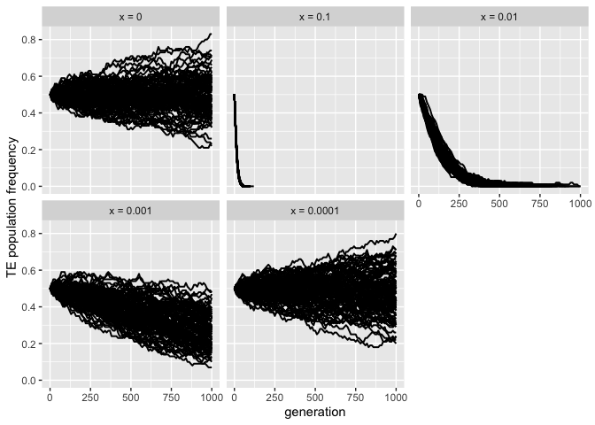
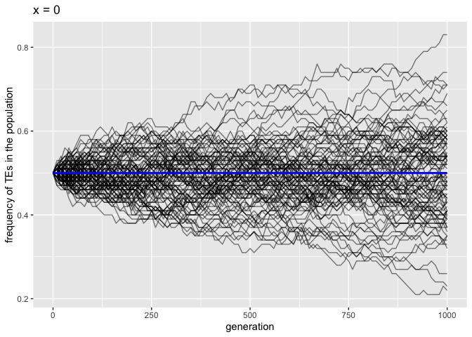

Validation of selection
================
Almorò Scarpa

## Introduction

In this validation we wanted to test if selection was correctly
implemented.

To do so we tested different scenarios:

### Selection on all TEs vs selection on non-cluster TEs

-   selection on all TEs, seed: 1659974765592236000

-   selection only on non-cluster TEs, seed: 1659974771025720000

### Different selection coefficients on the same population:

x is the selection coefficient.

-   x = 0, seed: 1659974780289607000

-   x = 0.1, seed: 1659976729436433000

-   x = 0.01, seed: 1659976873807557000

-   x = 0.001, seed: 1659977962027368000

-   x = 0.0001, seed: 1659979870159207000

### Effect of a fixed selection coefficient x = 0.01 on different population sizes

-   N = 10, seed: 1660120246965342000

-   N = 100, seed: 1660120247347350000

-   N = 1000, seed: 1660120250808495000

-   N = 10000, seed: 1660120309255585000

-   N = 100000, seed: 1660121647914582000

## Materials & Methods

version: invadego 0.2.2

### Commands for the simulation:

``` bash
echo "10000 R 0;999999;" > input_sel
% folder="/Users/ascarpa/Paramutations_TEs/Validation/Raw"
tool="/Users/ascarpa/invade-invadego/invadego022"

$tool --N 1000 --gen 100 --genome mb:1 --cluster kb:100 --rr 4 --rep 100 --u 0.1 --basepop 100 --steps 25 -x 0.1 --file-mhp $folder/validation_7_1_mhp> $folder/validation_7_1

$tool --N 1000 --gen 100 --genome mb:1 --cluster kb:100 --rr 4 --rep 100 --u 0.1 --basepop 100 --steps 25 -x 0.1 -no-x-cluins --file-mhp $folder/validation_7_2_mhp> $folder/validation_7_2

$tool --N 10000 --u 0 --basepop $folder/input_sel --gen 1000 --genome mb:1 --steps 10 --rr 0 --rep 100 --sampleid psel3 > $folder/validation_7_3

$tool --N 10000 --u 0 -x 0.1 --basepop $folder/input_sel --gen 1000 --genome mb:1 --steps 10 --rr 0 --rep 100 --sampleid psel4 > $folder/validation_7_4

$tool --N 10000 --u 0 -x 0.01 --basepop $folder/input_sel --gen 1000 --genome mb:1 --steps 10 --rr 0 --rep 100 --sampleid psel5 > $folder/validation_7_5

$tool --N 10000 --u 0 -x 0.001 --basepop $folder/input_sel --gen 1000 --genome mb:1 --steps 10 --rr 0 --rep 100 --sampleid psel6 > $folder/validation_7_6

$tool --N 10000 --u 0 -x 0.0001 --basepop $folder/input_sel --gen 1000 --genome mb:1 --steps 10 --rr 0 --rep 100 --sampleid psel7 > $folder/validation_7_7

$tool --N 10 --u 0 -x 0.01 --basepop 10 --gen 1000 --genome mb:1 --steps 10 --rr 0 --rep 100 --sampleid psel8 > $folder/validation_7_8

$tool --N 100 --u 0 -x 0.01 --basepop 100 --gen 1000 --genome mb:1 --steps 10 --rr 0 --rep 100 --sampleid psel9 > $folder/validation_7_9

$tool --N 1000 --u 0 -x 0.01 --basepop 1000 --gen 1000 --genome mb:1 --steps 10 --rr 0 --rep 100 --sampleid psel10 > $folder/validation_7_10

$tool --N 10000 --u 0 -x 0.01 --basepop 10000 --gen 1000 --genome mb:1 --steps 10 --rr 0 --rep 100 --sampleid psel11 > $folder/validation_7_11

$tool --N 100000 --u 0 -x 0.01 --basepop 100000 --gen 1000 --genome mb:1 --steps 10 --rr 0 --rep 100 --sampleid psel12 > $folder/validation_7_12

cat validation_7_3 validation_7_4 validation_7_5 validation_7_6 validation_7_7 |grep -v "^Invade"|grep -v "^#" > 2022_08_05_Validation_7_selection_1

cat validation_7_8 validation_7_9 validation_7_10 validation_7_11 validation_7_12 |grep -v "^Invade"|grep -v "^#" > 2022_08_05_Validation_7_selection_2
```

### Visualization in R

Setting the environment

``` r
library(ggplot2)
library(RColorBrewer)
library(dplyr)
library(patchwork)
```

# Selection vs selection on non-cluster insertions

``` r
t_1<-read.table("Raw/validation_7_1_mhp", fill = TRUE, sep = "\t")
names(t_1)<-c("rep","gen","chr","pos","locus","popfreq")
t_1$rep<-as.factor(t_1$rep)
t_1$gen<-as.factor(t_1$gen)
t_1<-subset(t_1,rep==10)
t_1<-subset(t_1,gen==0 | gen==25 | gen==50)
g_1<-ggplot(data=t_1,aes(x=pos, fill=locus))+geom_histogram(binwidth=10000)+facet_grid(gen~chr, scales="free_x", space = "free_x")+
  scale_x_continuous(breaks=c(0,500000,1000000,1500000),labels=c("0","0.5m","1m","1.5m"))+
  xlab("position")+ylab("counter per 10kb bin")
plot(g_1)
```

<!-- -->

``` r
t_1_2<-read.table("Raw/validation_7_1_mhp", fill = TRUE, sep = "\t")
names(t_1_2)<-c("rep","gen","chr","pos","locus","popfreq")
t_1_2$gen<-as.factor(t_1_2$gen)
t_1_2<-subset(t_1_2, gen==0)
g_1_2<-ggplot()+
  geom_bar(data=t_1_2,aes(x = locus, y = (..count..)/sum(..count..), fill = locus))+ 
  scale_y_continuous(labels = scales::percent_format(accuracy = 1))+
  ggtitle("Generation 0")+
  theme(legend.position="none", plot.title = element_text(size=14, face="bold.italic"))+
ylab("relative frequencies")

t_1_3<-read.table("Raw/validation_7_1_mhp", fill = TRUE, sep = "\t")
names(t_1_3)<-c("rep","gen","chr","pos","locus","popfreq")
t_1_3$gen<-as.factor(t_1_3$gen)
t_1_3<-subset(t_1_3, gen==50)
g_1_3<-ggplot()+
  geom_bar(data=t_1_3,aes(x = locus, y = (..count..)/sum(..count..), fill = locus))+ 
  scale_y_continuous(labels = scales::percent_format(accuracy = 1))+
  ggtitle("Generation 50")+
  theme(plot.title = element_text(size=14, face="bold.italic"))+
  ylab("relative frequencies")

g_1_2+g_1_3
```

<!-- -->

``` r
t_2<-read.table("Raw/validation_7_2_mhp", fill = TRUE, sep = "\t")
names(t_2)<-c("rep","gen","chr","pos","locus","popfreq")
t_2$rep<-as.factor(t_2$rep)
t_2$gen<-as.factor(t_2$gen)
t_2<-subset(t_2,rep==1)
t_2<-subset(t_2,gen==0 | gen==25 | gen==50 | gen==75 | gen==100)
g_2<-ggplot(data=t_2,aes(x=pos, fill=locus))+geom_histogram(binwidth=10000)+facet_grid(gen~chr, scales="free_x", space = "free_x")+
  scale_x_continuous(breaks=c(0,500000,1000000,1500000),labels=c("0","0.5m","1m","1.5m"))+
  xlab("position")+ylab("counter per 10kb bin")
plot(g_2)
```

<!-- -->

``` r
t_2_2<-read.table("Raw/validation_7_2_mhp", fill = TRUE, sep = "\t")
names(t_2_2)<-c("rep","gen","chr","pos","locus","popfreq")
t_2_2$gen<-as.factor(t_2_2$gen)
t_2_2<-subset(t_2_2, gen==0)
g_2_2<-ggplot()+
  geom_bar(data=t_2_2,aes(x = locus, y = (..count..)/sum(..count..), fill = locus))+ 
  scale_y_continuous(labels = scales::percent_format(accuracy = 1))+
  ggtitle("Generation 0")+
  theme(legend.position="none", plot.title = element_text(size=14, face="bold.italic"))+
  ylab("relative frequencies")

t_2_3<-read.table("Raw/validation_7_2_mhp", fill = TRUE, sep = "\t")
names(t_2_3)<-c("rep","gen","chr","pos","locus","popfreq")
t_2_3$gen<-as.factor(t_2_3$gen)
t_2_3<-subset(t_2_3, gen==100)
g_2_3<-ggplot()+
  geom_bar(data=t_2_3,aes(x = locus, y = (..count..)/sum(..count..), fill = locus))+ 
  scale_y_continuous(labels = scales::percent_format(accuracy = 1))+
  ggtitle("Generation 100")+
  theme(plot.title = element_text(size=14, face="bold.italic"))+
  ylab("relative frequencies")

g_2_2+g_2_3
```

<!-- -->

Selection can act on all TEs insertion, as in the first case or only in
non-cluster TEs insertions in the latter. The reason being is that
cluster insertions generate piRNAs. Therefore make sense to not consider
selection upon cluster insertion in some models. From the two pairs of
histograms is easy to see the difference: in the first case all TEs tend
to be lost, while in the second only non cluster TEs are lost, while
cluster insertions are maintained.

``` r
df_1<-read.table("Raw/2022_08_05_Validation_7_selection_1", fill = TRUE, sep = "\t")
names(df_1)<-c("rep", "gen", "popstat", "fmale", "spacer_1", "fwte", "avw", "avtes", "avpopfreq", "fixed","spacer_2","phase","fwpirna","spacer_3","fwcli","avcli","fixcli","spacer_4","fwpar_yespi","fwpar_nopi",
              "avpar","fixpar","spacer_5","piori","orifreq","spacer 6", "sampleid")

gt_1<-ggplot()+
  theme(legend.position="none")+
  geom_line(data=df_1,aes(x=gen, y=avtes , group=rep,color=phase),alpha=1,size=0.7)+
  ylab("TE population frequency") + xlab("generation")+
  scale_y_log10()+
  facet_wrap(~sampleid, labeller = labeller(sampleid = 
                                       c("psel3" = "x = 0",
                                         "psel4" = "x = 0.1",
                                         "psel5" = "x = 0.01",
                                         "psel6" = "x = 0.001",
                                         "psel7" = "x = 0.0001")))
plot(gt_1)
```

<!-- -->

``` r
df_2<-read.table("Raw/2022_08_05_Validation_7_selection_2", fill = TRUE, sep = "\t")
names(df_2)<-c("rep", "gen", "popstat", "fmale", "spacer_1", "fwte", "avw", "avtes", "avpopfreq", "fixed","spacer_2","phase","fwpirna","spacer_3","fwcli","avcli","fixcli","spacer_4","fwpar_yespi","fwpar_nopi",
            "avpar","fixpar","spacer_5","piori","orifreq","spacer 6", "sampleid")
df_2$sampleid <- factor(df_2$sampleid, levels=c("psel8", "psel9", "psel10", "psel11","psel12"))

gt_2<-ggplot()+
  theme(legend.position="none")+
  geom_line(data=df_2, aes(x=gen, y=avtes , group=rep,color=phase),alpha=1,size=0.7)+
  ylab("TE population frequency") + xlab("generation")+
  facet_wrap(~sampleid, labeller = labeller(sampleid = 
                                              c("psel8" = "N = 10",
                                                "psel9" = "N = 100",
                                                "psel10" = "N = 1000",
                                                "psel11" = "N = 10000",
                                                "psel12" = "N = 100000")))
plot(gt_2)
```

<!-- -->

``` r
gt_2_2<-ggplot()+
  theme(legend.position="none")+
  geom_line(data=df_2, aes(x=gen, y=fixed , group=rep,color=phase),alpha=1,size=0.7)+
  ylab("Fixed TEs") + xlab("generation")+
  facet_wrap(~sampleid, labeller = labeller(sampleid = 
                                              c("psel8" = "N = 10",
                                                "psel9" = "N = 100",
                                                "psel10" = "N = 1000",
                                                "psel11" = "N = 10000",
                                                "psel12" = "N = 100000")))
plot(gt_2_2)
```

<!-- -->

As we expected in the first set of graphs we can see how an higher
selection coefficient decrease the number of generations needed to lose
all the TEs in the population. But if selection is too small as in the
last case TEs can persist in the population.

Selection is linked to population size and to be effective it has to
meet the requirements from the following equation:


Thus in small populations the predominant force is not selection but
drift, this is shown by the second and third sets of graphs where
selection was maintained at 0.01, while the population size changed. The
frequency of the TEs was equal in all the population since the initial
TEs insertion were equal to N. In populations with N = 10 and N = 100
the TEs are able to become fixed in the population (as shown in the last
set of graphs), therefore selection can’t purge them even though they
decrease the fitness.

## Conclusions

The simulation matched our expectations.

Selection in the simulations follows the theoretical expectations.
