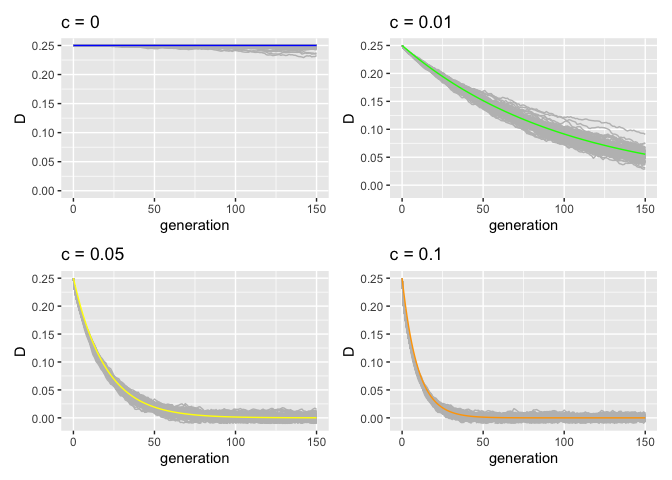

Validation of recombination
================
Almorò Scarpa

## Introduction

In this validation we wanted to test if recombination was correctly
implemented, to do so we used linkage disequilibrium decay, since it is
dependent on recombination.

Linkage disequilibrium is the non-random association of alleles at
different loci in a given population. Loci are said to be in linkage
disequilibrium when the frequency of association of their different
alleles is higher or lower than what would be expected if the loci were
independent and associated randomly.

Different factors can influence the decay of linkage disequilibrium such
as inbreeding and recombination rate.

The number of generations needed to reach

is described by the following equation:

^{n}D_{0}")

-   
    is the number of generations

-   
    is the value of the linkage disequilibrium at generation n

-   
    is the initial value of linkage disequilibrium

-   
    is the recombination rate

For more informations about the basics of linkage disequilibrium visit:
[Wikipedia](https://en.wikipedia.org/wiki/Linkage_disequilibrium).

## Scenarios

For all validations, a population of N = 10000 was used and an initial
TE distribution of 1000. These were simulated for 150 generations.

-   Validation 8_1: Linkage disequilibrium Recombination rate = 0.00
    seed: 1659961515792170000

-   Validation 8_2: Linkage disequilibrium Recombination rate = 0.01
    seed: 1659961877961144000

-   Validation 8_3: Linkage disequilibrium Recombination rate = 0.05
    seed: 1659962257330945000

-   Validation 8_4: Linkage disequilibrium Recombination rate = 0.1
    seed: 1659962642651211000

## Materials & Methods

version: invadego 0.2.2

### Commands for the simulation:

``` bash
echo "R 0;0 999999;" > input_LD
folder="/Users/ascarpa/Paramutations_TEs/Validation/Raw"
tool="/Users/ascarpa/invade-invadego/invadego022"


$tool --N 10000 --u 0 --basepop $folder/input_LD --file-debug $folder/validation_8_1_debug --gen 150 --genome mb:1 --steps 1 --rr 0 --rep 100 > $folder/validation_8_1

$tool --N 10000 --u 0 --basepop $folder/input_LD --file-debug $folder/validation_8_2_debug --gen 150 --genome mb:1 --steps 1 --rr 1 --rep 100 > $folder/validation_8_2

$tool --N 10000 --u 0 --basepop $folder/input_LD --file-debug $folder/validation_8_3_debug --gen 150 --genome mb:1 --steps 1 --rr 5 --rep 100 > $folder/validation_8_3

$tool --N 10000 --u 0 --basepop $folder/input_LD --file-debug $folder/validation_8_4_debug --gen 150 --genome mb:1 --steps 1 --rr 10 --rep 100 > $folder/validation_8_4
```

### Visualization in R

Setting the environment

``` r
library(ggplot2)
library(dplyr)
library(patchwork)
```

# Theoretical Linkage Disequilibrium decay for different recombination rates

``` r
D0 = 0.25

Dnc_0.00<-((1-0.00)**(0:150))*D0
Dnc_0.01<-((1-0.01)**(0:150))*D0
Dnc_0.05<-((1-0.05)**(0:150))*D0
Dnc_0.1<-((1-0.1)**(0:150))*D0
Dnc_0.5<-((1-0.5)**(0:150))*D0

gen = c(0:150)
df<- data.frame(Dnc_0.00, Dnc_0.01, Dnc_0.05, Dnc_0.1, Dnc_0.5, gen)


gl<-ggplot(df, aes( x = gen))+
  geom_line(aes(y = Dnc_0.00), color = "blue")+
  geom_line(aes(y = Dnc_0.01), color = "green")+
  geom_line(aes(y = Dnc_0.05), color = "yellow")+
  geom_line(aes(y = Dnc_0.1), color = "orange")+
  geom_line(aes(y = Dnc_0.5), color = "red")+
  geom_label(aes(x = 48.5, y = 0.25,label = "c = 0.00"))+
  geom_label(aes(x = 30, y = 0.185,label = "c = 0.01"))+
  geom_label(aes(x = 18.5, y = 0.10,label = "c = 0.05"))+
  geom_label(aes(x = 12, y = 0.07,label = "c = 0.1"))+
  geom_label(aes(x = 4, y = 0.02,label = "c = 0.5"))+
  xlim(0,50)+
  ylab("D Linkage disequilibrium")+xlab("generation")
plot(gl)
```

<!-- -->

This plot shows how linkage disequilibrium decays with different
recombination rates.

``` r
t_8_1<-read.table("Raw/validation_8_1_debug", fill = TRUE, sep = "\t")
names(t_8_1)<-c("rep", "gen", "D")
g_8_1<-ggplot()+
  geom_line(data = t_8_1, aes(x = gen, y = D, group = rep), color = "grey")+
  geom_line(data = df, aes(x = gen, y = Dnc_0.00), color = "blue")+
  xlab("generation")+ylab("D")+
  ggtitle("c = 0")+
  ylim(0, 0.25)


t_8_2<-read.table("Raw/validation_8_2_debug", fill = TRUE, sep = "\t")
names(t_8_2)<-c("rep", "gen", "D")
g_8_2<-ggplot()+
  geom_line(data = t_8_2, aes(x = gen, y = D, group = rep), color = "grey")+
  geom_line(data = df, aes(x = gen, y = Dnc_0.01), color = "green")+
  xlab("generation")+ylab("D")+
  ggtitle("c = 0.01")+
  ylim(-0.01, 0.25)


t_8_3<-read.table("Raw/validation_8_3_debug", fill = TRUE, sep = "\t")
names(t_8_3)<-c("rep", "gen", "D")
g_8_3<-ggplot()+
  geom_line(data = t_8_3, aes(x = gen, y = D, group = rep), color = "grey")+
  geom_line(data = df, aes(x = gen, y = Dnc_0.05), color = "yellow")+
  xlab("generation")+ylab("D")+
  ggtitle("c = 0.05")+
  ylim(-0.01, 0.25)


t_8_4<-read.table("Raw/validation_8_4_debug", fill = TRUE, sep = "\t")
names(t_8_4)<-c("rep", "gen", "D")
g_8_4<-ggplot()+
  geom_line(data = t_8_4, aes(x = gen, y = D, group = rep), color = "grey")+
  geom_line(data = df, aes(x = gen, y = Dnc_0.1), color = "orange")+
  xlab("generation")+ylab("D")+
  ggtitle("c = 0.1")+
  ylim(-0.01, 0.25)

(g_8_1+g_8_2)/
  (g_8_3+g_8_4)
```

<!-- -->

In the 4 graphs above the theoretical value is described by the colored
line, while the grey lines represent the 100 simulated populations for
each of the 4 values of c.

## Conclusions

The simulation matched our expectations.

The linkage disequilibrium decay from the simulations follows the shown
theoretical decay.
