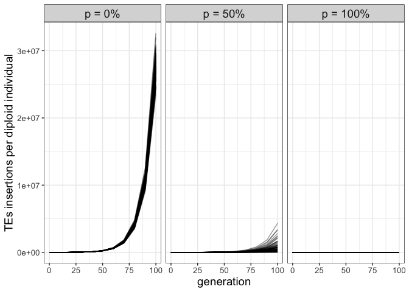

2023_01_20_Validation_9\_Paramutations
================
Almo
2023-01-20

## Introduction

With this validation we wanted to verify paramutable loci correct
implementations, to do so we simulated 3 scenarios:

-   p0 a fixed paramutable locus but no piRNAs deposition. Expectation:
    exponential TE spreading.

-   p50 a fixed paramutable locus and half of the population with piRNAs
    deposition. Expectation: some TE spreading.

-   p100 a fixed paramutable locus and piRNAs deposition in every
    individual. Expectation: no TE spreading.

### Initial conditions:

A population of 1000 individuals, 1 chromosome of length 1Mb, 100
replicates.

## Materials & Methods

version: invadego0.2.3

-   p0 seed: 1674139261390254000

-   p50 seed: 1674149106570645000

-   p100 seed: 1674149388846672000

### Commands for the simulation:

``` bash
echo "1000 R 0;1;1" > 2023_01_19_input_50

echo "500 R 1;1;1
500 R 0;1;1" > 2023_01_19_input_50

echo "1000 R 1;1;1" > 2023_01_19_input_50

folder="/Users/ascarpa/Paramutations_TEs/Validation/Raw""
tool="/Users/ascarpa/invade-invadego/invadego023"

$tool --N 1000 --basepop $folder/2023_01_19_input_0 --cluster kb:0 --u 0.1 --gen 100 --genome mb:10 --steps 10 --rr 4 --paramutation 999999:1 --rep 100 --silent > $folder/validation_9_1 

$tool --N 1000 --basepop $folder/2023_01_19_input_50 --cluster kb:0 --u 0.1 --gen 100 --genome mb:10 --steps 10 --rr 4 --paramutation 999999:1 --rep 100 --silent > $folder/validation_9_2 

$tool --N 1000 --basepop $folder/2023_01_19_input_100 --cluster kb:0 --u 0.1 --gen 100 --genome mb:10 --steps 10 --rr 4 --paramutation 999999:1 --rep 100 --silent > $folder/validation_9_3 
```

### Visualization in R

Setting the environment

``` r
library(ggplot2)
library(plyr)
theme_set(theme_bw())
```

Visualization: comparing the simulations with the prediction

``` r
setwd("/Users/ascarpa/Paramutations_TEs/Validation/Raw")

df_1<-read.table("validation_9_1", fill = TRUE, sep = "\t")
df_2<-read.table("validation_9_2", fill = TRUE, sep = "\t")
df_3<-read.table("validation_9_3", fill = TRUE, sep = "\t")


naming<-c("rep", "gen", "popstat", "fmale", "spacer_1", "fwte", "avw", "min_w", "avtes", "avpopfreq",
             "fixed","spacer_2", "phase", "fwpirna", "spacer_3", "fwcli", "avcli", "fixcli", "spacer_4",
             "fwpar_yespi","fwpar_nopi", "avpar","fixpar","spacer_5","piori","orifreq","spacer 6")

names(df_1)<-naming
names(df_2)<-naming
names(df_3)<-naming

df_1$sampleid <- "p0"
df_2$sampleid <- "p50"
df_3$sampleid <- "p100"

df_total <- rbind(df_1, df_2, df_3)

df_total$sampleid <- factor(df_total$sampleid,
                            levels = c("p0", "p50", "p100"))

g<-ggplot()+geom_line(data=df_total,aes(x=gen,group=rep,y=avtes*1000),alpha=0.4)+
  ylab("TEs insertions per diploid individual")+
  xlab("generation")+
  theme(plot.title = element_text(size=14),
        axis.text.x = element_text(size=10),
        axis.text.y = element_text(size=10),
        axis.title.x = element_text(size=14),
        axis.title.y = element_text(size=14),
        strip.text = element_text(size = 14))+
  facet_wrap(~sampleid, ncol=3)
  facet_wrap(~sampleid, ncol=3)
```

    ## <ggproto object: Class FacetWrap, Facet, gg>
    ##     compute_layout: function
    ##     draw_back: function
    ##     draw_front: function
    ##     draw_labels: function
    ##     draw_panels: function
    ##     finish_data: function
    ##     init_scales: function
    ##     map_data: function
    ##     params: list
    ##     setup_data: function
    ##     setup_params: function
    ##     shrink: TRUE
    ##     train_scales: function
    ##     vars: function
    ##     super:  <ggproto object: Class FacetWrap, Facet, gg>

``` r
plot(g)
```

<!-- -->

### Visualization in R

All the scenarioss matched the theoretical expectations: paramutable
loci are correctly implemented.
